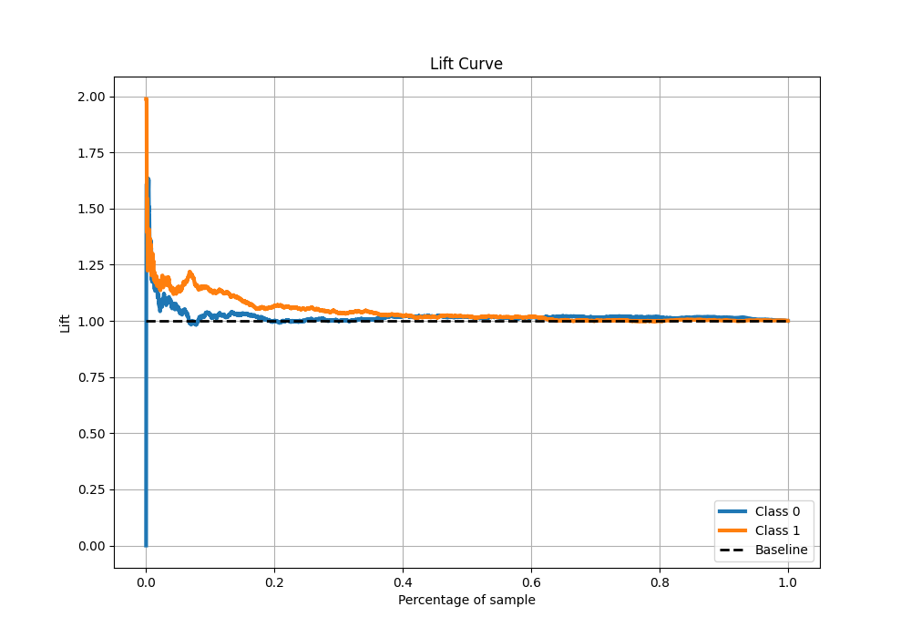

# Summary of 12_LightGBM

[<< Go back](../README.md)

## LightGBM
- **n_jobs**: -1
- **objective**: binary
- **num_leaves**: 63
- **learning_rate**: 0.2
- **feature_fraction**: 0.5
- **bagging_fraction**: 1.0
- **min_data_in_leaf**: 10
- **metric**: binary_logloss
- **custom_eval_metric_name**: None
- **explain_level**: 1

## Validation
 - **validation_type**: kfold
 - **k_folds**: 5
 - **shuffle**: True
 - **stratify**: True

## Optimized metric
logloss

## Training time

4.6 seconds

## Metric details
|           |     score |   threshold |
|:----------|----------:|------------:|
| logloss   | 0.692996  |  nan        |
| auc       | 0.514208  |  nan        |
| f1        | 0.669324  |    0.270275 |
| accuracy  | 0.513379  |    0.533118 |
| precision | 0.631579  |    0.604062 |
| recall    | 1         |    0.270275 |
| mcc       | 0.0574005 |    0.557246 |

## Metric details with threshold from accuracy metric
|           |     score |   threshold |
|:----------|----------:|------------:|
| logloss   | 0.692996  |  nan        |
| auc       | 0.514208  |  nan        |
| f1        | 0.244341  |    0.533118 |
| accuracy  | 0.513379  |    0.533118 |
| precision | 0.558074  |    0.533118 |
| recall    | 0.156411  |    0.533118 |
| mcc       | 0.0446259 |    0.533118 |

## Confusion matrix (at threshold=0.533118)
|              |   Predicted as 0 |   Predicted as 1 |
|:-------------|-----------------:|-----------------:|
| Labeled as 0 |             2177 |              312 |
| Labeled as 1 |             2125 |              394 |

## Learning curves

## Permutation-based Importance

## Confusion Matrix

## Normalized Confusion Matrix

## ROC Curve

## Kolmogorov-Smirnov Statistic

## Precision-Recall Curve

## Calibration Curve

## Cumulative Gains Curve

## Lift Curve

[<< Go back](../README.md)
