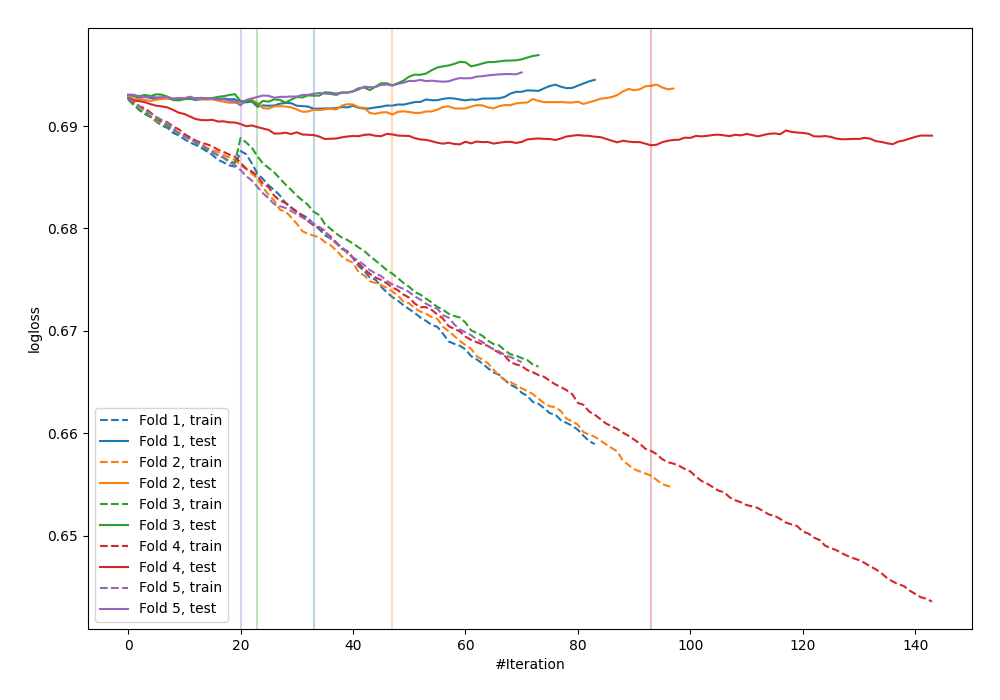
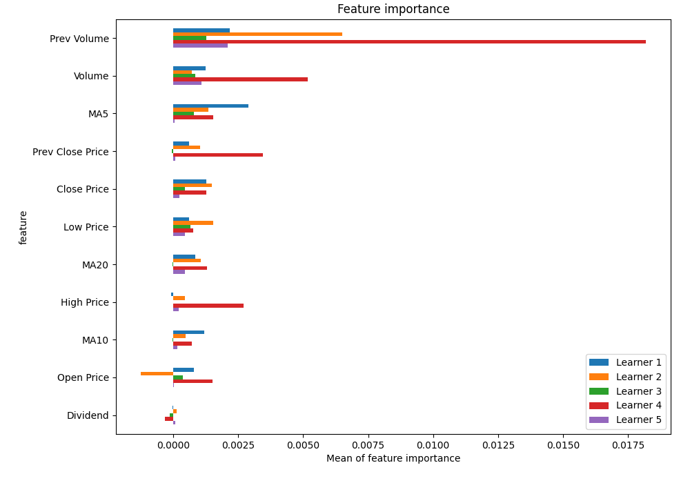
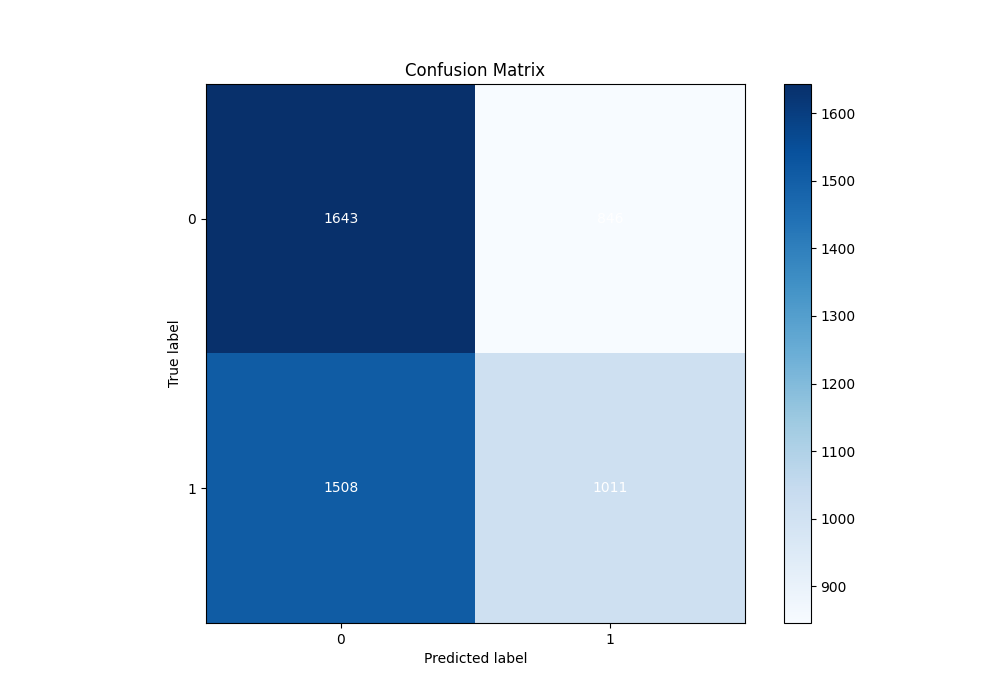
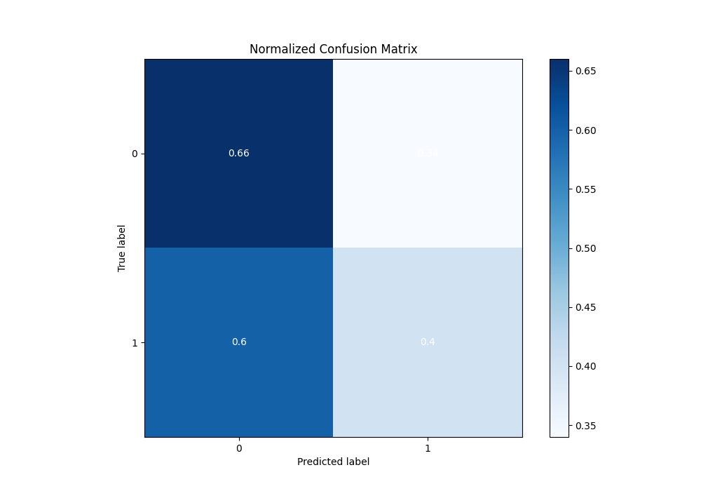
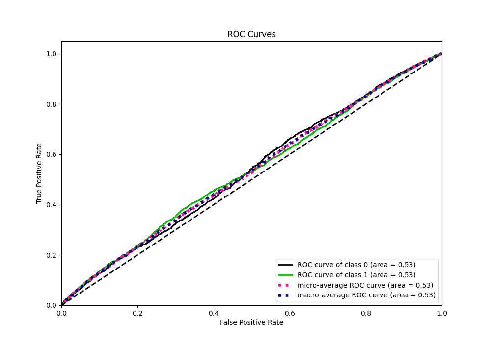
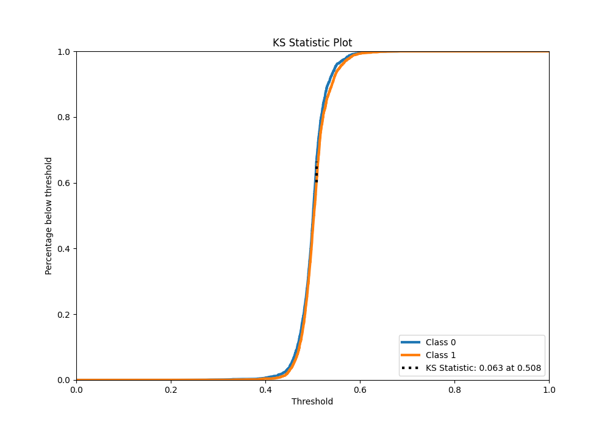
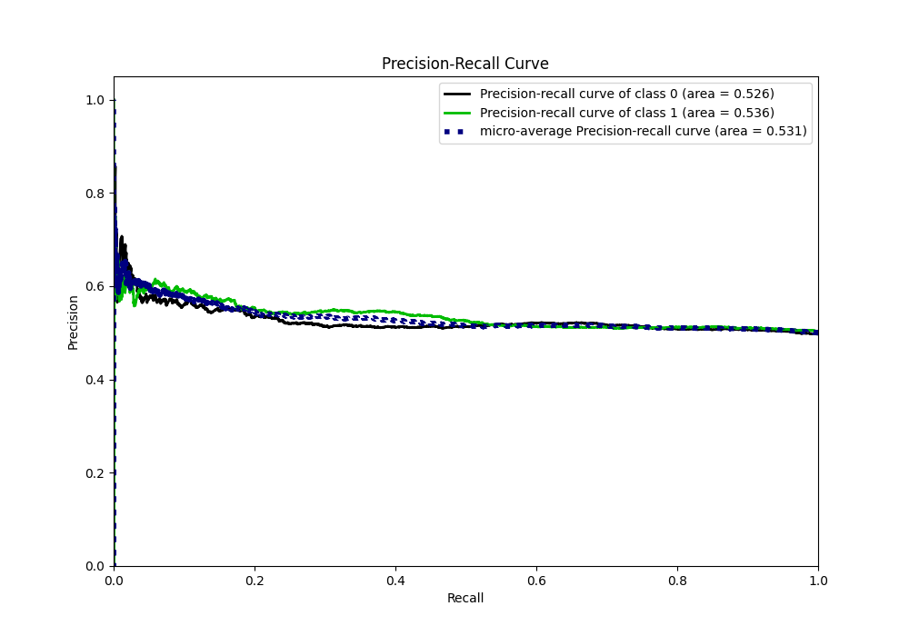
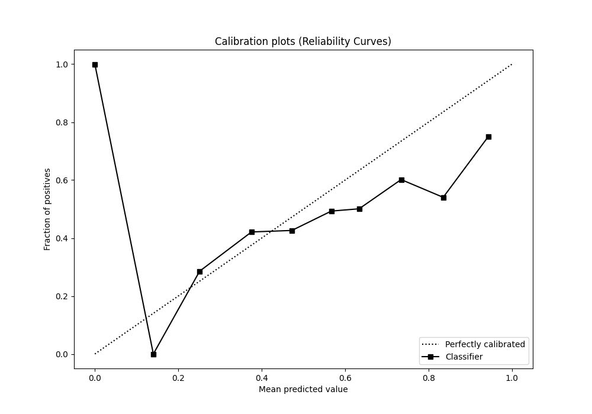
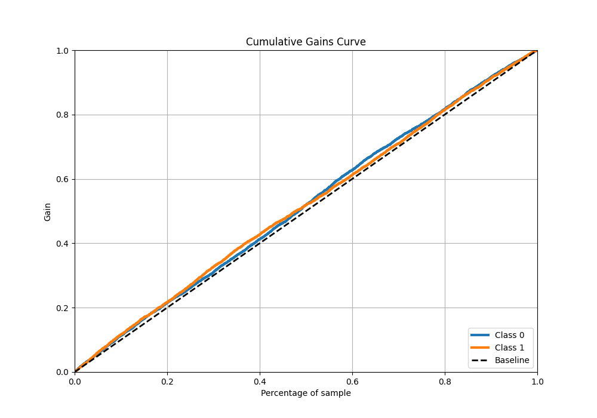
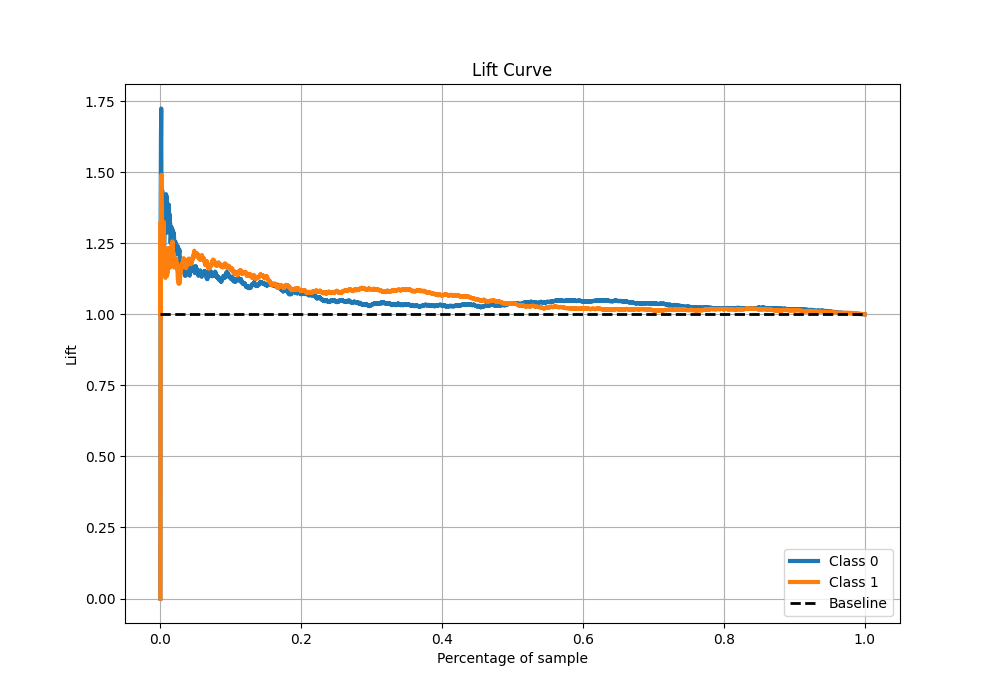

# Summary of 15_CatBoost

[<< Go back](../README.md)

## CatBoost
- **n_jobs**: -1
- **learning_rate**: 0.05
- **depth**: 8
- **rsm**: 0.8
- **loss_function**: Logloss
- **eval_metric**: Logloss
- **explain_level**: 1

## Validation
 - **validation_type**: kfold
 - **k_folds**: 5
 - **shuffle**: True
 - **stratify**: True

## Optimized metric
logloss

## Training time

7.0 seconds

## Metric details
|           |     score |   threshold |
|:----------|----------:|------------:|
| logloss   | 0.691007  |  nan        |
| auc       | 0.532086  |  nan        |
| f1        | 0.669324  |    0.191207 |
| accuracy  | 0.529952  |    0.507963 |
| precision | 0.614035  |    0.584825 |
| recall    | 1         |    0.191207 |
| mcc       | 0.0646355 |    0.509065 |

## Metric details with threshold from accuracy metric
|           |     score |   threshold |
|:----------|----------:|------------:|
| logloss   | 0.691007  |  nan        |
| auc       | 0.532086  |  nan        |
| f1        | 0.462066  |    0.507963 |
| accuracy  | 0.529952  |    0.507963 |
| precision | 0.544426  |    0.507963 |
| recall    | 0.40135   |    0.507963 |
| mcc       | 0.0636133 |    0.507963 |

## Confusion matrix (at threshold=0.507963)
|              |   Predicted as 0 |   Predicted as 1 |
|:-------------|-----------------:|-----------------:|
| Labeled as 0 |             1643 |              846 |
| Labeled as 1 |             1508 |             1011 |

## Learning curves

## Permutation-based Importance

## Confusion Matrix

## Normalized Confusion Matrix

## ROC Curve

## Kolmogorov-Smirnov Statistic

## Precision-Recall Curve

## Calibration Curve

## Cumulative Gains Curve

## Lift Curve

[<< Go back](../README.md)
