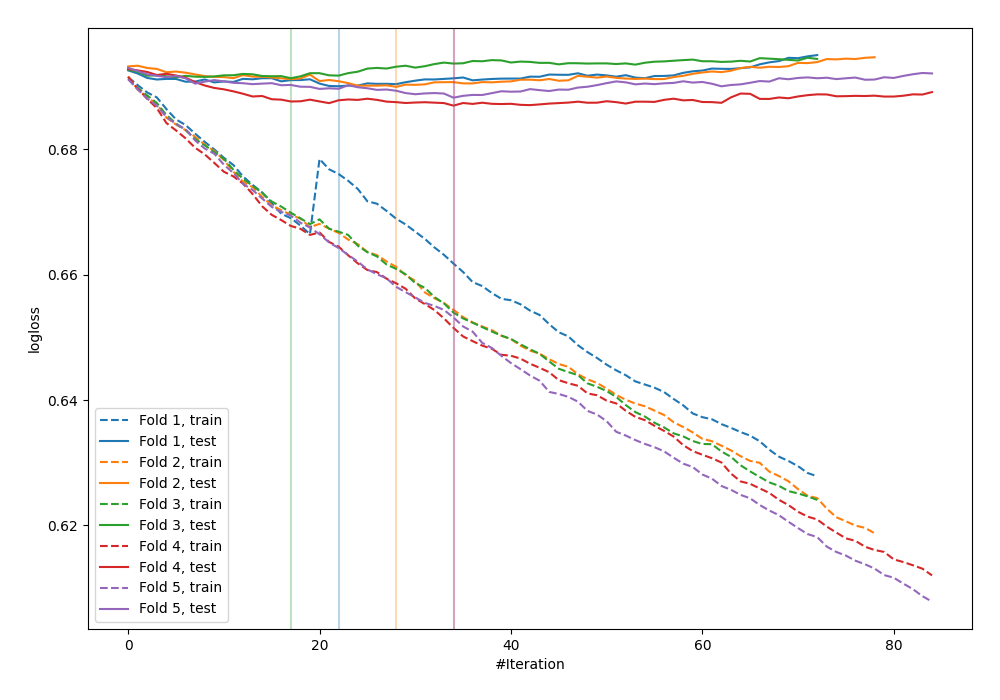
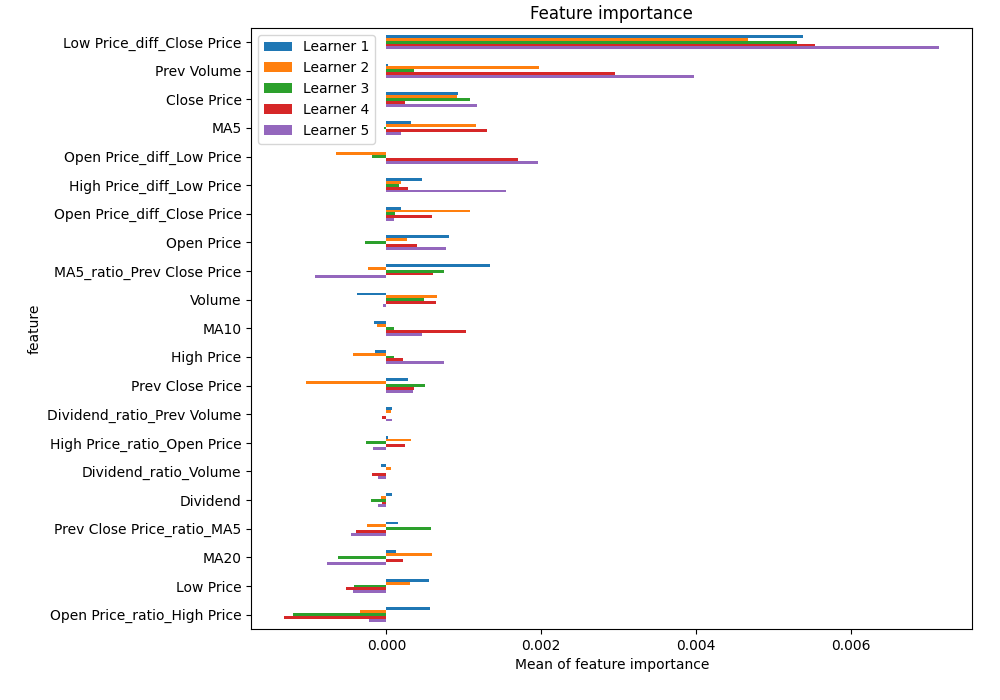
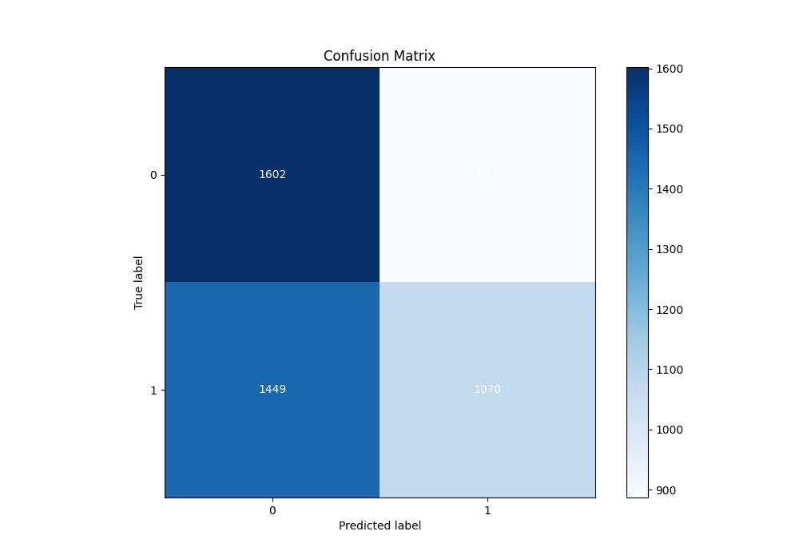
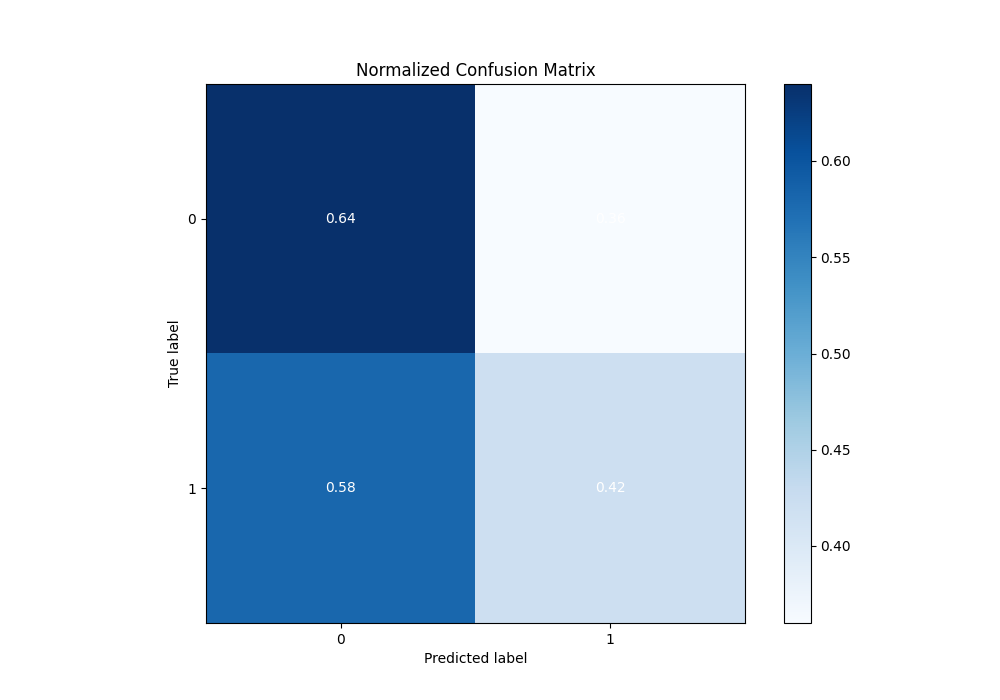
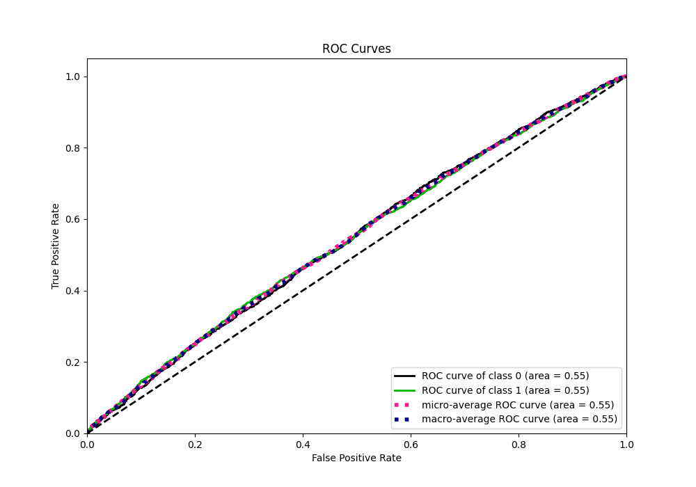
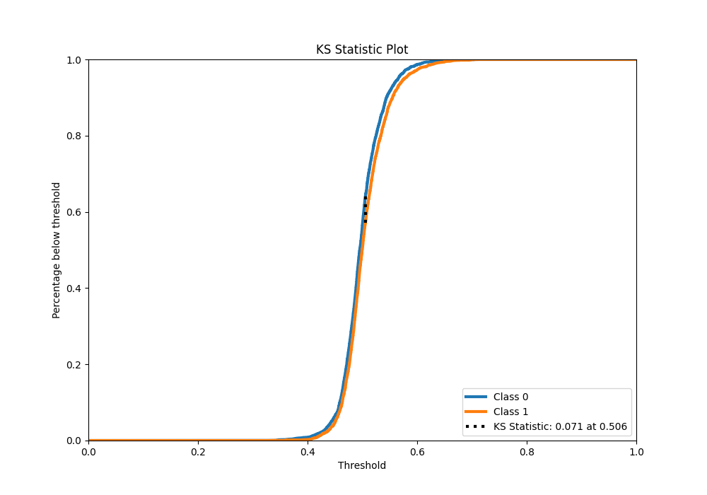
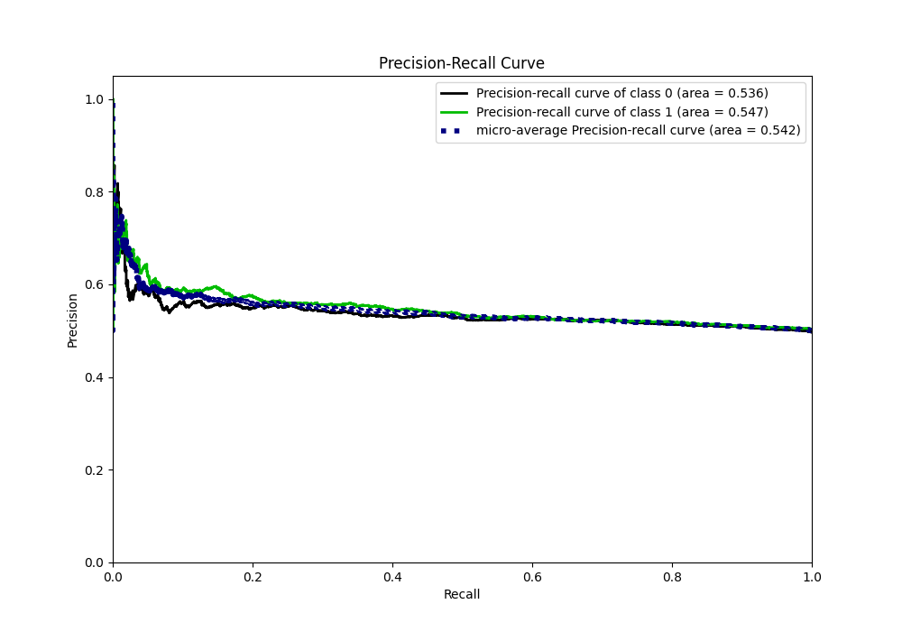
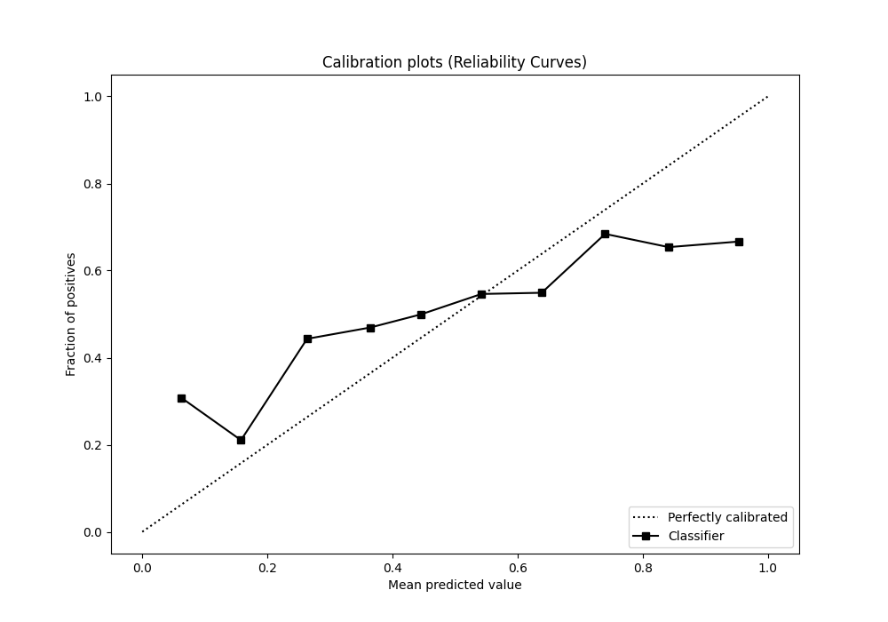
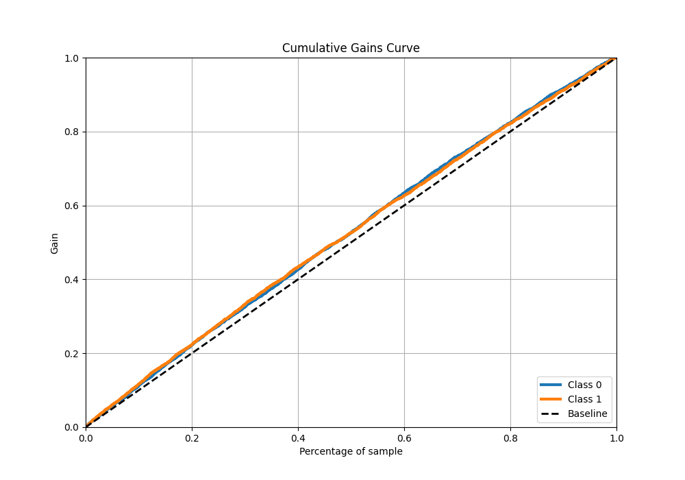
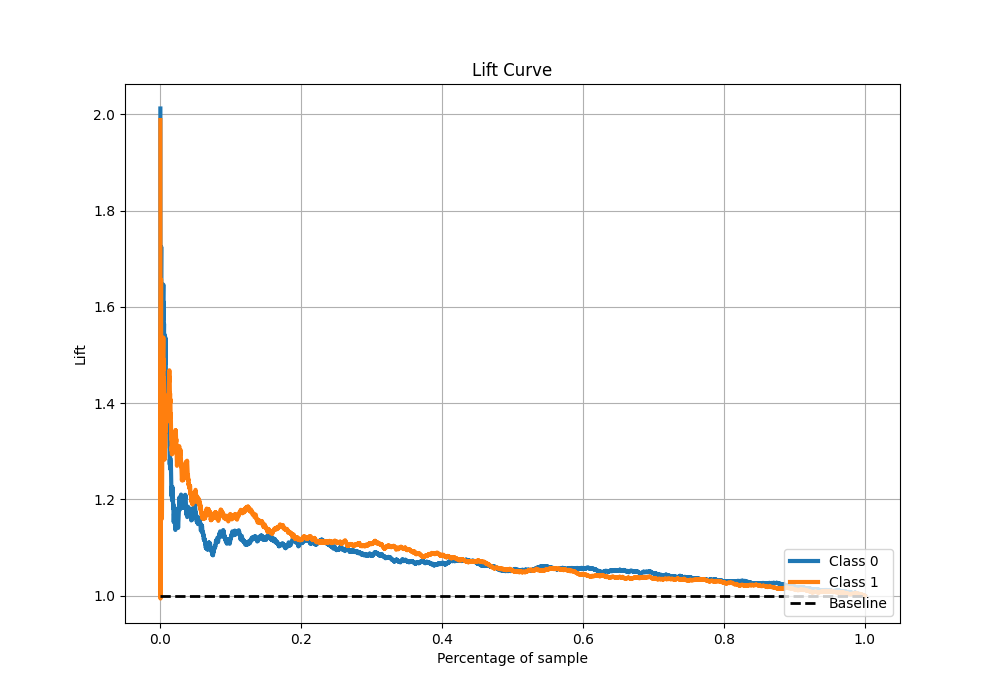

# Summary of 15_CatBoost_GoldenFeatures

[<< Go back](../README.md)

## CatBoost
- **n_jobs**: -1
- **learning_rate**: 0.05
- **depth**: 8
- **rsm**: 0.8
- **loss_function**: Logloss
- **eval_metric**: Logloss
- **explain_level**: 1

## Validation
 - **validation_type**: kfold
 - **k_folds**: 5
 - **shuffle**: True
 - **stratify**: True

## Optimized metric
logloss

## Training time

31.5 seconds

## Metric details
|           |     score |   threshold |
|:----------|----------:|------------:|
| logloss   | 0.689364  |  nan        |
| auc       | 0.545229  |  nan        |
| f1        | 0.669342  |    0.412713 |
| accuracy  | 0.533546  |    0.50591  |
| precision | 0.701754  |    0.620079 |
| recall    | 1         |    0.295105 |
| mcc       | 0.0731987 |    0.514132 |

## Metric details with threshold from accuracy metric
|           |     score |   threshold |
|:----------|----------:|------------:|
| logloss   | 0.689364  |   nan       |
| auc       | 0.545229  |   nan       |
| f1        | 0.478105  |     0.50591 |
| accuracy  | 0.533546  |     0.50591 |
| precision | 0.546755  |     0.50591 |
| recall    | 0.424772  |     0.50591 |
| mcc       | 0.0700954 |     0.50591 |

## Confusion matrix (at threshold=0.50591)
|              |   Predicted as 0 |   Predicted as 1 |
|:-------------|-----------------:|-----------------:|
| Labeled as 0 |             1602 |              887 |
| Labeled as 1 |             1449 |             1070 |

## Learning curves

## Permutation-based Importance

## Confusion Matrix

## Normalized Confusion Matrix

## ROC Curve

## Kolmogorov-Smirnov Statistic

## Precision-Recall Curve

## Calibration Curve

## Cumulative Gains Curve

## Lift Curve

[<< Go back](../README.md)
