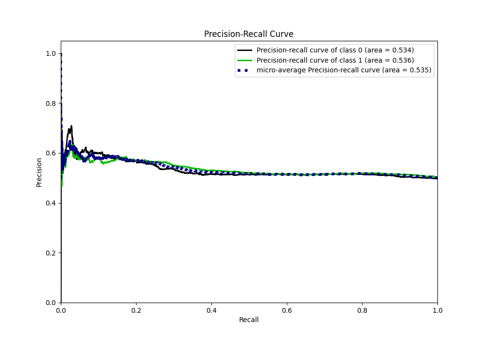

# Summary of 16_CatBoost

[<< Go back](../README.md)

## CatBoost
- **n_jobs**: -1
- **learning_rate**: 0.1
- **depth**: 8
- **rsm**: 1.0
- **loss_function**: Logloss
- **eval_metric**: Logloss
- **explain_level**: 1

## Validation
 - **validation_type**: kfold
 - **k_folds**: 5
 - **shuffle**: True
 - **stratify**: True

## Optimized metric
logloss

## Training time

6.4 seconds

## Metric details
|           |    score |   threshold |
|:----------|---------:|------------:|
| logloss   | 0.690463 |  nan        |
| auc       | 0.535844 |  nan        |
| f1        | 0.670347 |    0.432713 |
| accuracy  | 0.529153 |    0.518647 |
| precision | 0.626168 |    0.587146 |
| recall    | 1        |    0.262797 |
| mcc       | 0.070765 |    0.518647 |

## Metric details with threshold from accuracy metric
|           |    score |   threshold |
|:----------|---------:|------------:|
| logloss   | 0.690463 |  nan        |
| auc       | 0.535844 |  nan        |
| f1        | 0.374867 |    0.518647 |
| accuracy  | 0.529153 |    0.518647 |
| precision | 0.564246 |    0.518647 |
| recall    | 0.280667 |    0.518647 |
| mcc       | 0.070765 |    0.518647 |

## Confusion matrix (at threshold=0.518647)
|              |   Predicted as 0 |   Predicted as 1 |
|:-------------|-----------------:|-----------------:|
| Labeled as 0 |             1943 |              546 |
| Labeled as 1 |             1812 |              707 |

## Learning curves

## Permutation-based Importance

## Confusion Matrix

## Normalized Confusion Matrix

## ROC Curve

## Kolmogorov-Smirnov Statistic

## Precision-Recall Curve

## Calibration Curve

## Cumulative Gains Curve

## Lift Curve

[<< Go back](../README.md)
