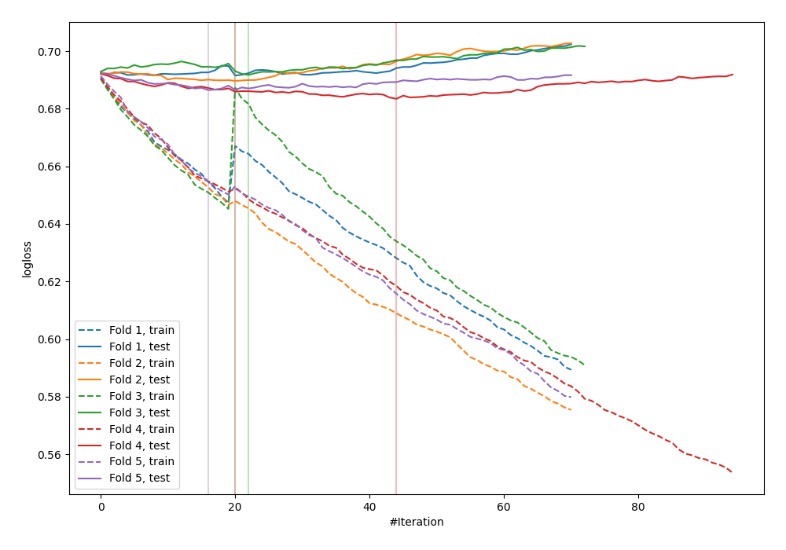
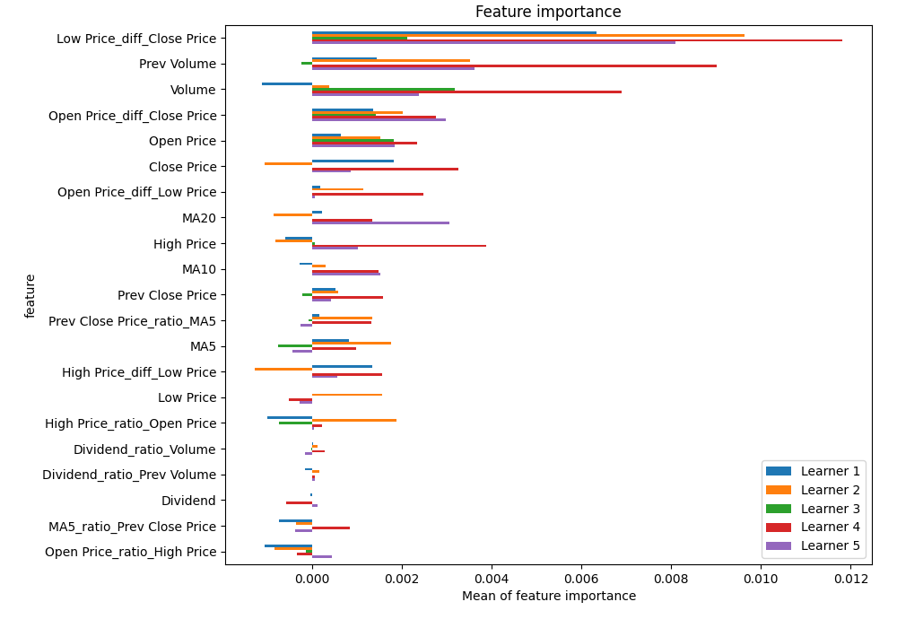
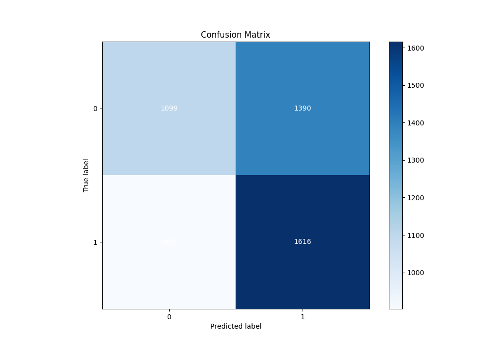
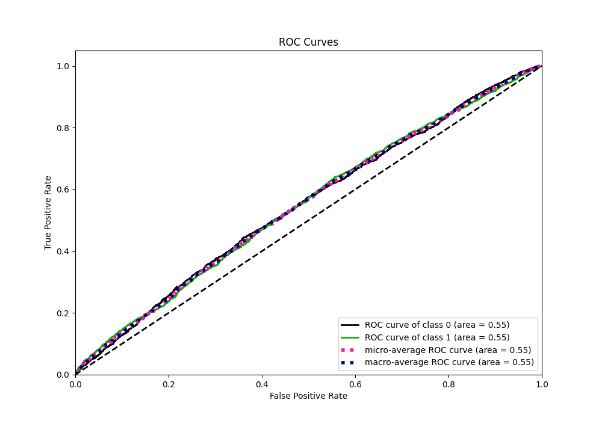
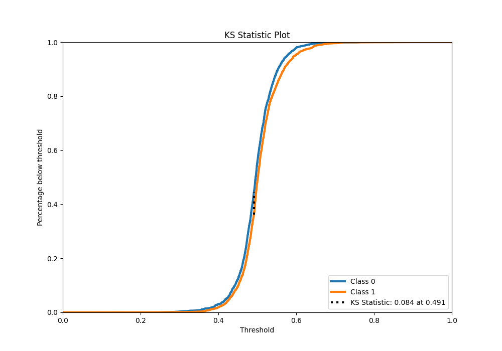
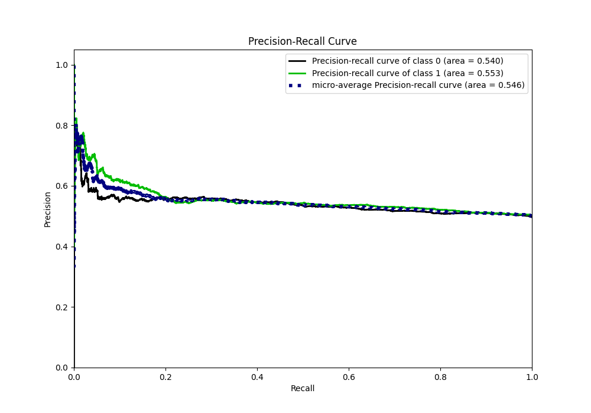
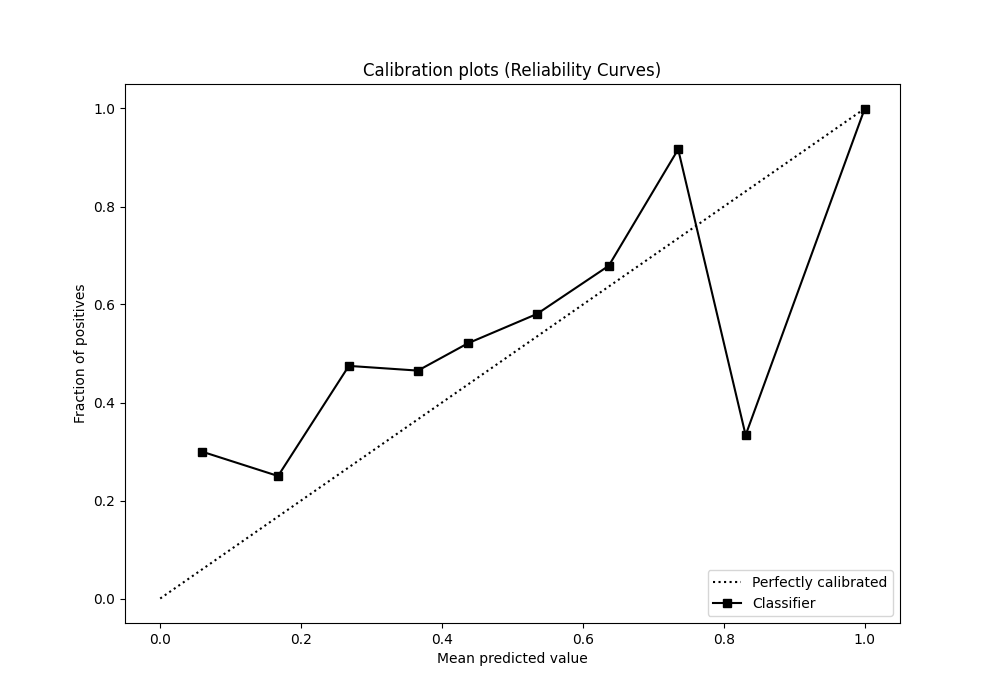
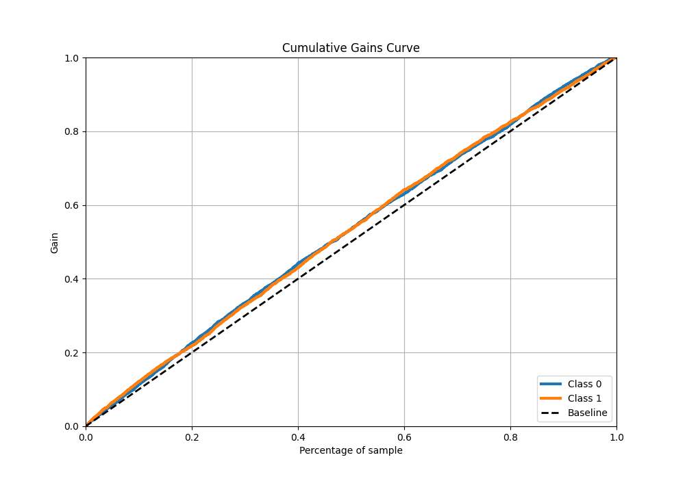
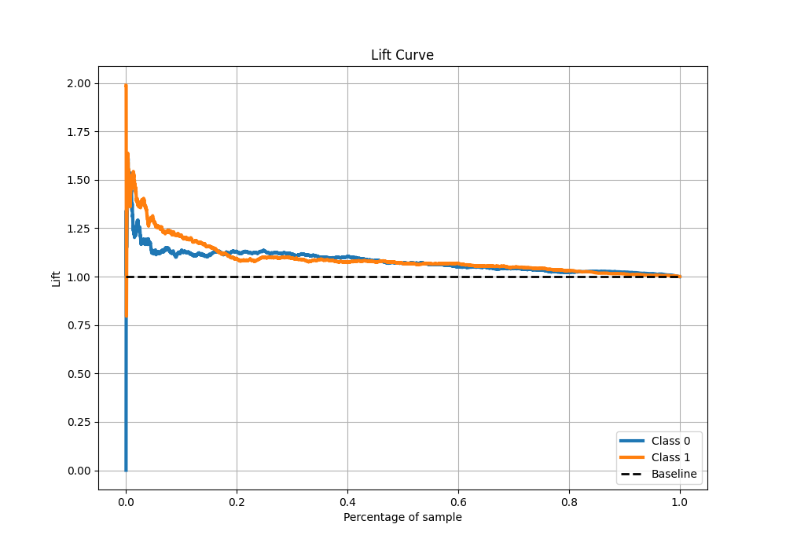

# Summary of 16_CatBoost_GoldenFeatures

[<< Go back](../README.md)

## CatBoost
- **n_jobs**: -1
- **learning_rate**: 0.1
- **depth**: 8
- **rsm**: 1.0
- **loss_function**: Logloss
- **eval_metric**: Logloss
- **explain_level**: 1

## Validation
 - **validation_type**: kfold
 - **k_folds**: 5
 - **shuffle**: True
 - **stratify**: True

## Optimized metric
logloss

## Training time

28.4 seconds

## Metric details
|           |     score |   threshold |
|:----------|----------:|------------:|
| logloss   | 0.688577  |  nan        |
| auc       | 0.550308  |  nan        |
| f1        | 0.669877  |    0.368054 |
| accuracy  | 0.542133  |    0.491007 |
| precision | 0.754386  |    0.644249 |
| recall    | 1         |    0.211213 |
| mcc       | 0.0847871 |    0.491007 |

## Metric details with threshold from accuracy metric
|           |     score |   threshold |
|:----------|----------:|------------:|
| logloss   | 0.688577  |  nan        |
| auc       | 0.550308  |  nan        |
| f1        | 0.584977  |    0.491007 |
| accuracy  | 0.542133  |    0.491007 |
| precision | 0.537591  |    0.491007 |
| recall    | 0.641524  |    0.491007 |
| mcc       | 0.0847871 |    0.491007 |

## Confusion matrix (at threshold=0.491007)
|              |   Predicted as 0 |   Predicted as 1 |
|:-------------|-----------------:|-----------------:|
| Labeled as 0 |             1099 |             1390 |
| Labeled as 1 |              903 |             1616 |

## Learning curves

## Permutation-based Importance

## Confusion Matrix

## Normalized Confusion Matrix

## ROC Curve

## Kolmogorov-Smirnov Statistic

## Precision-Recall Curve

## Calibration Curve

## Cumulative Gains Curve

## Lift Curve

[<< Go back](../README.md)
