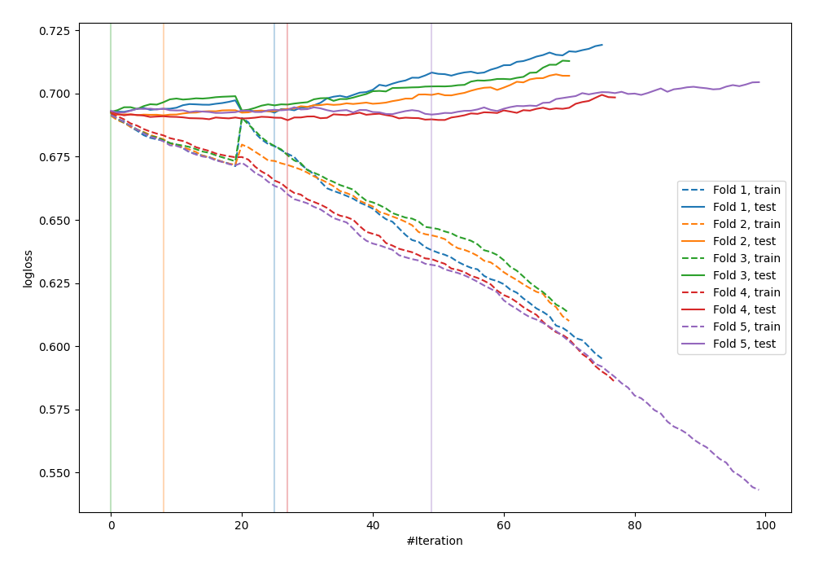
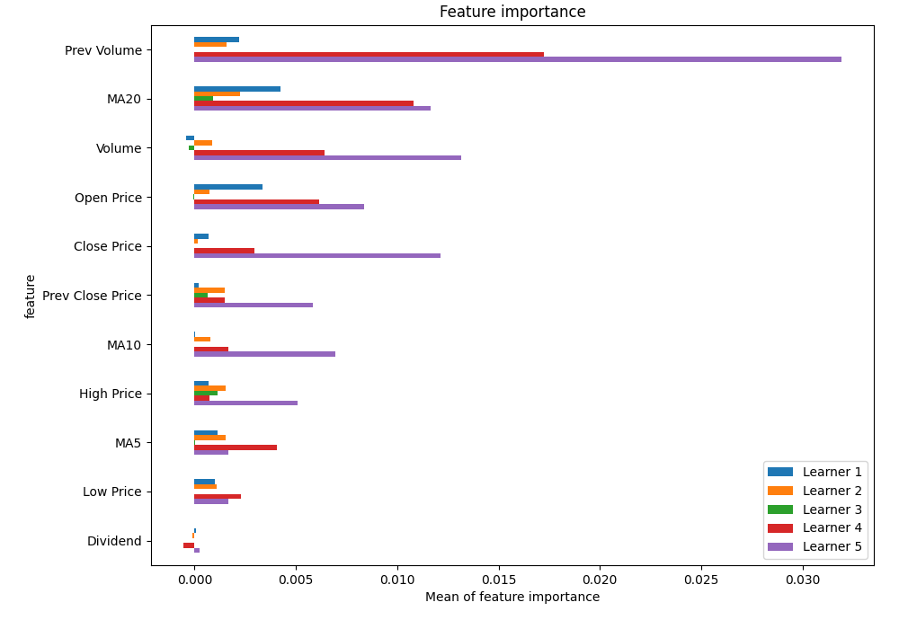
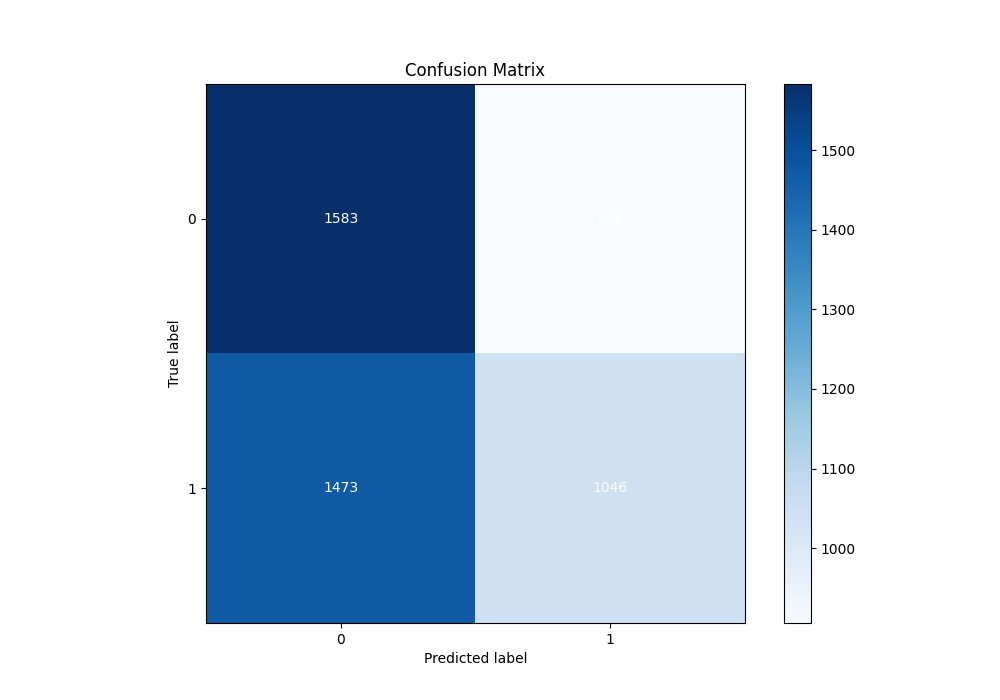
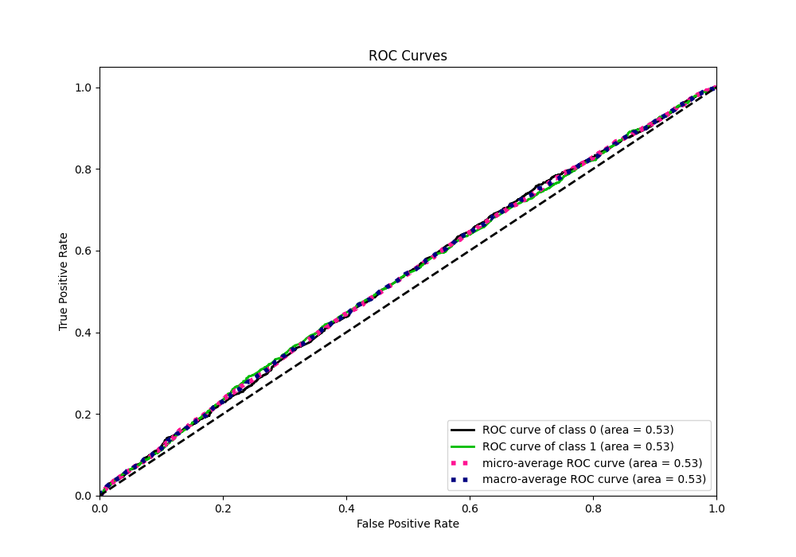
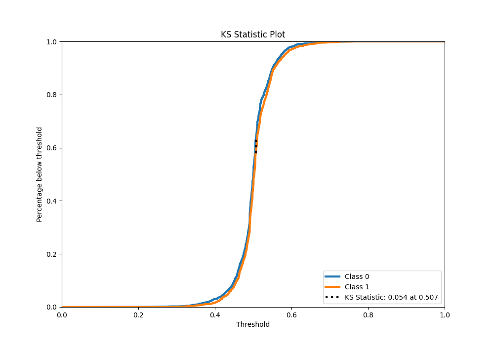
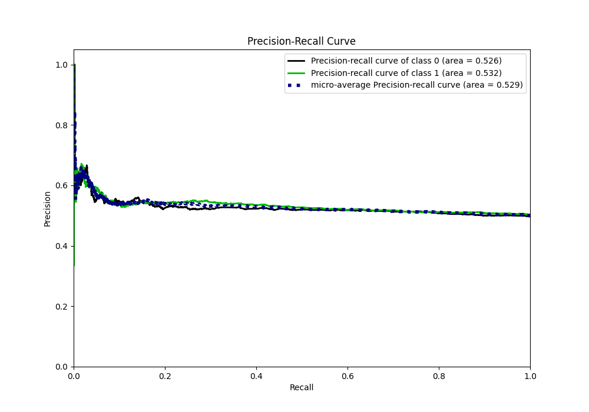
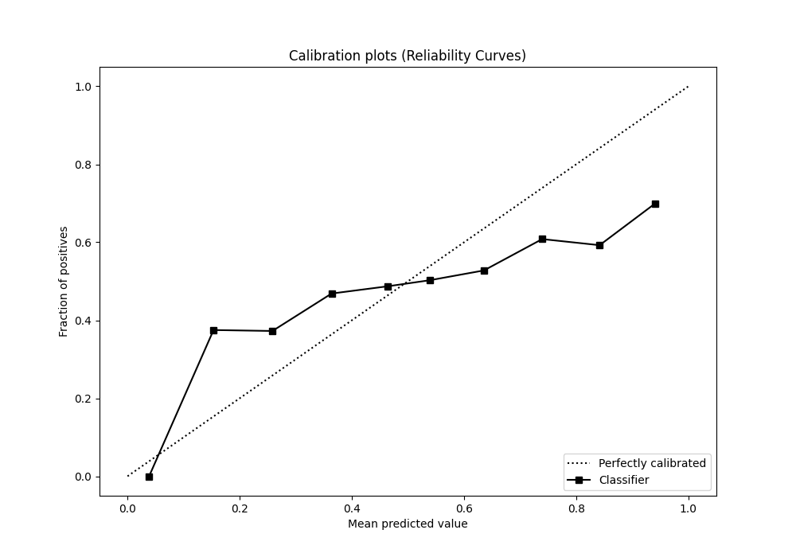
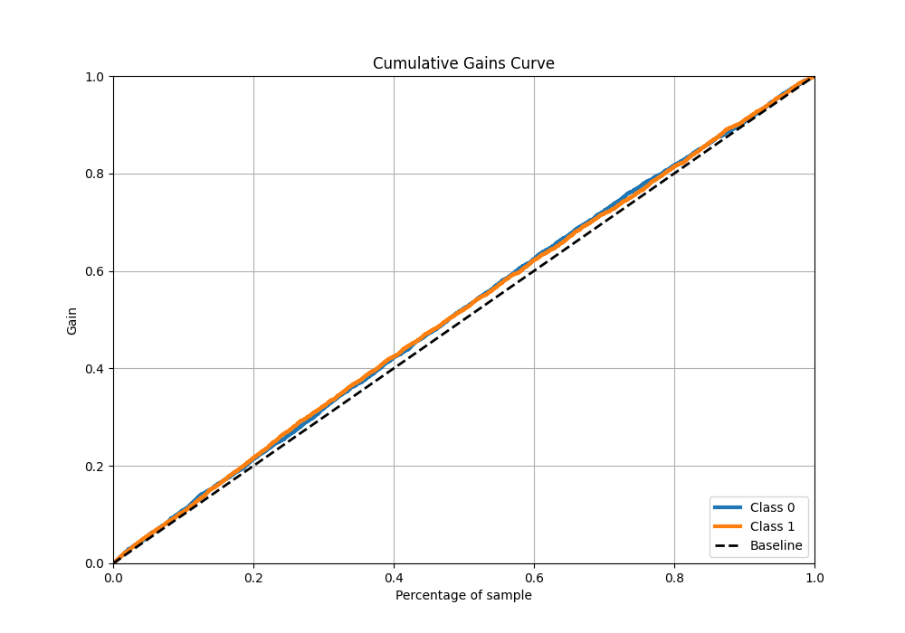
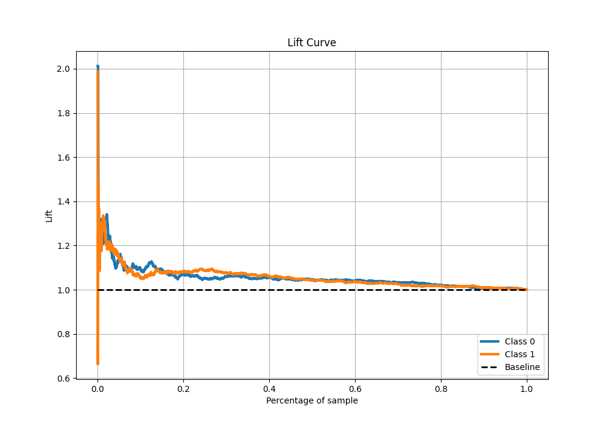

# Summary of 18_CatBoost

[<< Go back](../README.md)

## CatBoost
- **n_jobs**: -1
- **learning_rate**: 0.2
- **depth**: 8
- **rsm**: 1.0
- **loss_function**: Logloss
- **eval_metric**: Logloss
- **explain_level**: 1

## Validation
 - **validation_type**: kfold
 - **k_folds**: 5
 - **shuffle**: True
 - **stratify**: True

## Optimized metric
logloss

## Training time

7.2 seconds

## Metric details
|           |     score |   threshold |
|:----------|----------:|------------:|
| logloss   | 0.691885  |  nan        |
| auc       | 0.531758  |  nan        |
| f1        | 0.669324  |    0.181126 |
| accuracy  | 0.52496   |    0.507106 |
| precision | 0.649123  |    0.634541 |
| recall    | 1         |    0.181126 |
| mcc       | 0.0539923 |    0.517628 |

## Metric details with threshold from accuracy metric
|           |    score |   threshold |
|:----------|---------:|------------:|
| logloss   | 0.691885 |  nan        |
| auc       | 0.531758 |  nan        |
| f1        | 0.467904 |    0.507106 |
| accuracy  | 0.52496  |    0.507106 |
| precision | 0.535861 |    0.507106 |
| recall    | 0.415244 |    0.507106 |
| mcc       | 0.052534 |    0.507106 |

## Confusion matrix (at threshold=0.507106)
|              |   Predicted as 0 |   Predicted as 1 |
|:-------------|-----------------:|-----------------:|
| Labeled as 0 |             1583 |              906 |
| Labeled as 1 |             1473 |             1046 |

## Learning curves

## Permutation-based Importance

## Confusion Matrix

## Normalized Confusion Matrix

## ROC Curve

## Kolmogorov-Smirnov Statistic

## Precision-Recall Curve

## Calibration Curve

## Cumulative Gains Curve

## Lift Curve

[<< Go back](../README.md)
