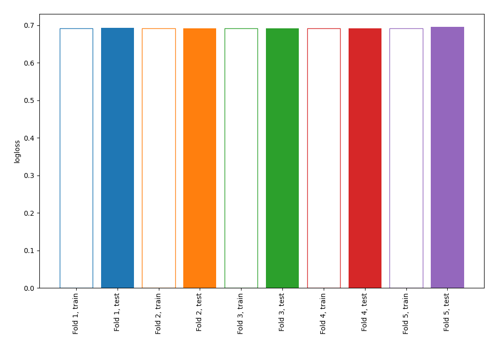
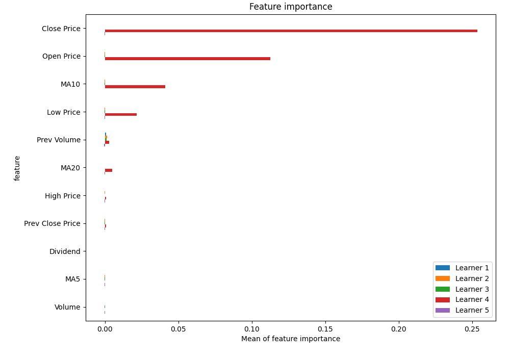
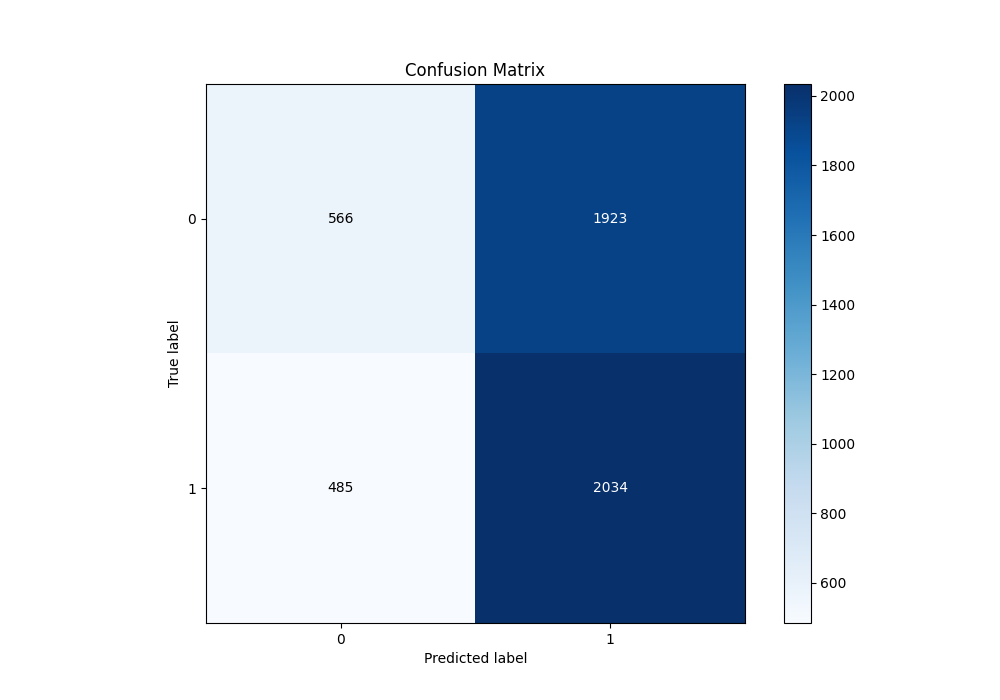
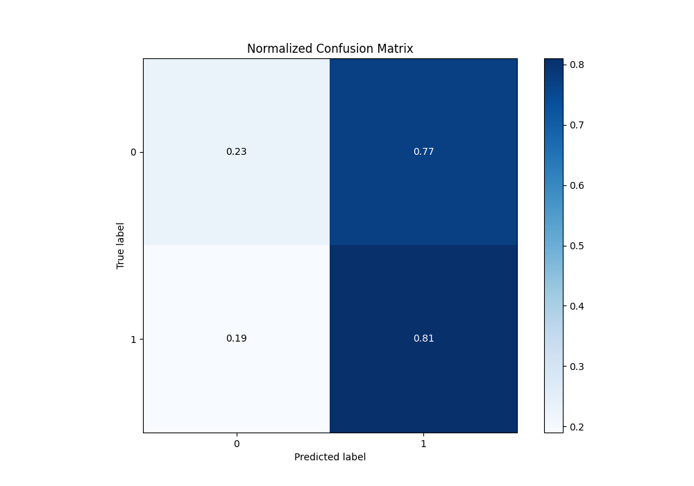
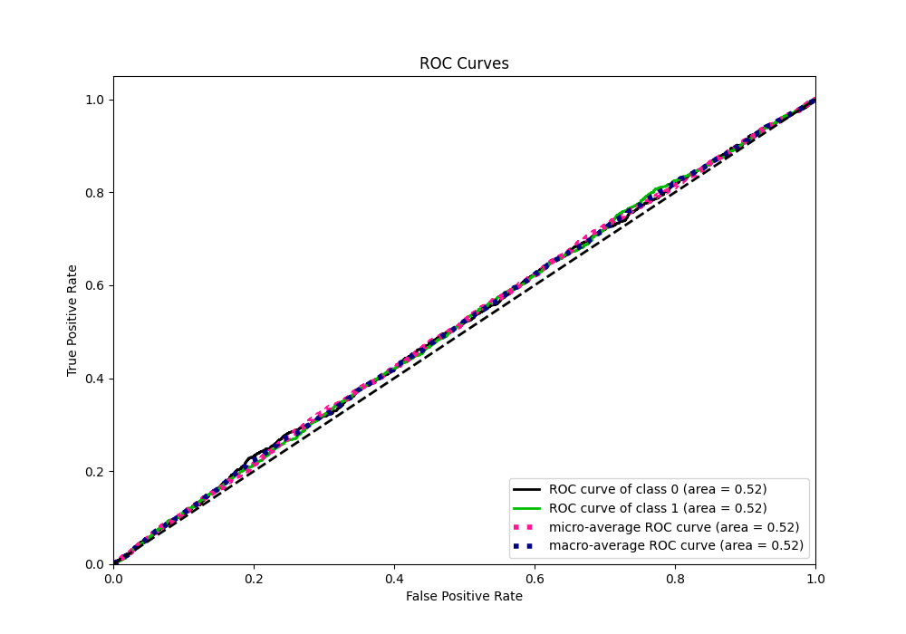
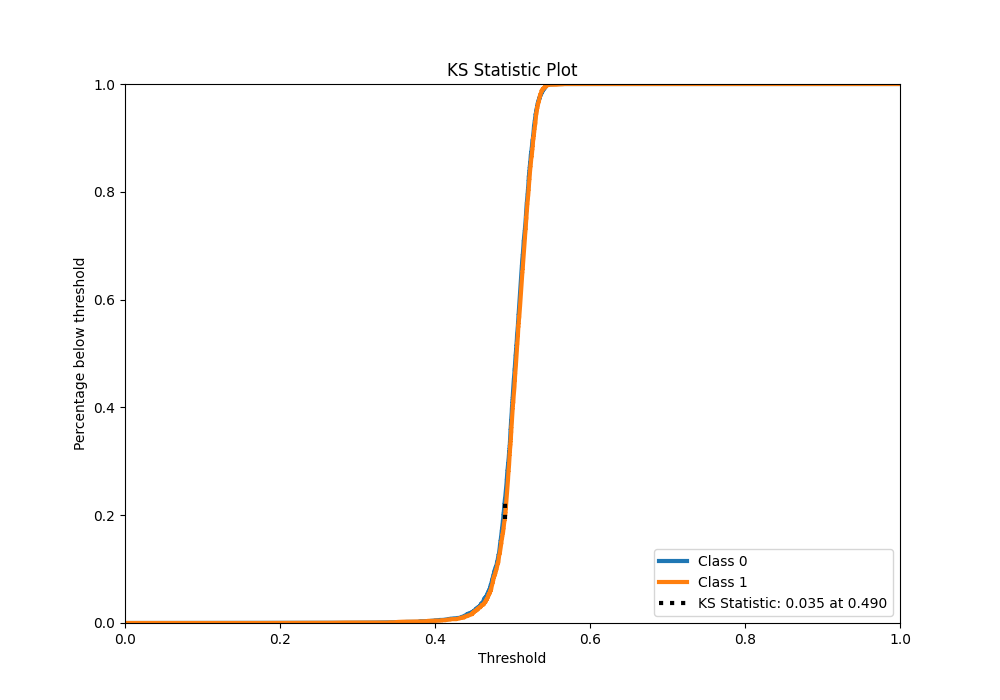
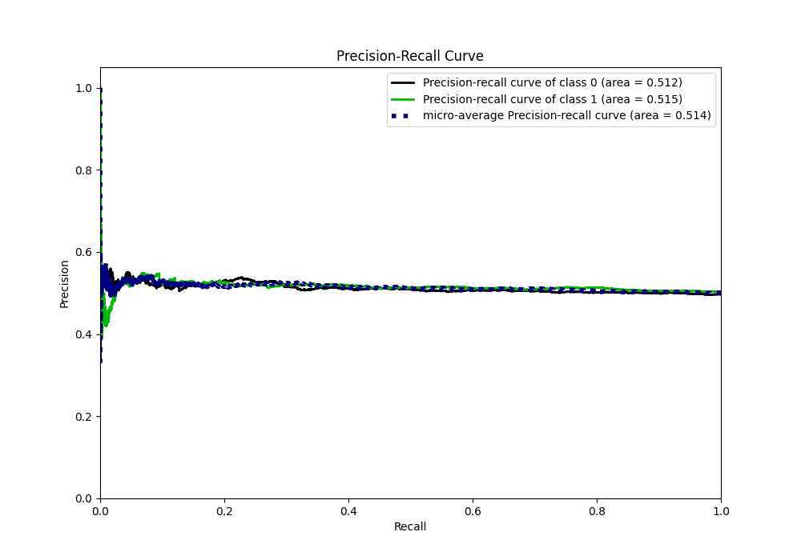
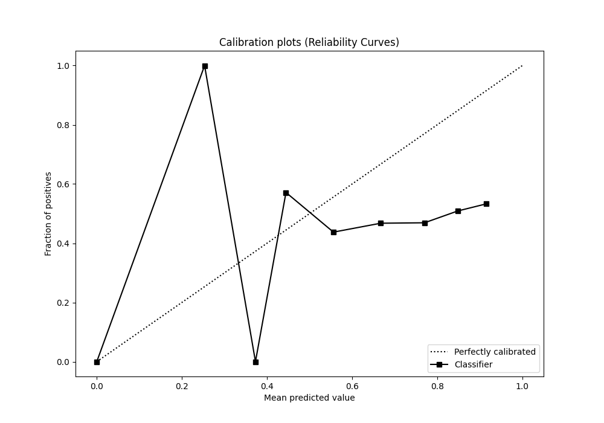
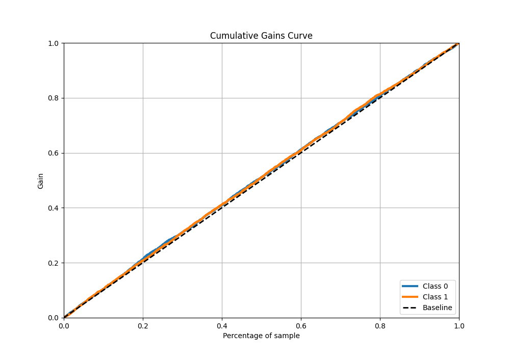
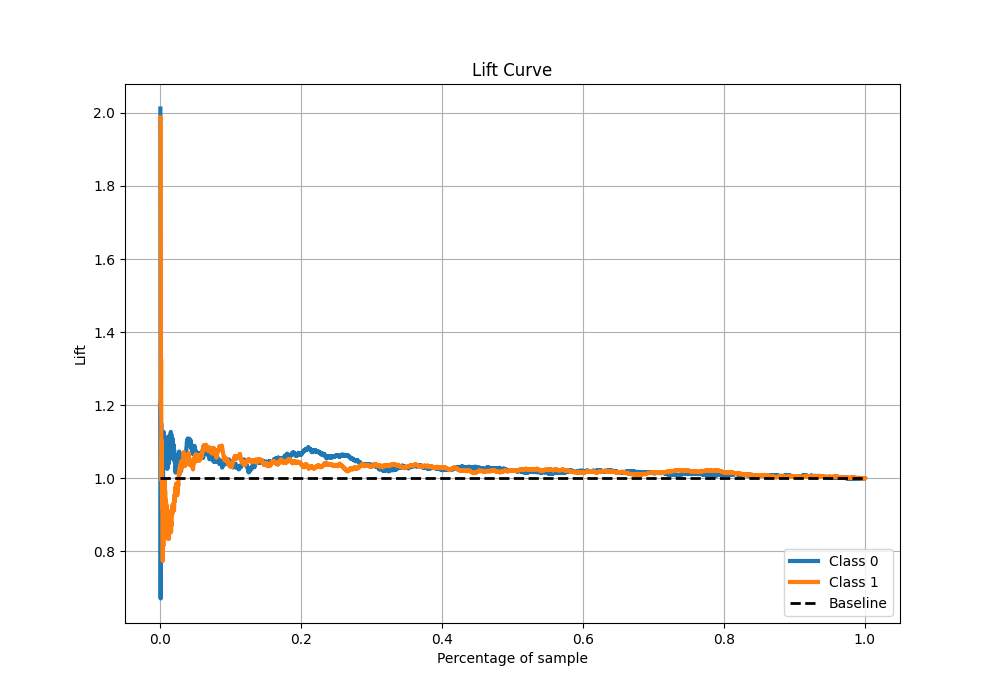

# Summary of 1_Linear

[<< Go back](../README.md)

## Logistic Regression (Linear)
- **n_jobs**: -1
- **explain_level**: 1

## Validation
 - **validation_type**: kfold
 - **k_folds**: 5
 - **shuffle**: True
 - **stratify**: True

## Optimized metric
logloss

## Training time

12.7 seconds

## Metric details
|           |     score |   threshold |
|:----------|----------:|------------:|
| logloss   | 0.692931  |  nan        |
| auc       | 0.516998  |  nan        |
| f1        | 0.669324  |    0.159214 |
| accuracy  | 0.519169  |    0.490051 |
| precision | 0.547231  |    0.529857 |
| recall    | 1         |    0.159214 |
| mcc       | 0.0428073 |    0.490051 |

## Metric details with threshold from accuracy metric
|           |     score |   threshold |
|:----------|----------:|------------:|
| logloss   | 0.692931  |  nan        |
| auc       | 0.516998  |  nan        |
| f1        | 0.628166  |    0.490051 |
| accuracy  | 0.519169  |    0.490051 |
| precision | 0.514026  |    0.490051 |
| recall    | 0.807463  |    0.490051 |
| mcc       | 0.0428073 |    0.490051 |

## Confusion matrix (at threshold=0.490051)
|              |   Predicted as 0 |   Predicted as 1 |
|:-------------|-----------------:|-----------------:|
| Labeled as 0 |              566 |             1923 |
| Labeled as 1 |              485 |             2034 |

## Learning curves

## Coefficients
| feature          |    Learner_1 |   Learner_2 |    Learner_3 |    Learner_4 |    Learner_5 |
|:-----------------|-------------:|------------:|-------------:|-------------:|-------------:|
| Open Price       |  0.00844577  |  0.011005   |  0.0107737   |  0.733385    | -0.000373848 |
| MA10             |  0.00220379  |  0.00511782 |  0.00530451  |  0.425935    | -0.000306456 |
| Low Price        |  0.0017879   |  0.00718067 |  0.00680323  |  0.300302    | -0.00484426  |
| Prev Close Price |  0.00402798  |  0.00638772 |  0.00802777  |  0.0510732   | -0.00414611  |
| intercept        |  0.0115005   |  0.0117043  |  0.0117408   |  0.0113089   |  0.0114679   |
| Volume           |  0.00296468  |  0.0112082  |  0.019345    |  0.000472649 | -0.0224899   |
| MA5              |  0.000886647 |  0.00418098 |  0.00927888  | -0.0114359   | -0.00398543  |
| Dividend         | -0.0122947   | -0.00941501 | -0.000852388 |  0.0186236   | -0.00638821  |
| High Price       |  0.00674084  |  0.00705323 |  0.00163672  | -0.081236    | -0.00218534  |
| MA20             |  0.0017767   |  0.00265821 | -0.00297175  | -0.163163    | -0.00315926  |
| Prev Volume      | -0.0816156   | -0.0564738  | -0.080061    | -0.0785142   | -0.106373    |
| Close Price      | -0.0112739   | -0.00912379 | -0.0111908   | -1.24648     | -0.0152322   |

## Permutation-based Importance

## Confusion Matrix

## Normalized Confusion Matrix

## ROC Curve

## Kolmogorov-Smirnov Statistic

## Precision-Recall Curve

## Calibration Curve

## Cumulative Gains Curve

## Lift Curve

[<< Go back](../README.md)
