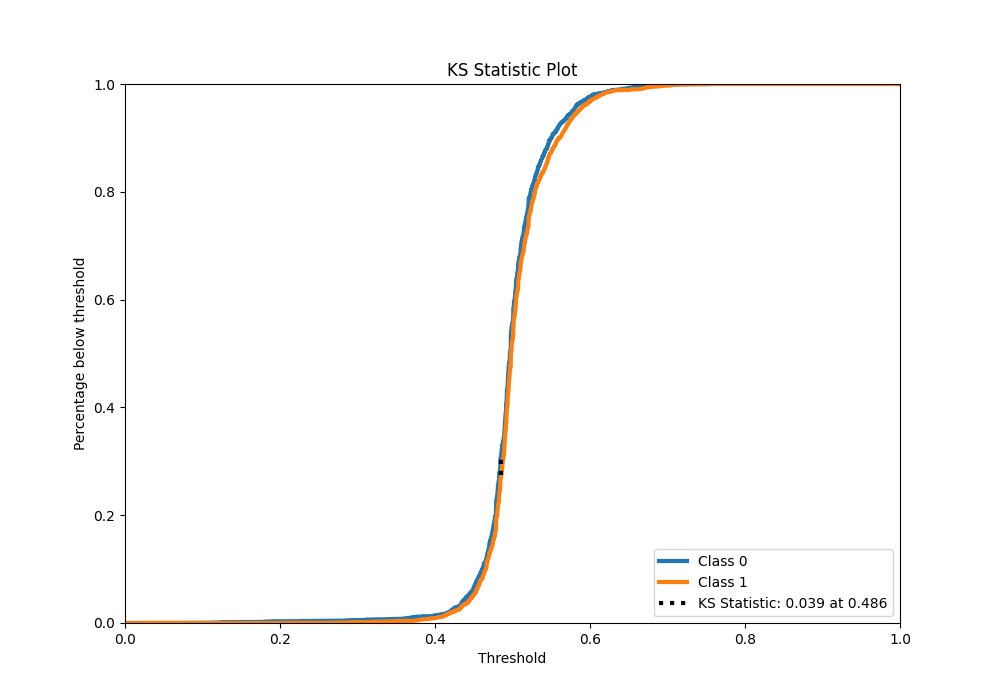

# Summary of 22_RandomForest

[<< Go back](../README.md)

## Random Forest
- **n_jobs**: -1
- **criterion**: entropy
- **max_features**: 0.6
- **min_samples_split**: 50
- **max_depth**: 6
- **eval_metric_name**: logloss
- **explain_level**: 1

## Validation
 - **validation_type**: kfold
 - **k_folds**: 5
 - **shuffle**: True
 - **stratify**: True

## Optimized metric
logloss

## Training time

10.3 seconds

## Metric details
|           |     score |   threshold |
|:----------|----------:|------------:|
| logloss   | 0.692001  | nan         |
| auc       | 0.526234  | nan         |
| f1        | 0.669324  |   0.0931587 |
| accuracy  | 0.521166  |   0.482722  |
| precision | 0.57767   |   0.587073  |
| recall    | 1         |   0.0931587 |
| mcc       | 0.0450727 |   0.482722  |

## Metric details with threshold from accuracy metric
|           |     score |   threshold |
|:----------|----------:|------------:|
| logloss   | 0.692001  |  nan        |
| auc       | 0.526234  |  nan        |
| f1        | 0.615459  |    0.482722 |
| accuracy  | 0.521166  |    0.482722 |
| precision | 0.516277  |    0.482722 |
| recall    | 0.76181   |    0.482722 |
| mcc       | 0.0450727 |    0.482722 |

## Confusion matrix (at threshold=0.482722)
|              |   Predicted as 0 |   Predicted as 1 |
|:-------------|-----------------:|-----------------:|
| Labeled as 0 |              691 |             1798 |
| Labeled as 1 |              600 |             1919 |

## Learning curves

## Permutation-based Importance

## Confusion Matrix

## Normalized Confusion Matrix

## ROC Curve

## Kolmogorov-Smirnov Statistic

## Precision-Recall Curve

## Calibration Curve

## Cumulative Gains Curve

## Lift Curve

[<< Go back](../README.md)
