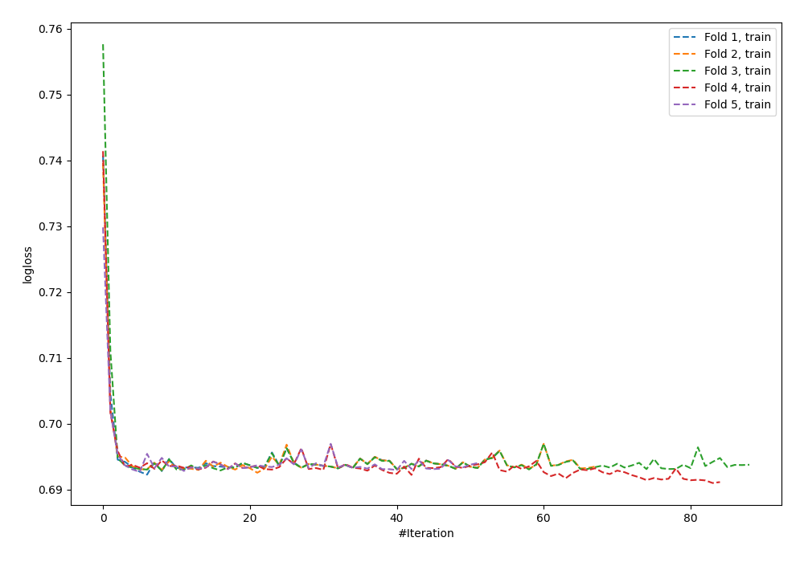
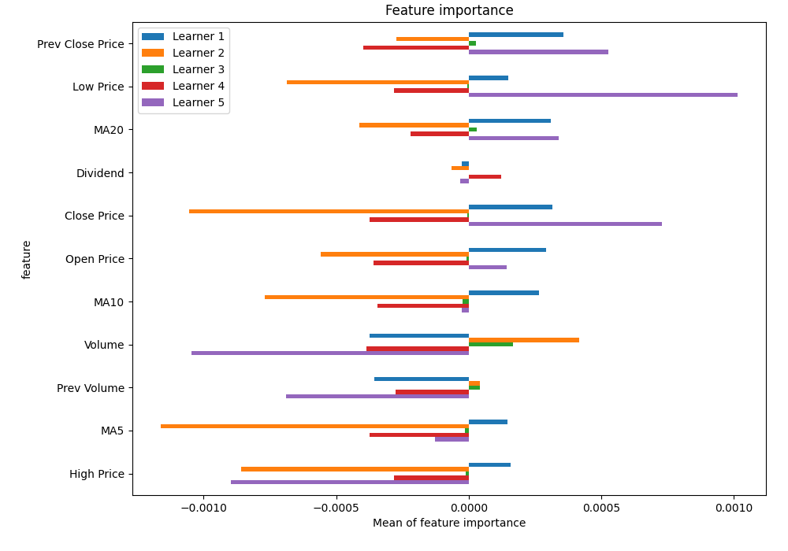
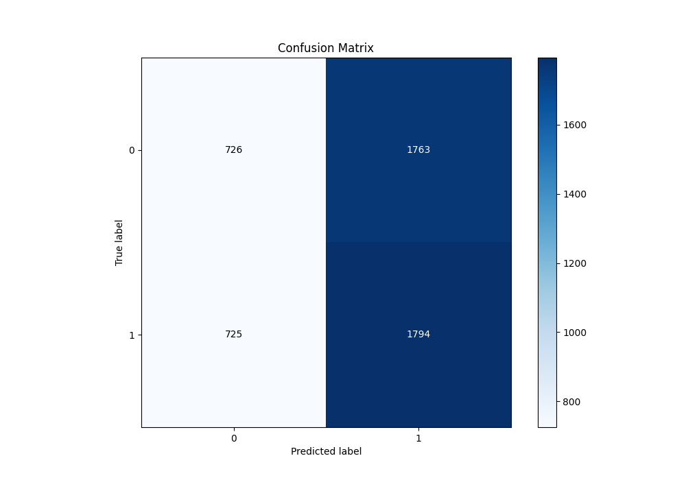
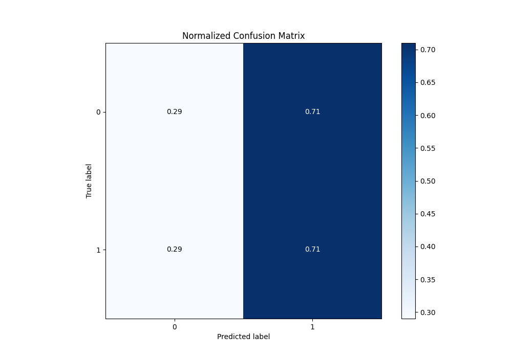
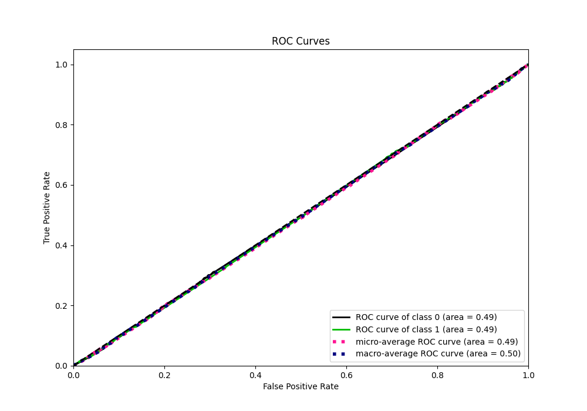
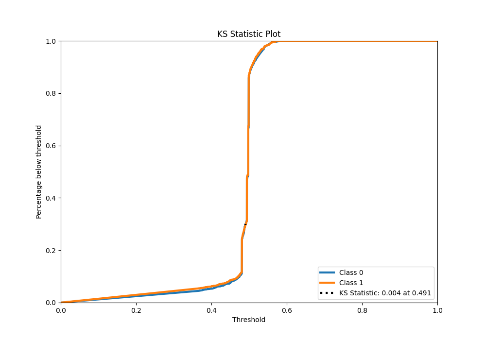
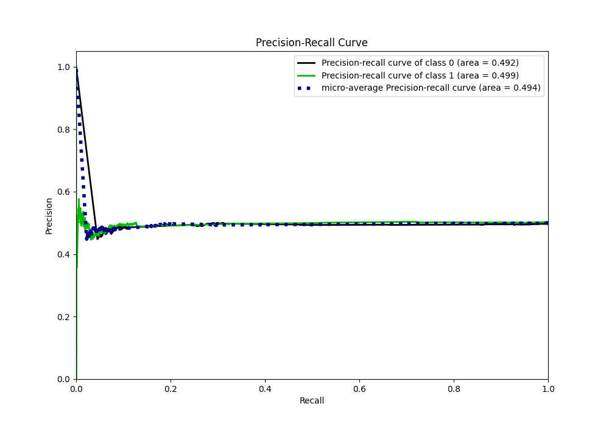
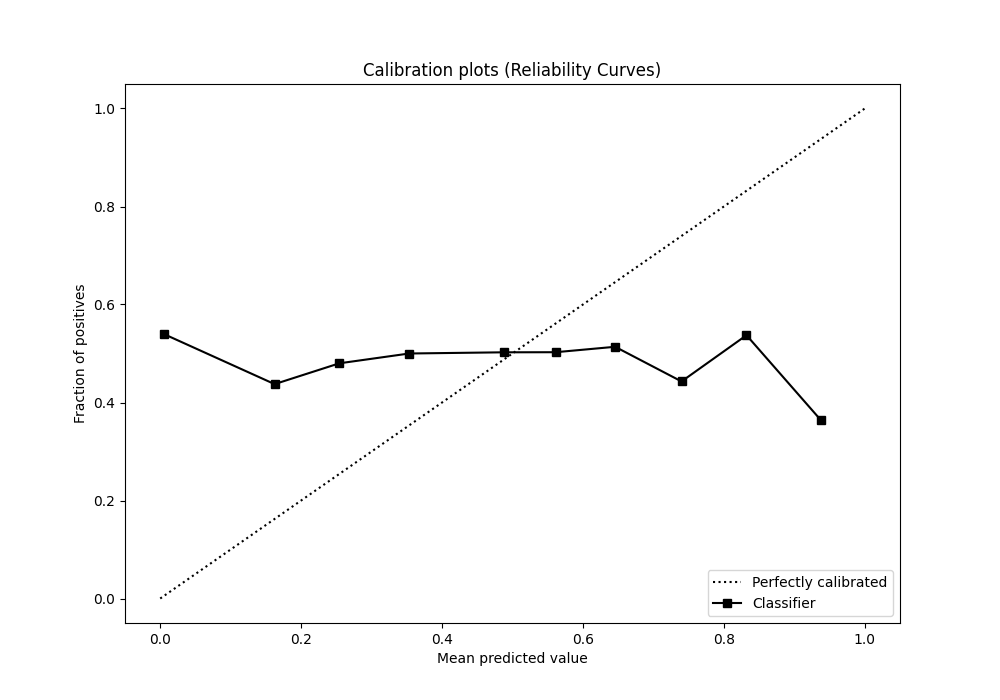
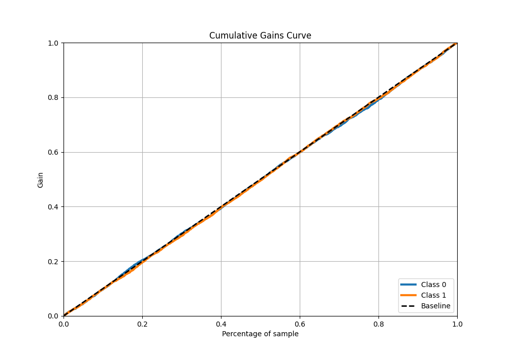
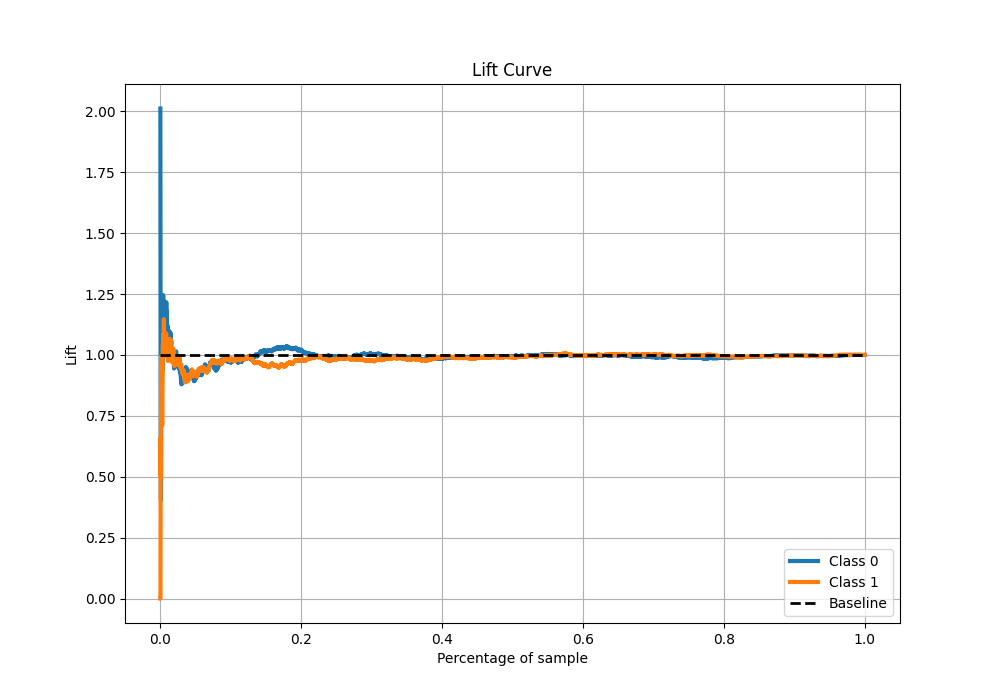

# Summary of 23_NeuralNetwork

[<< Go back](../README.md)

## Neural Network
- **n_jobs**: -1
- **dense_1_size**: 32
- **dense_2_size**: 4
- **learning_rate**: 0.05
- **explain_level**: 1

## Validation
 - **validation_type**: kfold
 - **k_folds**: 5
 - **shuffle**: True
 - **stratify**: True

## Optimized metric
logloss

## Training time

6.6 seconds

## Metric details
|           |      score |   threshold |
|:----------|-----------:|------------:|
| logloss   | 0.697174   |  nan        |
| auc       | 0.494984   |  nan        |
| f1        | 0.669324   |    0.330417 |
| accuracy  | 0.503195   |    0.488889 |
| precision | 0.508772   |    0.554791 |
| recall    | 1          |    0.330417 |
| mcc       | 0.00426628 |    0.488889 |

## Metric details with threshold from accuracy metric
|           |      score |   threshold |
|:----------|-----------:|------------:|
| logloss   | 0.697174   |  nan        |
| auc       | 0.494984   |  nan        |
| f1        | 0.59052    |    0.488889 |
| accuracy  | 0.503195   |    0.488889 |
| precision | 0.504358   |    0.488889 |
| recall    | 0.712187   |    0.488889 |
| mcc       | 0.00426628 |    0.488889 |

## Confusion matrix (at threshold=0.488889)
|              |   Predicted as 0 |   Predicted as 1 |
|:-------------|-----------------:|-----------------:|
| Labeled as 0 |              726 |             1763 |
| Labeled as 1 |              725 |             1794 |

## Learning curves

## Permutation-based Importance

## Confusion Matrix

## Normalized Confusion Matrix

## ROC Curve

## Kolmogorov-Smirnov Statistic

## Precision-Recall Curve

## Calibration Curve

## Cumulative Gains Curve

## Lift Curve

[<< Go back](../README.md)
