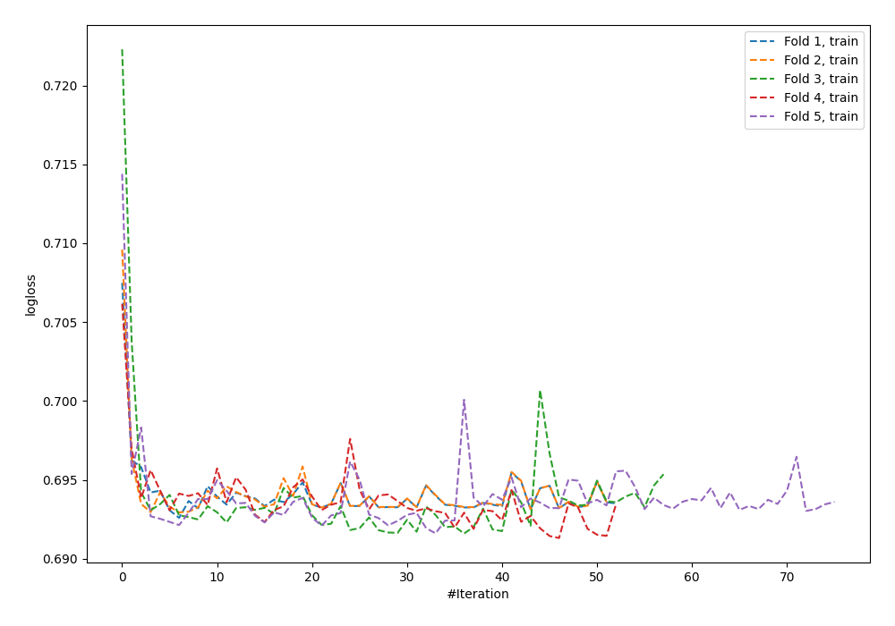
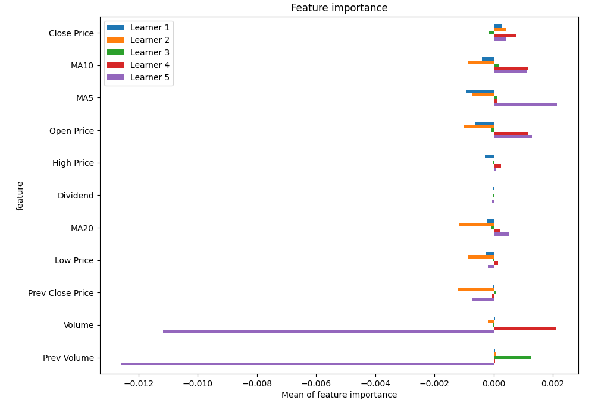
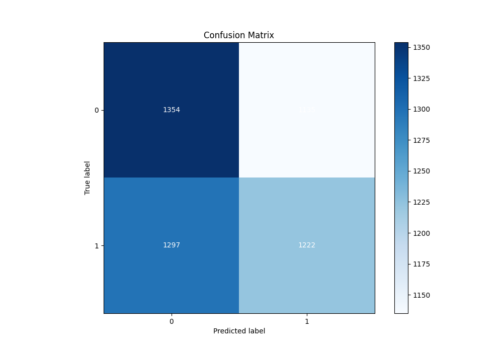
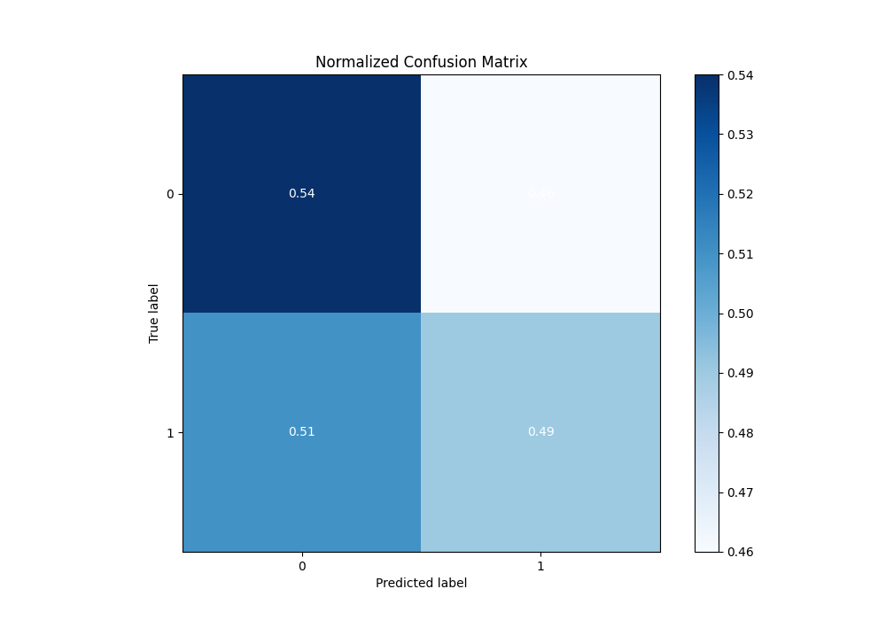
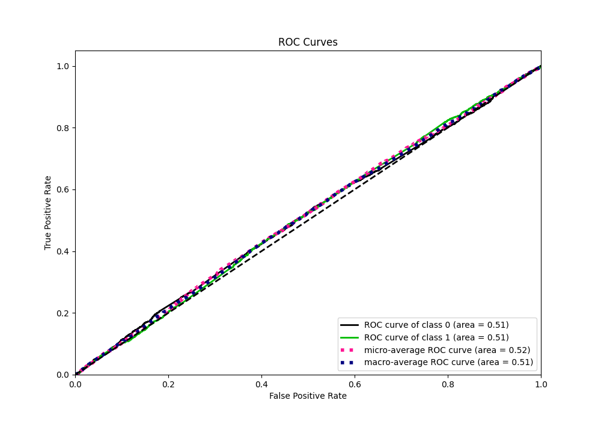
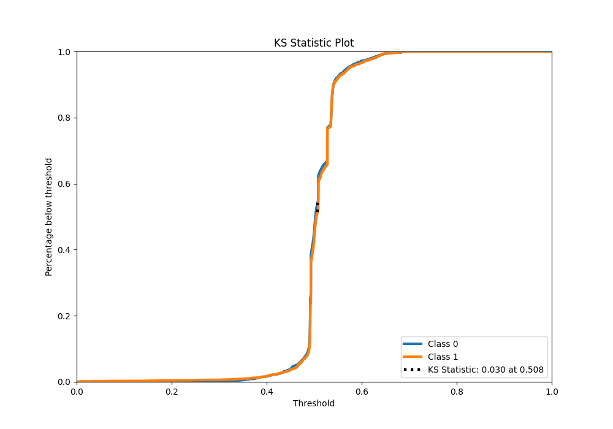
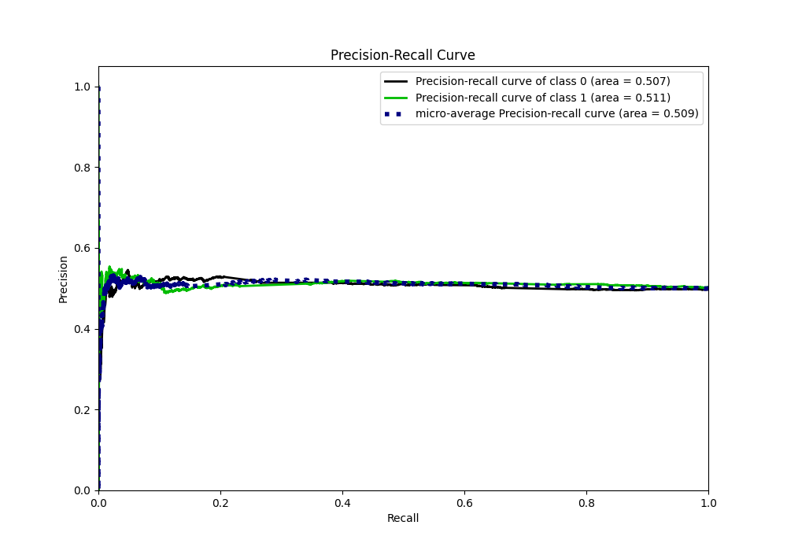
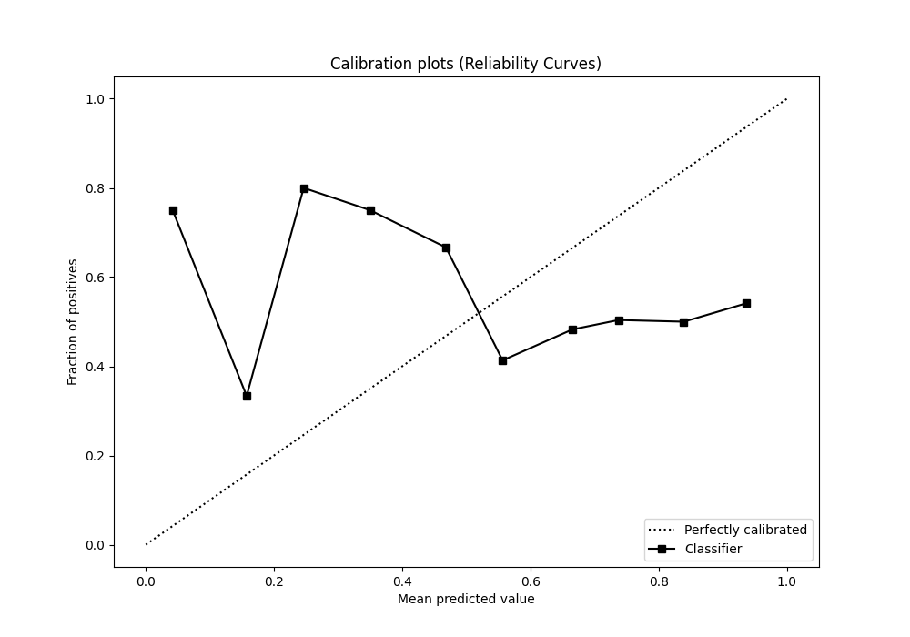
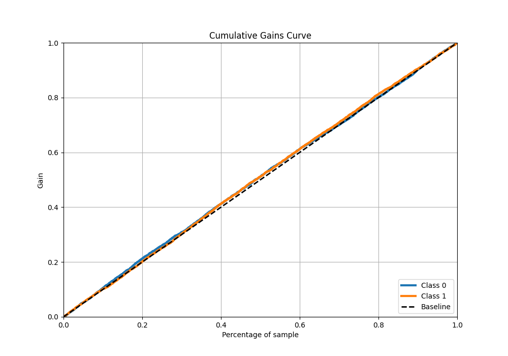
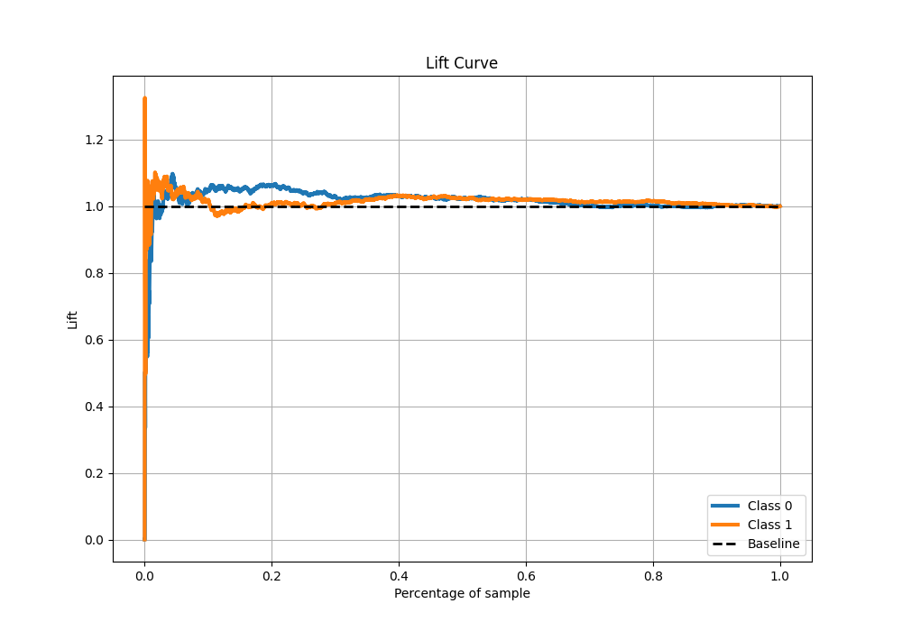

# Summary of 26_NeuralNetwork

[<< Go back](../README.md)

## Neural Network
- **n_jobs**: -1
- **dense_1_size**: 32
- **dense_2_size**: 32
- **learning_rate**: 0.05
- **explain_level**: 1

## Validation
 - **validation_type**: kfold
 - **k_folds**: 5
 - **shuffle**: True
 - **stratify**: True

## Optimized metric
logloss

## Training time

19.1 seconds

## Metric details
|           |     score |    threshold |
|:----------|----------:|-------------:|
| logloss   | 0.69951   | nan          |
| auc       | 0.513316  | nan          |
| f1        | 0.669324  |   0.00296094 |
| accuracy  | 0.514377  |   0.5077     |
| precision | 0.547771  |   0.599775   |
| recall    | 1         |   0.00296094 |
| mcc       | 0.0298834 |   0.491658   |

## Metric details with threshold from accuracy metric
|           |     score |   threshold |
|:----------|----------:|------------:|
| logloss   | 0.69951   |    nan      |
| auc       | 0.513316  |    nan      |
| f1        | 0.501231  |      0.5077 |
| accuracy  | 0.514377  |      0.5077 |
| precision | 0.518456  |      0.5077 |
| recall    | 0.485113  |      0.5077 |
| mcc       | 0.0291565 |      0.5077 |

## Confusion matrix (at threshold=0.5077)
|              |   Predicted as 0 |   Predicted as 1 |
|:-------------|-----------------:|-----------------:|
| Labeled as 0 |             1354 |             1135 |
| Labeled as 1 |             1297 |             1222 |

## Learning curves

## Permutation-based Importance

## Confusion Matrix

## Normalized Confusion Matrix

## ROC Curve

## Kolmogorov-Smirnov Statistic

## Precision-Recall Curve

## Calibration Curve

## Cumulative Gains Curve

## Lift Curve

[<< Go back](../README.md)
