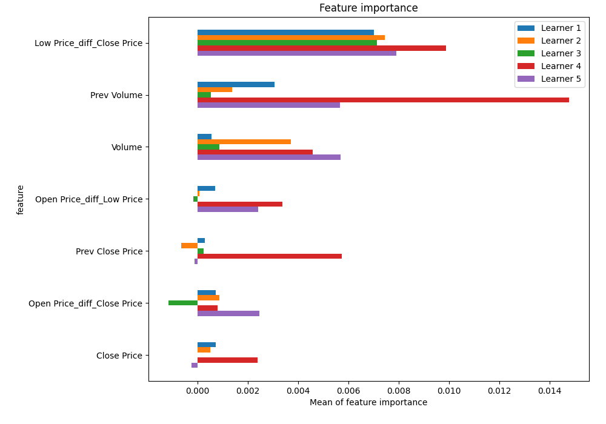
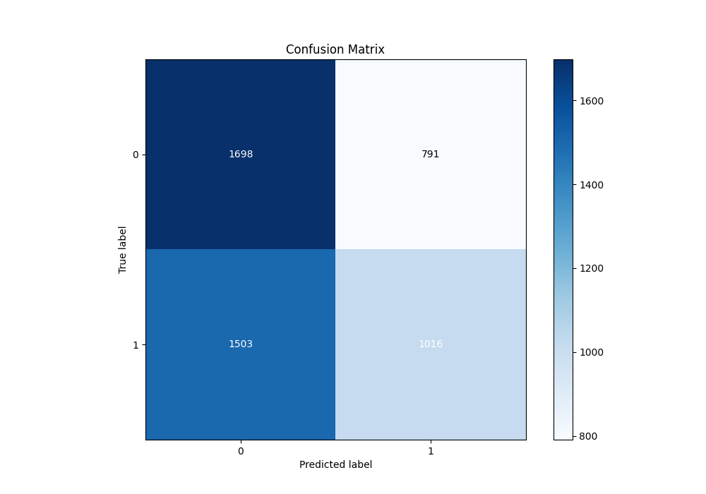

# Summary of 27_CatBoost_GoldenFeatures_SelectedFeatures

[<< Go back](../README.md)

## CatBoost
- **n_jobs**: -1
- **learning_rate**: 0.1
- **depth**: 7
- **rsm**: 1.0
- **loss_function**: Logloss
- **eval_metric**: Logloss
- **explain_level**: 1

## Validation
 - **validation_type**: kfold
 - **k_folds**: 5
 - **shuffle**: True
 - **stratify**: True

## Optimized metric
logloss

## Training time

23.8 seconds

## Metric details
|           |    score |   threshold |
|:----------|---------:|------------:|
| logloss   | 0.686666 |  nan        |
| auc       | 0.558165 |  nan        |
| f1        | 0.670412 |    0.368068 |
| accuracy  | 0.541933 |    0.513859 |
| precision | 0.71028  |    0.621084 |
| recall    | 1        |    0.161708 |
| mcc       | 0.100154 |    0.537032 |

## Metric details with threshold from accuracy metric
|           |     score |   threshold |
|:----------|----------:|------------:|
| logloss   | 0.686666  |  nan        |
| auc       | 0.558165  |  nan        |
| f1        | 0.469718  |    0.513859 |
| accuracy  | 0.541933  |    0.513859 |
| precision | 0.562258  |    0.513859 |
| recall    | 0.403335  |    0.513859 |
| mcc       | 0.0890544 |    0.513859 |

## Confusion matrix (at threshold=0.513859)
|              |   Predicted as 0 |   Predicted as 1 |
|:-------------|-----------------:|-----------------:|
| Labeled as 0 |             1698 |              791 |
| Labeled as 1 |             1503 |             1016 |

## Learning curves

## Permutation-based Importance

## Confusion Matrix

## Normalized Confusion Matrix

## ROC Curve

## Kolmogorov-Smirnov Statistic

## Precision-Recall Curve

## Calibration Curve

## Cumulative Gains Curve

## Lift Curve

[<< Go back](../README.md)
