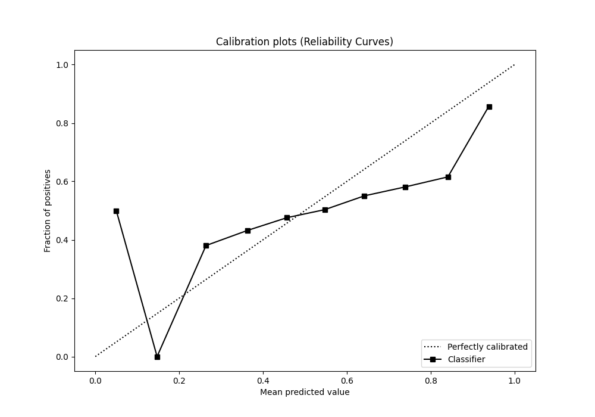

# Summary of 28_CatBoost_GoldenFeatures_SelectedFeatures

[<< Go back](../README.md)

## CatBoost
- **n_jobs**: -1
- **learning_rate**: 0.1
- **depth**: 9
- **rsm**: 1.0
- **loss_function**: Logloss
- **eval_metric**: Logloss
- **explain_level**: 1

## Validation
 - **validation_type**: kfold
 - **k_folds**: 5
 - **shuffle**: True
 - **stratify**: True

## Optimized metric
logloss

## Training time

30.9 seconds

## Metric details
|           |    score |   threshold |
|:----------|---------:|------------:|
| logloss   | 0.688358 |  nan        |
| auc       | 0.552091 |  nan        |
| f1        | 0.669324 |    0.244367 |
| accuracy  | 0.537141 |    0.501165 |
| precision | 0.635514 |    0.607956 |
| recall    | 1        |    0.244367 |
| mcc       | 0.082922 |    0.540012 |

## Metric details with threshold from accuracy metric
|           |     score |   threshold |
|:----------|----------:|------------:|
| logloss   | 0.688358  |  nan        |
| auc       | 0.552091  |  nan        |
| f1        | 0.538798  |    0.501165 |
| accuracy  | 0.537141  |    0.501165 |
| precision | 0.540088  |    0.501165 |
| recall    | 0.537515  |    0.501165 |
| mcc       | 0.0742754 |    0.501165 |

## Confusion matrix (at threshold=0.501165)
|              |   Predicted as 0 |   Predicted as 1 |
|:-------------|-----------------:|-----------------:|
| Labeled as 0 |             1336 |             1153 |
| Labeled as 1 |             1165 |             1354 |

## Learning curves

## Permutation-based Importance

## Confusion Matrix

## Normalized Confusion Matrix

## ROC Curve

## Kolmogorov-Smirnov Statistic

## Precision-Recall Curve

## Calibration Curve

## Cumulative Gains Curve

## Lift Curve

[<< Go back](../README.md)
