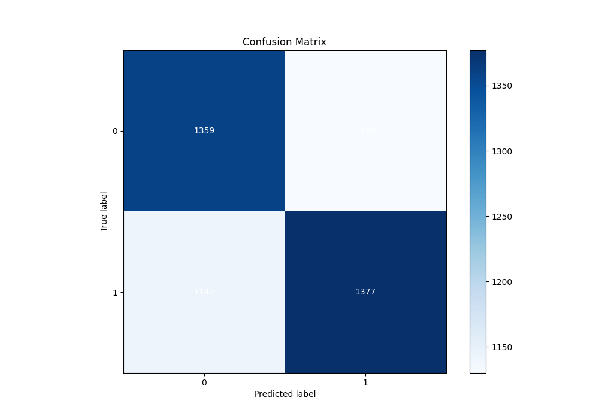

# Summary of 29_CatBoost_GoldenFeatures

[<< Go back](../README.md)

## CatBoost
- **n_jobs**: -1
- **learning_rate**: 0.1
- **depth**: 9
- **rsm**: 1.0
- **loss_function**: Logloss
- **eval_metric**: Logloss
- **explain_level**: 1

## Validation
 - **validation_type**: kfold
 - **k_folds**: 5
 - **shuffle**: True
 - **stratify**: True

## Optimized metric
logloss

## Training time

40.5 seconds

## Metric details
|           |     score |   threshold |
|:----------|----------:|------------:|
| logloss   | 0.688371  |  nan        |
| auc       | 0.556091  |  nan        |
| f1        | 0.669342  |    0.395221 |
| accuracy  | 0.546326  |    0.498891 |
| precision | 0.666667  |    0.631442 |
| recall    | 1         |    0.260163 |
| mcc       | 0.0926463 |    0.498891 |

## Metric details with threshold from accuracy metric
|           |     score |   threshold |
|:----------|----------:|------------:|
| logloss   | 0.688371  |  nan        |
| auc       | 0.556091  |  nan        |
| f1        | 0.547951  |    0.498891 |
| accuracy  | 0.546326  |    0.498891 |
| precision | 0.549262  |    0.498891 |
| recall    | 0.546645  |    0.498891 |
| mcc       | 0.0926463 |    0.498891 |

## Confusion matrix (at threshold=0.498891)
|              |   Predicted as 0 |   Predicted as 1 |
|:-------------|-----------------:|-----------------:|
| Labeled as 0 |             1359 |             1130 |
| Labeled as 1 |             1142 |             1377 |

## Learning curves

## Permutation-based Importance

## Confusion Matrix

## Normalized Confusion Matrix

## ROC Curve

## Kolmogorov-Smirnov Statistic

## Precision-Recall Curve

## Calibration Curve

## Cumulative Gains Curve

## Lift Curve

[<< Go back](../README.md)
