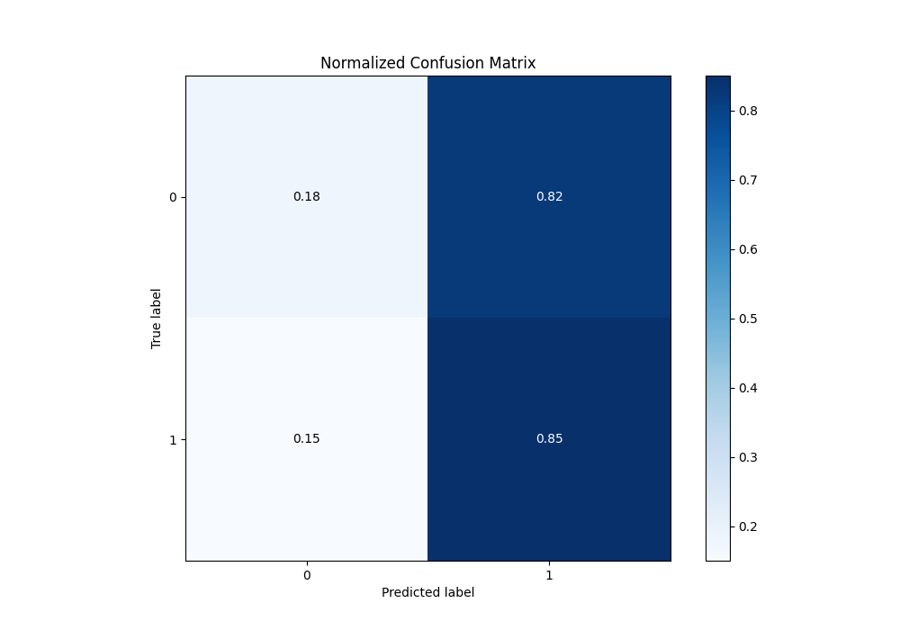
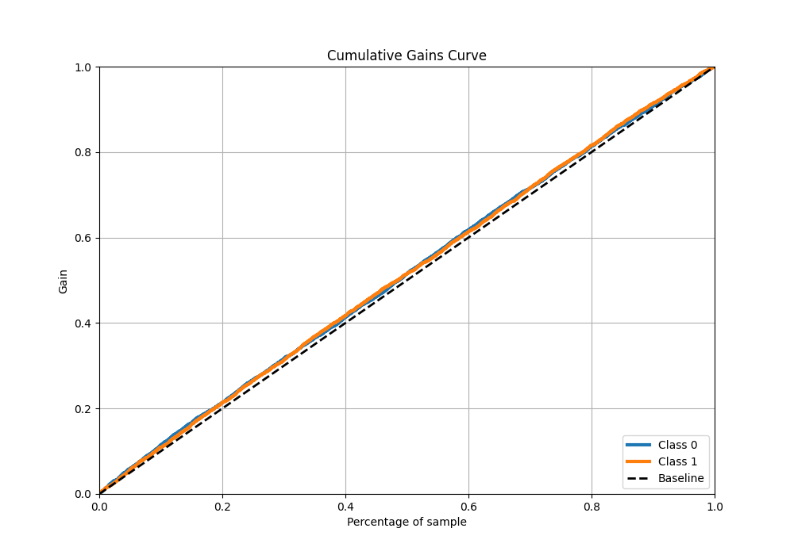

# Summary of 36_RandomForest

[<< Go back](../README.md)

## Random Forest
- **n_jobs**: -1
- **criterion**: gini
- **max_features**: 0.7
- **min_samples_split**: 40
- **max_depth**: 3
- **eval_metric_name**: logloss
- **explain_level**: 1

## Validation
 - **validation_type**: kfold
 - **k_folds**: 5
 - **shuffle**: True
 - **stratify**: True

## Optimized metric
logloss

## Training time

35.3 seconds

## Metric details
|           |     score |   threshold |
|:----------|----------:|------------:|
| logloss   | 0.691457  |  nan        |
| auc       | 0.526348  |  nan        |
| f1        | 0.669342  |    0.402003 |
| accuracy  | 0.519569  |    0.483015 |
| precision | 0.649123  |    0.604398 |
| recall    | 1         |    0.149527 |
| mcc       | 0.0519841 |    0.475871 |

## Metric details with threshold from accuracy metric
|           |     score |   threshold |
|:----------|----------:|------------:|
| logloss   | 0.691457  |  nan        |
| auc       | 0.526348  |  nan        |
| f1        | 0.641538  |    0.483015 |
| accuracy  | 0.519569  |    0.483015 |
| precision | 0.513475  |    0.483015 |
| recall    | 0.854704  |    0.483015 |
| mcc       | 0.0475409 |    0.483015 |

## Confusion matrix (at threshold=0.483015)
|              |   Predicted as 0 |   Predicted as 1 |
|:-------------|-----------------:|-----------------:|
| Labeled as 0 |              449 |             2040 |
| Labeled as 1 |              366 |             2153 |

## Learning curves

## Permutation-based Importance

## Confusion Matrix

## Normalized Confusion Matrix

## ROC Curve

## Kolmogorov-Smirnov Statistic

## Precision-Recall Curve

## Calibration Curve

## Cumulative Gains Curve

## Lift Curve

[<< Go back](../README.md)
