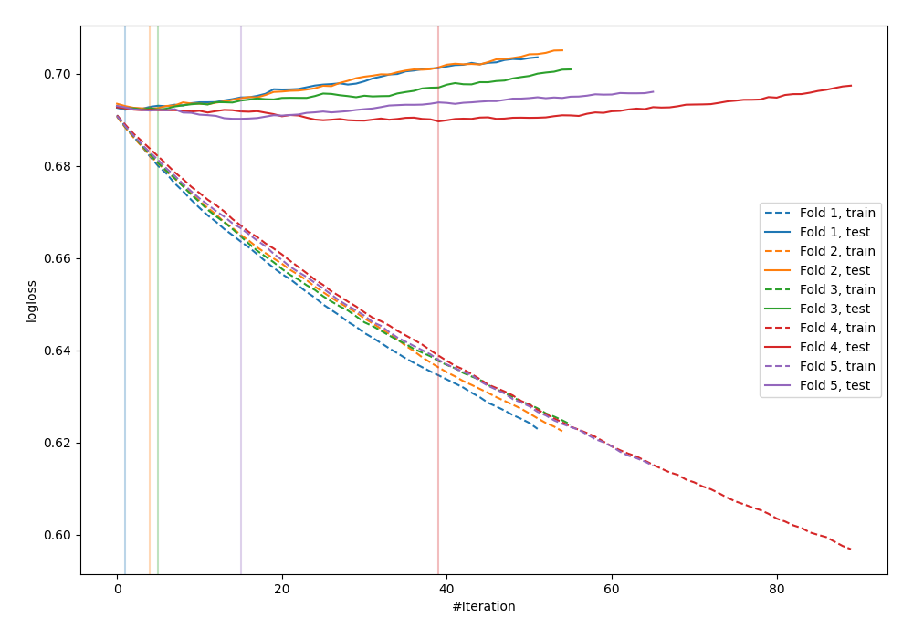
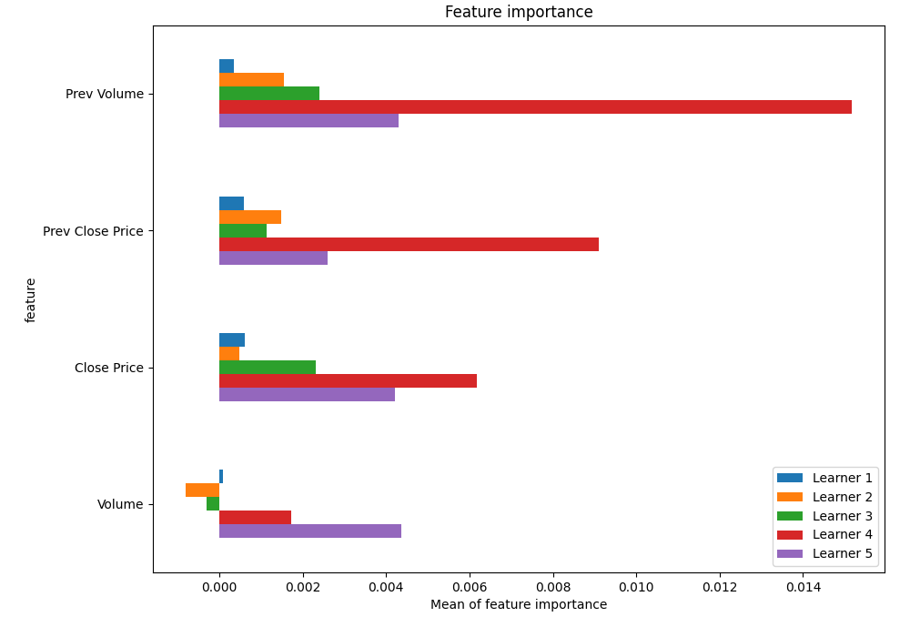
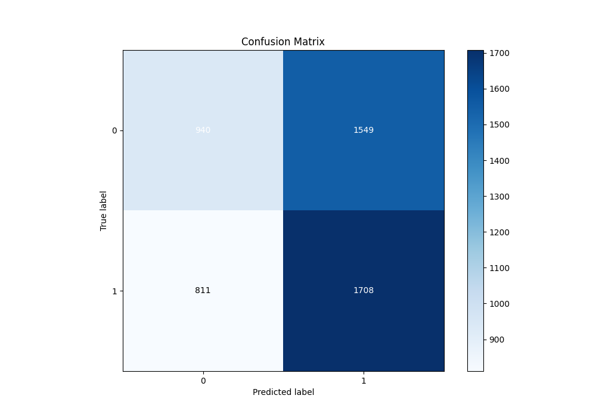
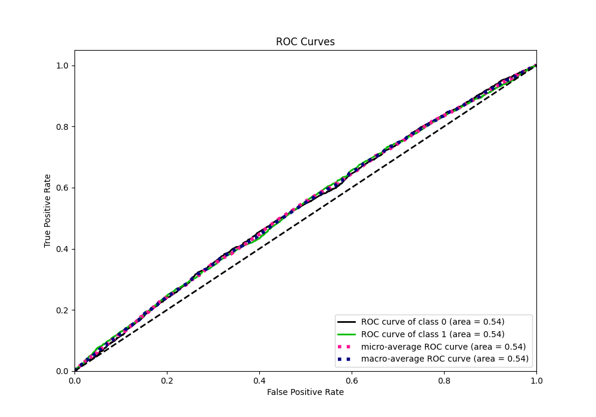
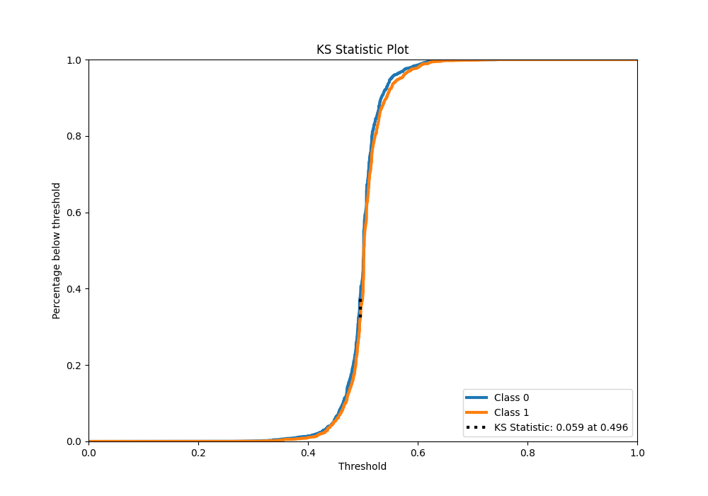
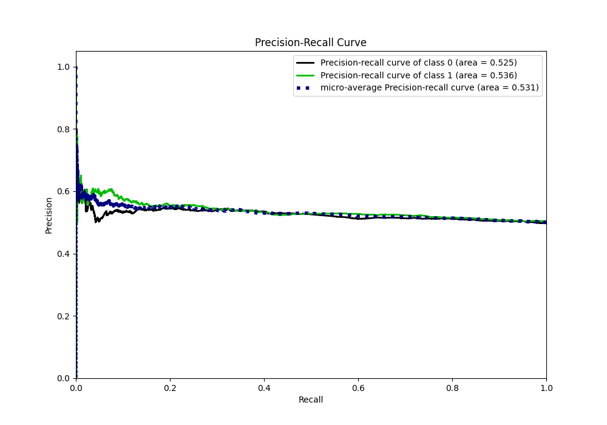
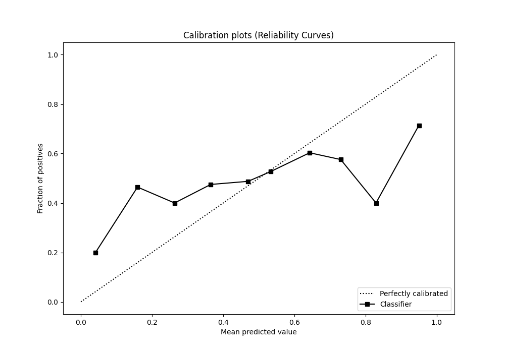
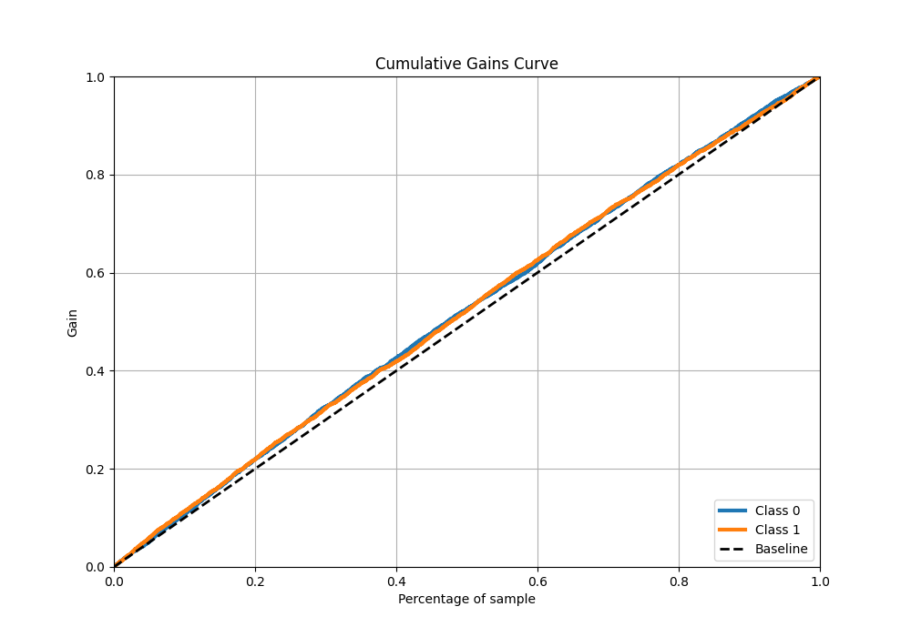
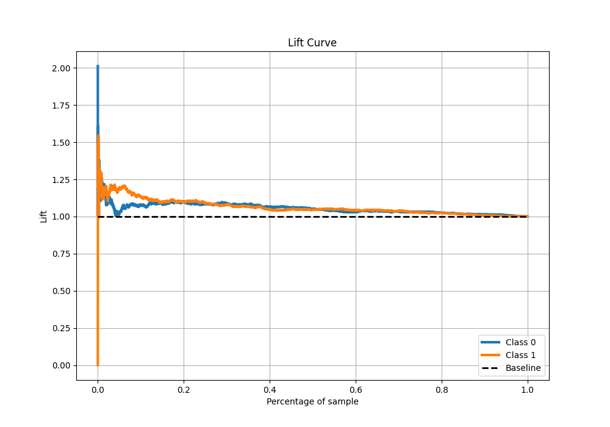

# Summary of 38_LightGBM_SelectedFeatures

[<< Go back](../README.md)

## LightGBM
- **n_jobs**: -1
- **objective**: binary
- **num_leaves**: 31
- **learning_rate**: 0.05
- **feature_fraction**: 0.9
- **bagging_fraction**: 1.0
- **min_data_in_leaf**: 20
- **metric**: binary_logloss
- **custom_eval_metric_name**: None
- **explain_level**: 1

## Validation
 - **validation_type**: kfold
 - **k_folds**: 5
 - **shuffle**: True
 - **stratify**: True

## Optimized metric
logloss

## Training time

24.5 seconds

## Metric details
|           |     score |   threshold |
|:----------|----------:|------------:|
| logloss   | 0.691306  |  nan        |
| auc       | 0.536585  |  nan        |
| f1        | 0.669324  |    0.240562 |
| accuracy  | 0.528754  |    0.495386 |
| precision | 0.605863  |    0.552233 |
| recall    | 1         |    0.240562 |
| mcc       | 0.0587377 |    0.491736 |

## Metric details with threshold from accuracy metric
|           |     score |   threshold |
|:----------|----------:|------------:|
| logloss   | 0.691306  |  nan        |
| auc       | 0.536585  |  nan        |
| f1        | 0.591413  |    0.495386 |
| accuracy  | 0.528754  |    0.495386 |
| precision | 0.524409  |    0.495386 |
| recall    | 0.678047  |    0.495386 |
| mcc       | 0.0584112 |    0.495386 |

## Confusion matrix (at threshold=0.495386)
|              |   Predicted as 0 |   Predicted as 1 |
|:-------------|-----------------:|-----------------:|
| Labeled as 0 |              940 |             1549 |
| Labeled as 1 |              811 |             1708 |

## Learning curves

## Permutation-based Importance

## Confusion Matrix

## Normalized Confusion Matrix

## ROC Curve

## Kolmogorov-Smirnov Statistic

## Precision-Recall Curve

## Calibration Curve

## Cumulative Gains Curve

## Lift Curve

[<< Go back](../README.md)
