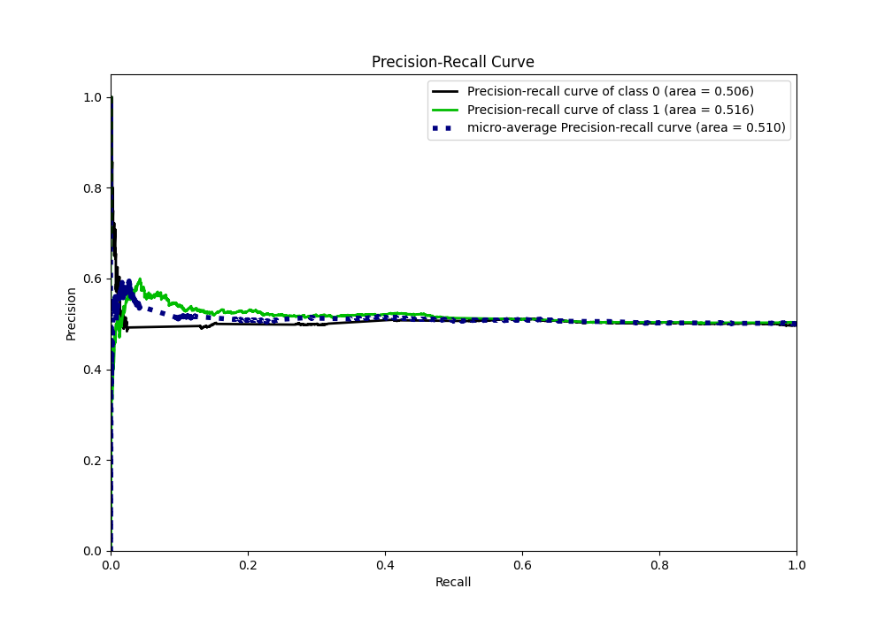

# Summary of 44_NeuralNetwork_SelectedFeatures

[<< Go back](../README.md)

## Neural Network
- **n_jobs**: -1
- **dense_1_size**: 32
- **dense_2_size**: 32
- **learning_rate**: 0.05
- **explain_level**: 1

## Validation
 - **validation_type**: kfold
 - **k_folds**: 5
 - **shuffle**: True
 - **stratify**: True

## Optimized metric
logloss

## Training time

33.5 seconds

## Metric details
|           |     score |   threshold |
|:----------|----------:|------------:|
| logloss   | 0.692905  |  nan        |
| auc       | 0.512208  |  nan        |
| f1        | 0.669324  |    0.384825 |
| accuracy  | 0.516374  |    0.496333 |
| precision | 0.57971   |    0.525664 |
| recall    | 1         |    0.384825 |
| mcc       | 0.0346261 |    0.496333 |

## Metric details with threshold from accuracy metric
|           |     score |   threshold |
|:----------|----------:|------------:|
| logloss   | 0.692905  |  nan        |
| auc       | 0.512208  |  nan        |
| f1        | 0.46487   |    0.496333 |
| accuracy  | 0.516374  |    0.496333 |
| precision | 0.524165  |    0.496333 |
| recall    | 0.417626  |    0.496333 |
| mcc       | 0.0346261 |    0.496333 |

## Confusion matrix (at threshold=0.496333)
|              |   Predicted as 0 |   Predicted as 1 |
|:-------------|-----------------:|-----------------:|
| Labeled as 0 |             1534 |              955 |
| Labeled as 1 |             1467 |             1052 |

## Learning curves

## Permutation-based Importance

## Confusion Matrix

## Normalized Confusion Matrix

## ROC Curve

## Kolmogorov-Smirnov Statistic

## Precision-Recall Curve

## Calibration Curve

## Cumulative Gains Curve

## Lift Curve

[<< Go back](../README.md)
