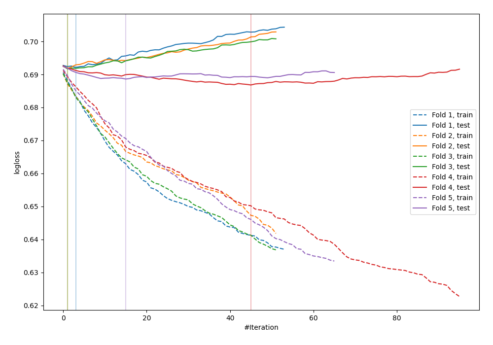
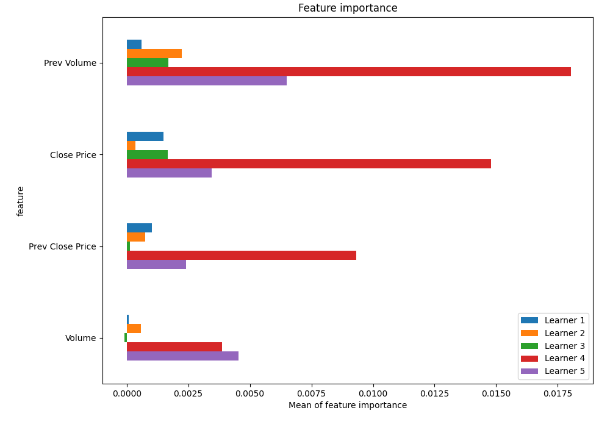
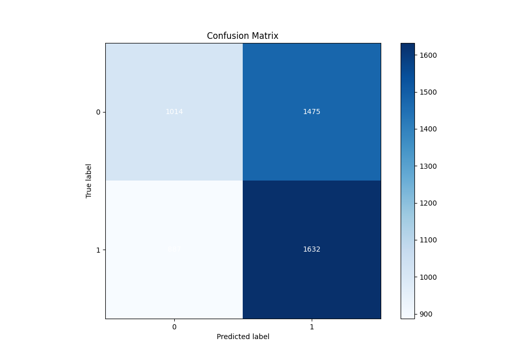
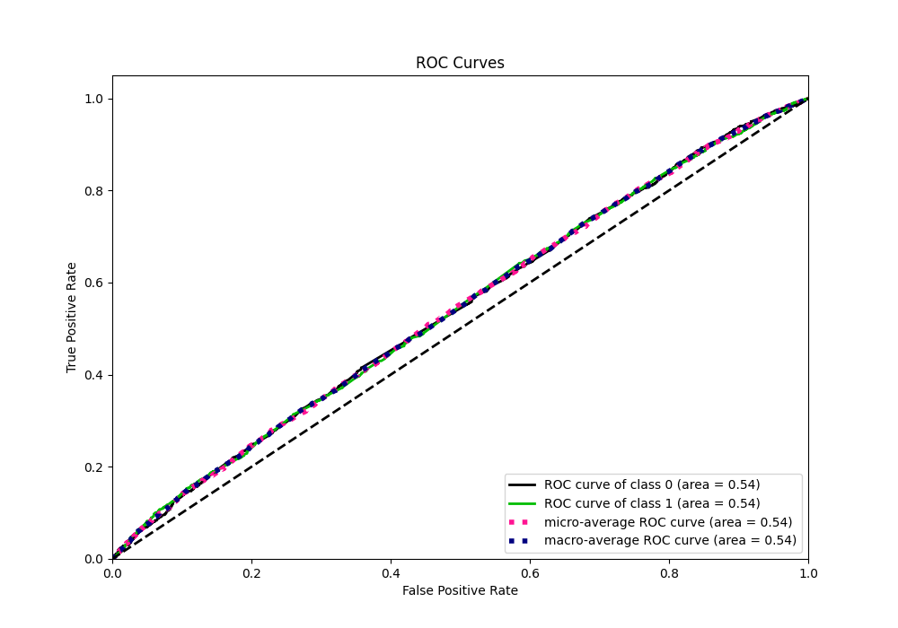
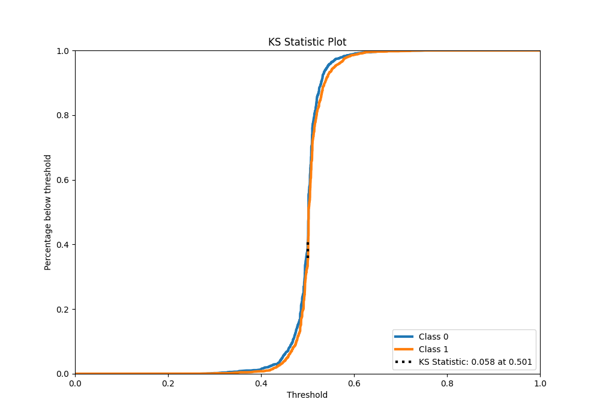
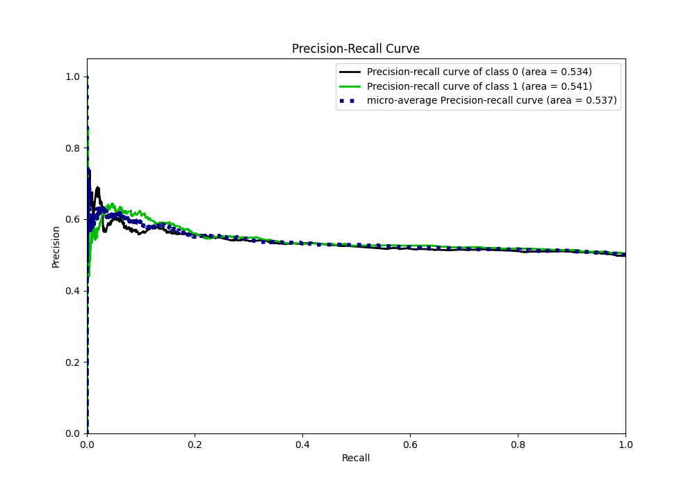
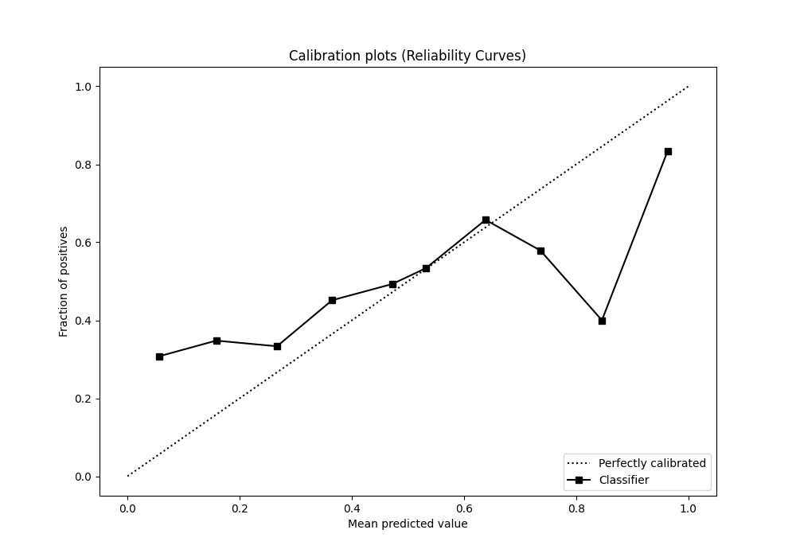
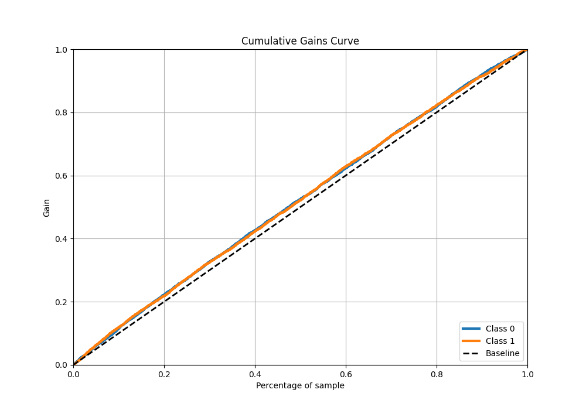
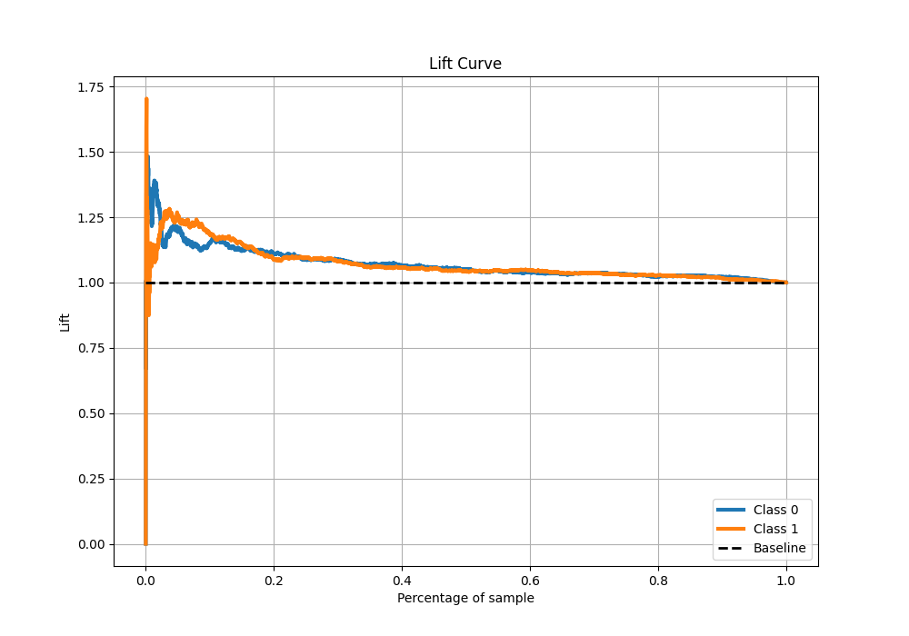

# Summary of 46_Xgboost_SelectedFeatures

[<< Go back](../README.md)

## Extreme Gradient Boosting (Xgboost)
- **n_jobs**: -1
- **objective**: binary:logistic
- **eta**: 0.075
- **max_depth**: 6
- **min_child_weight**: 5
- **subsample**: 1.0
- **colsample_bytree**: 1.0
- **eval_metric**: logloss
- **explain_level**: 1

## Validation
 - **validation_type**: kfold
 - **k_folds**: 5
 - **shuffle**: True
 - **stratify**: True

## Optimized metric
logloss

## Training time

22.3 seconds

## Metric details
|           |     score |   threshold |
|:----------|----------:|------------:|
| logloss   | 0.690206  |  nan        |
| auc       | 0.540396  |  nan        |
| f1        | 0.669324  |    0.241686 |
| accuracy  | 0.528355  |    0.500899 |
| precision | 0.636943  |    0.569739 |
| recall    | 1         |    0.241686 |
| mcc       | 0.0691036 |    0.53754  |

## Metric details with threshold from accuracy metric
|           |     score |   threshold |
|:----------|----------:|------------:|
| logloss   | 0.690206  |  nan        |
| auc       | 0.540396  |  nan        |
| f1        | 0.580164  |    0.500899 |
| accuracy  | 0.528355  |    0.500899 |
| precision | 0.525266  |    0.500899 |
| recall    | 0.647876  |    0.500899 |
| mcc       | 0.0569435 |    0.500899 |

## Confusion matrix (at threshold=0.500899)
|              |   Predicted as 0 |   Predicted as 1 |
|:-------------|-----------------:|-----------------:|
| Labeled as 0 |             1014 |             1475 |
| Labeled as 1 |              887 |             1632 |

## Learning curves

## Permutation-based Importance

## Confusion Matrix

## Normalized Confusion Matrix

## ROC Curve

## Kolmogorov-Smirnov Statistic

## Precision-Recall Curve

## Calibration Curve

## Cumulative Gains Curve

## Lift Curve

[<< Go back](../README.md)
