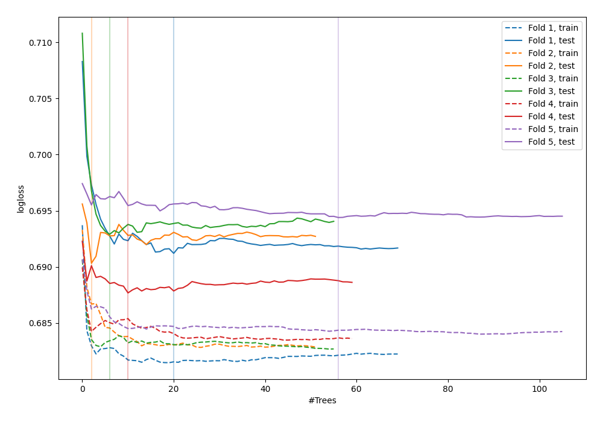
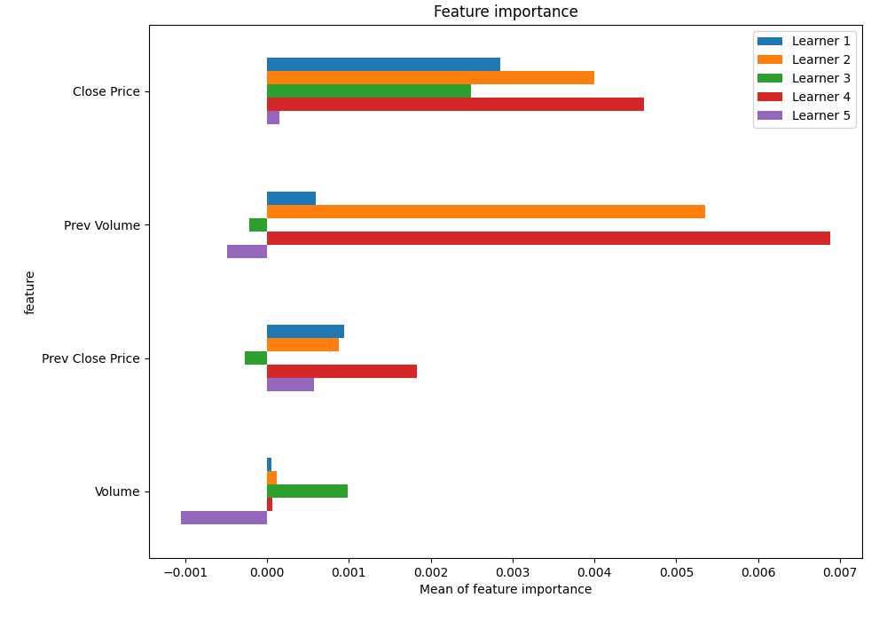
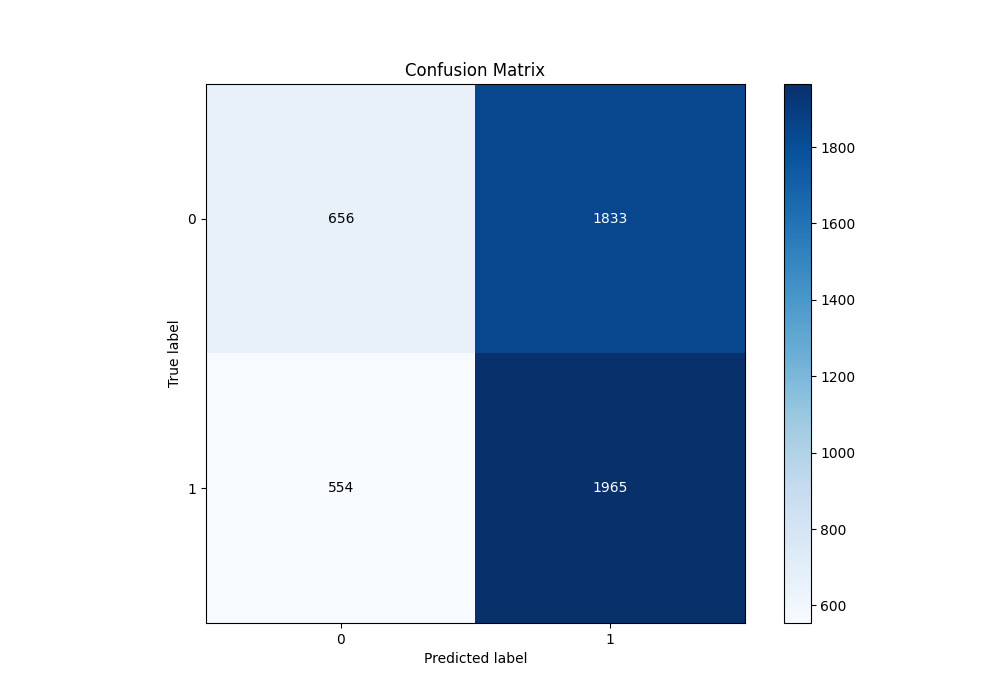
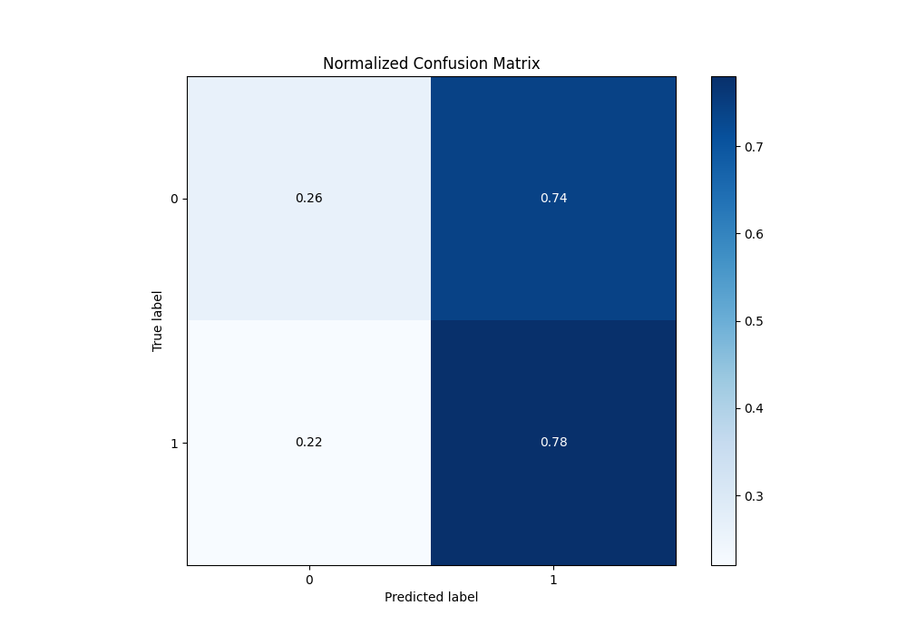
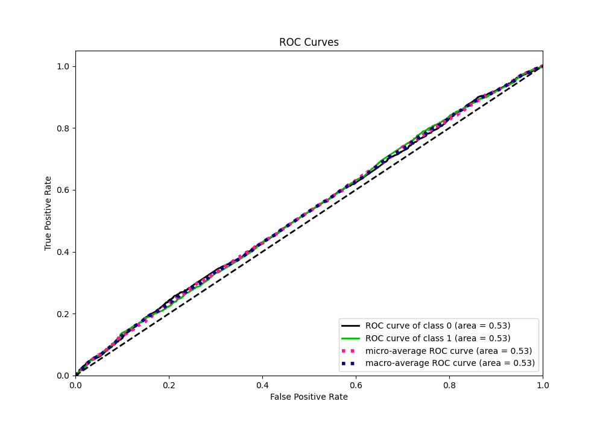
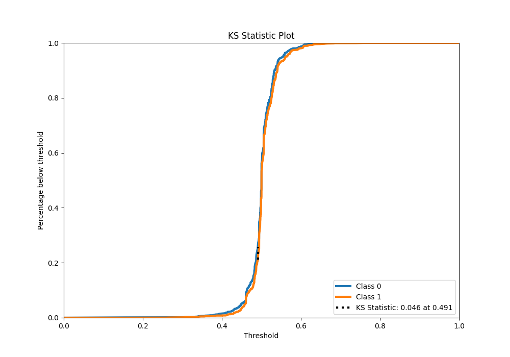
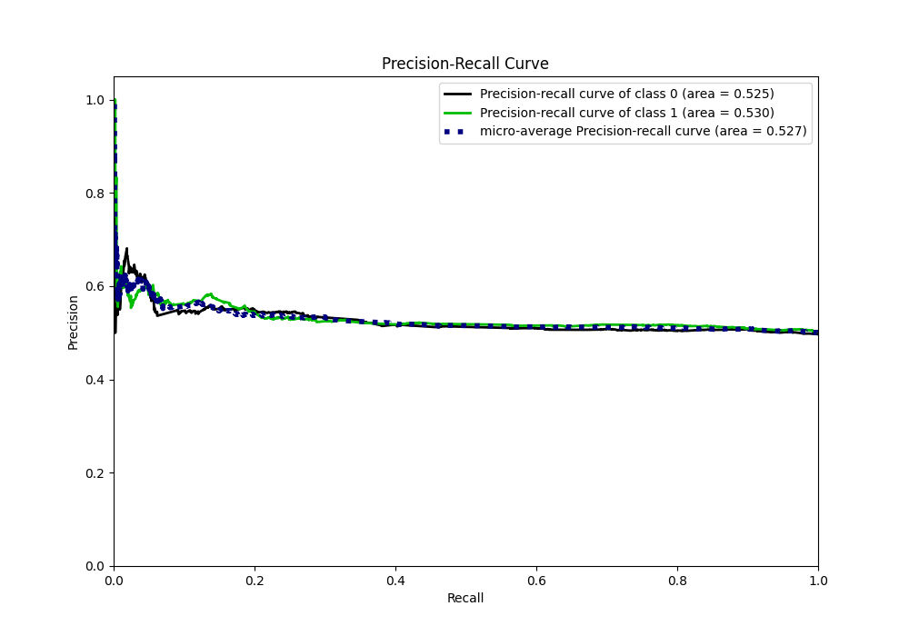
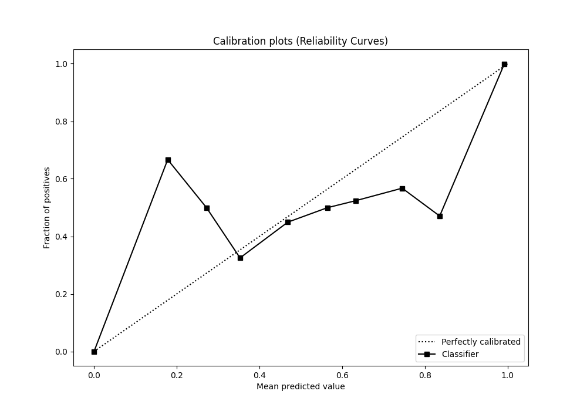
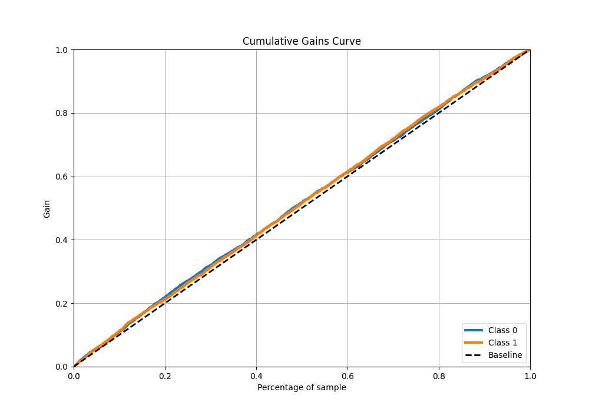
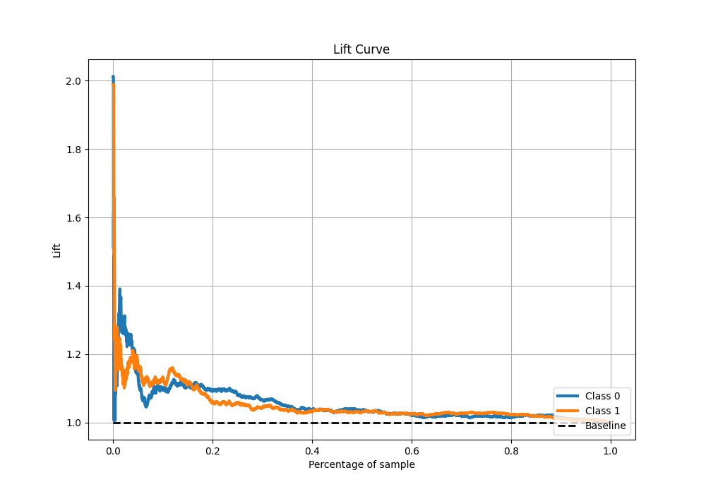

# Summary of 48_RandomForest_SelectedFeatures

[<< Go back](../README.md)

## Random Forest
- **n_jobs**: -1
- **criterion**: gini
- **max_features**: 1.0
- **min_samples_split**: 40
- **max_depth**: 3
- **eval_metric_name**: logloss
- **explain_level**: 1

## Validation
 - **validation_type**: kfold
 - **k_folds**: 5
 - **shuffle**: True
 - **stratify**: True

## Optimized metric
logloss

## Training time

10.4 seconds

## Metric details
|           |     score |   threshold |
|:----------|----------:|------------:|
| logloss   | 0.691304  |  nan        |
| auc       | 0.527518  |  nan        |
| f1        | 0.669324  |    0.138214 |
| accuracy  | 0.523363  |    0.491213 |
| precision | 0.599034  |    0.565852 |
| recall    | 1         |    0.138214 |
| mcc       | 0.0586201 |    0.533002 |

## Metric details with threshold from accuracy metric
|           |     score |   threshold |
|:----------|----------:|------------:|
| logloss   | 0.691304  |  nan        |
| auc       | 0.527518  |  nan        |
| f1        | 0.622131  |    0.491213 |
| accuracy  | 0.523363  |    0.491213 |
| precision | 0.517378  |    0.491213 |
| recall    | 0.780071  |    0.491213 |
| mcc       | 0.0509627 |    0.491213 |

## Confusion matrix (at threshold=0.491213)
|              |   Predicted as 0 |   Predicted as 1 |
|:-------------|-----------------:|-----------------:|
| Labeled as 0 |              656 |             1833 |
| Labeled as 1 |              554 |             1965 |

## Learning curves

## Permutation-based Importance

## Confusion Matrix

## Normalized Confusion Matrix

## ROC Curve

## Kolmogorov-Smirnov Statistic

## Precision-Recall Curve

## Calibration Curve

## Cumulative Gains Curve

## Lift Curve

[<< Go back](../README.md)
