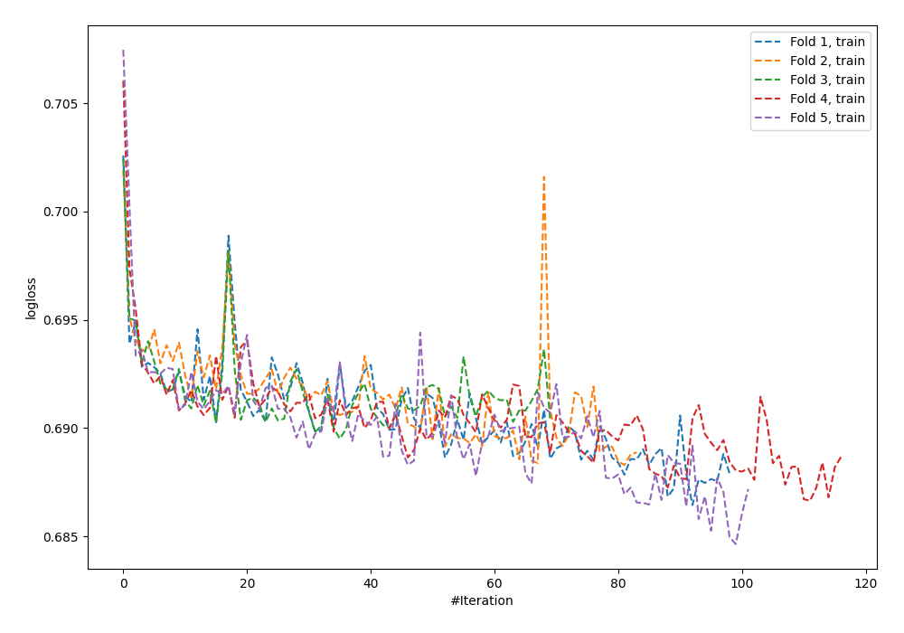
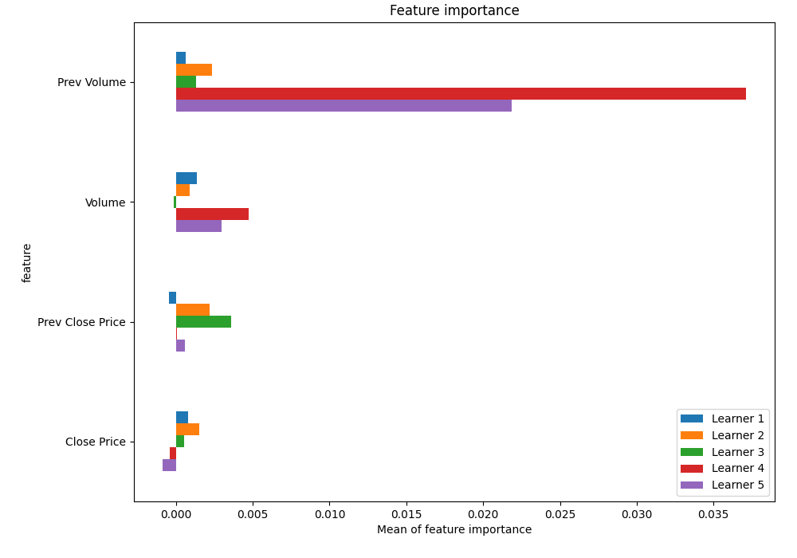
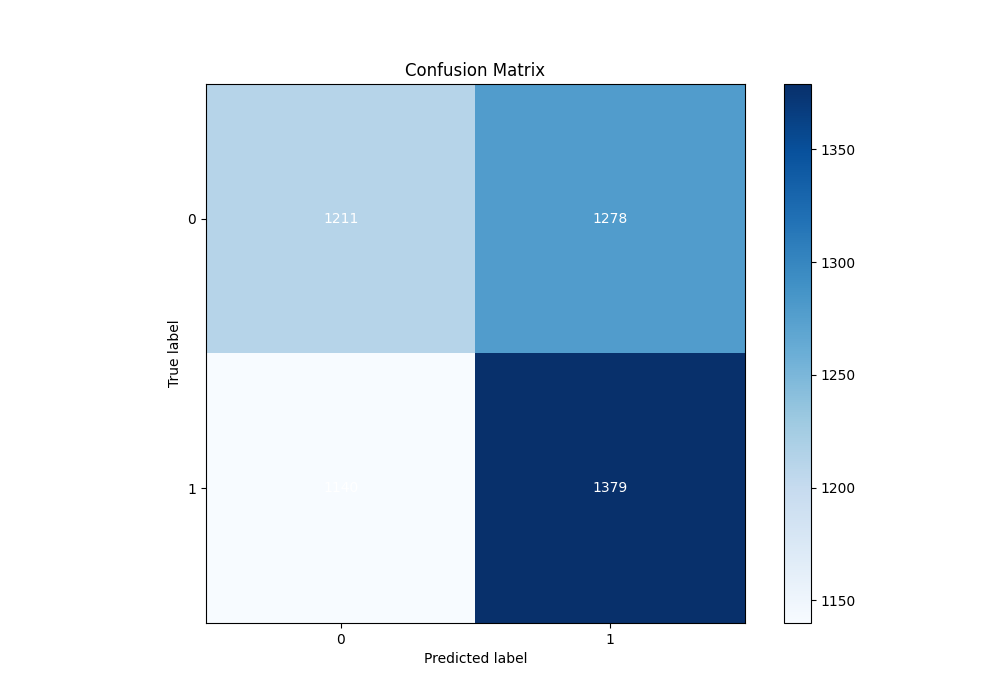
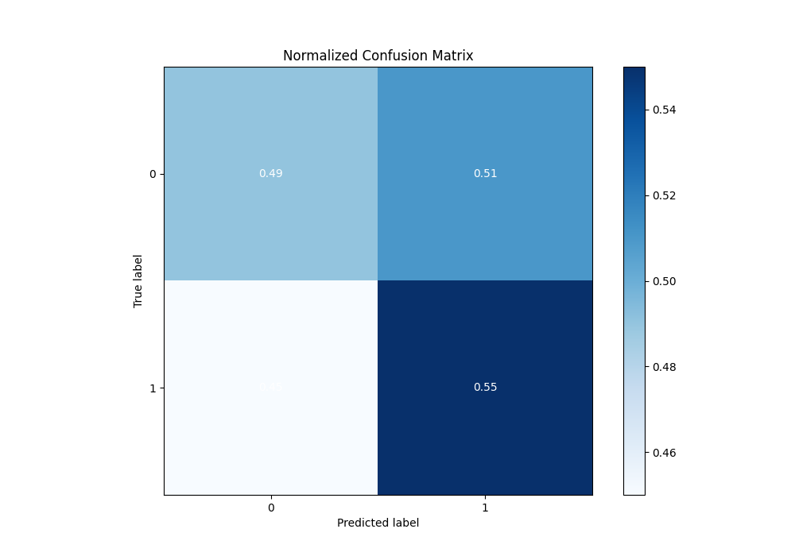
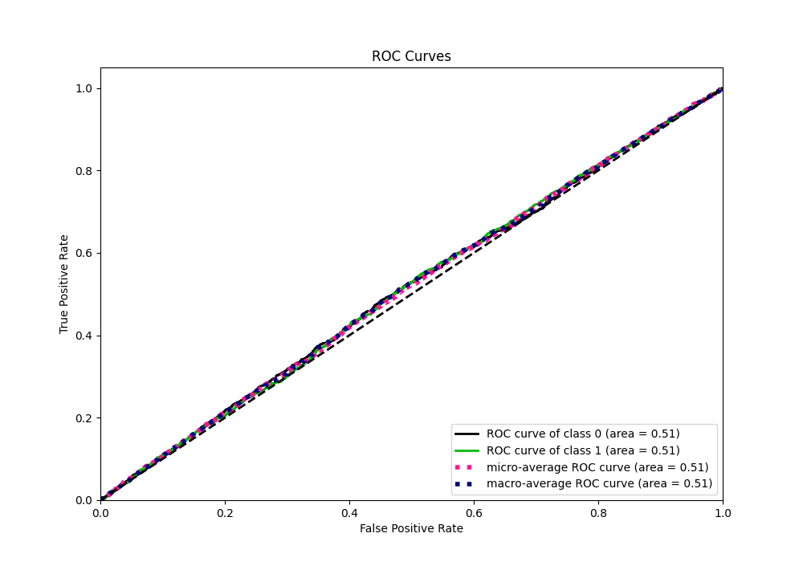
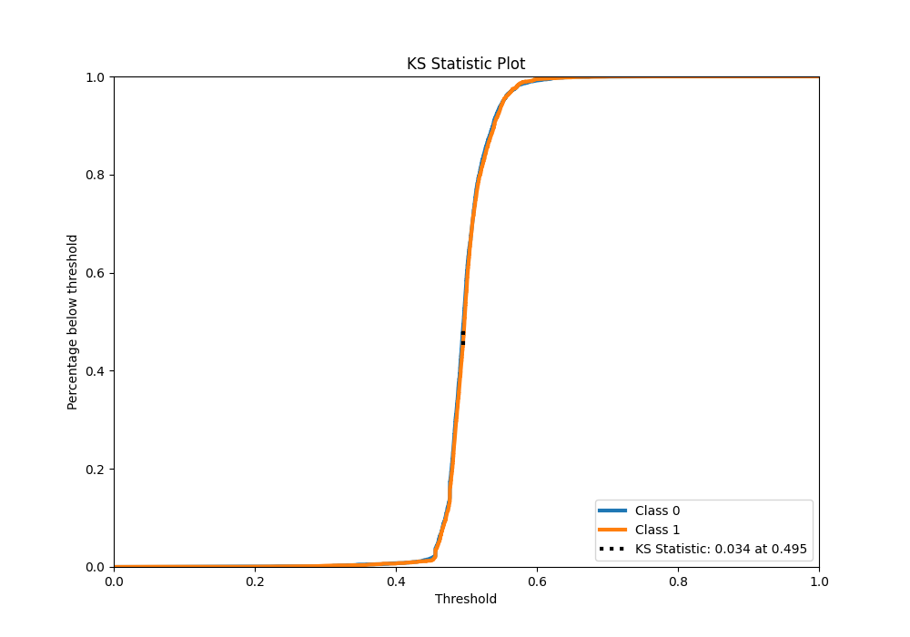
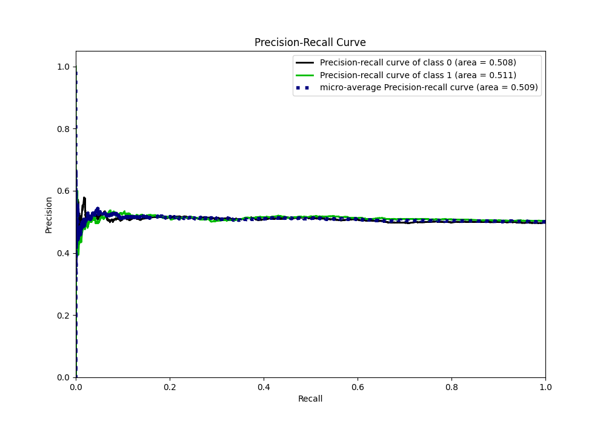
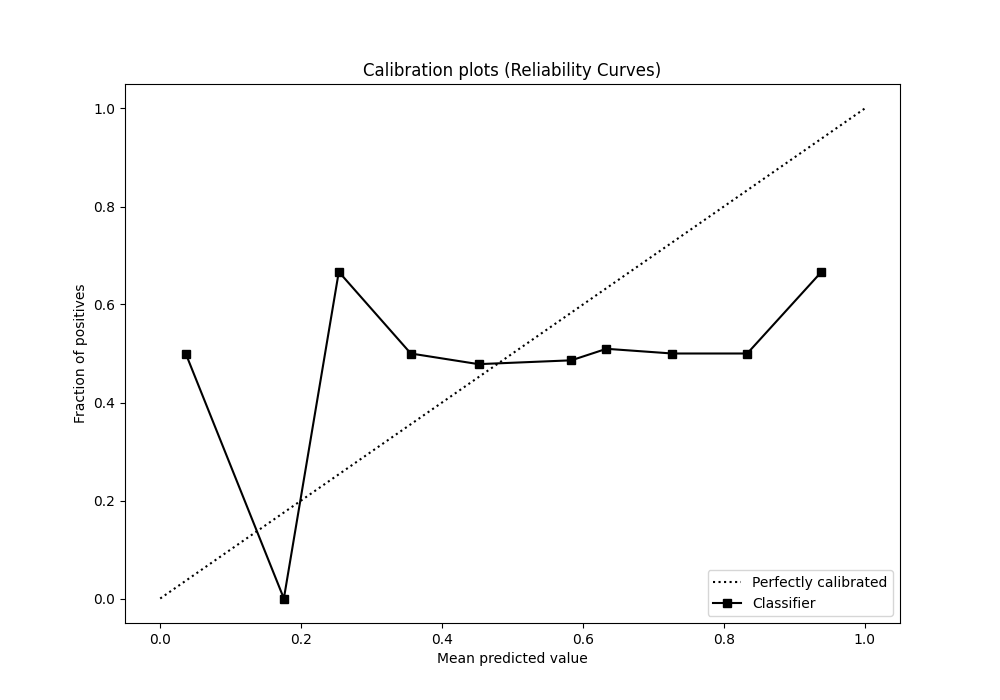
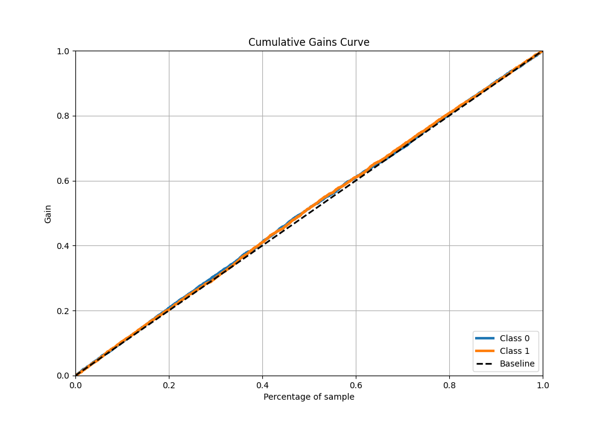
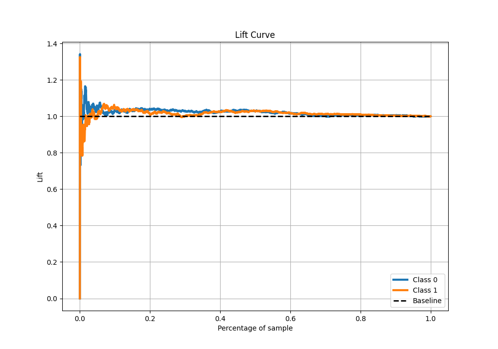

# Summary of 53_NeuralNetwork_SelectedFeatures

[<< Go back](../README.md)

## Neural Network
- **n_jobs**: -1
- **dense_1_size**: 32
- **dense_2_size**: 32
- **learning_rate**: 0.01
- **explain_level**: 1

## Validation
 - **validation_type**: kfold
 - **k_folds**: 5
 - **shuffle**: True
 - **stratify**: True

## Optimized metric
logloss

## Training time

37.5 seconds

## Metric details
|           |     score |   threshold |
|:----------|----------:|------------:|
| logloss   | 0.694574  |  nan        |
| auc       | 0.512812  |  nan        |
| f1        | 0.669324  |    0.05465  |
| accuracy  | 0.517173  |    0.495149 |
| precision | 0.529412  |    0.545834 |
| recall    | 1         |    0.05465  |
| mcc       | 0.0340432 |    0.495149 |

## Metric details with threshold from accuracy metric
|           |     score |   threshold |
|:----------|----------:|------------:|
| logloss   | 0.694574  |  nan        |
| auc       | 0.512812  |  nan        |
| f1        | 0.532844  |    0.495149 |
| accuracy  | 0.517173  |    0.495149 |
| precision | 0.519006  |    0.495149 |
| recall    | 0.547439  |    0.495149 |
| mcc       | 0.0340432 |    0.495149 |

## Confusion matrix (at threshold=0.495149)
|              |   Predicted as 0 |   Predicted as 1 |
|:-------------|-----------------:|-----------------:|
| Labeled as 0 |             1211 |             1278 |
| Labeled as 1 |             1140 |             1379 |

## Learning curves

## Permutation-based Importance

## Confusion Matrix

## Normalized Confusion Matrix

## ROC Curve

## Kolmogorov-Smirnov Statistic

## Precision-Recall Curve

## Calibration Curve

## Cumulative Gains Curve

## Lift Curve

[<< Go back](../README.md)
