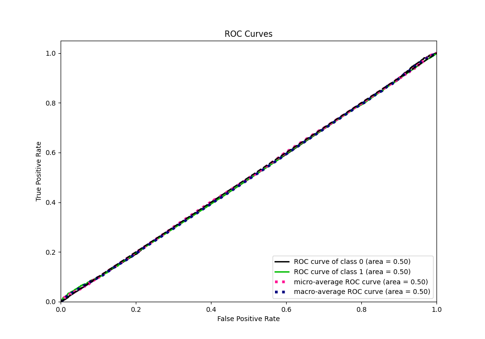

# Summary of 54_NeuralNetwork_SelectedFeatures

[<< Go back](../README.md)

## Neural Network
- **n_jobs**: -1
- **dense_1_size**: 32
- **dense_2_size**: 32
- **learning_rate**: 0.08
- **explain_level**: 1

## Validation
 - **validation_type**: kfold
 - **k_folds**: 5
 - **shuffle**: True
 - **stratify**: True

## Optimized metric
logloss

## Training time

32.0 seconds

## Metric details
|           |     score |   threshold |
|:----------|----------:|------------:|
| logloss   | 0.699098  |  nan        |
| auc       | 0.495758  |  nan        |
| f1        | 0.669324  |    0.390967 |
| accuracy  | 0.502995  |    0.390967 |
| precision | 0.701754  |    0.744843 |
| recall    | 1         |    0.390967 |
| mcc       | 0.0426536 |    0.744843 |

## Metric details with threshold from accuracy metric
|           |    score |   threshold |
|:----------|---------:|------------:|
| logloss   | 0.699098 |  nan        |
| auc       | 0.495758 |  nan        |
| f1        | 0.669324 |    0.390967 |
| accuracy  | 0.502995 |    0.390967 |
| precision | 0.502995 |    0.390967 |
| recall    | 1        |    0.390967 |
| mcc       | 0        |    0.390967 |

## Confusion matrix (at threshold=0.390967)
|              |   Predicted as 0 |   Predicted as 1 |
|:-------------|-----------------:|-----------------:|
| Labeled as 0 |                0 |             2489 |
| Labeled as 1 |                0 |             2519 |

## Learning curves

## Permutation-based Importance

## Confusion Matrix

## Normalized Confusion Matrix

## ROC Curve

## Kolmogorov-Smirnov Statistic

## Precision-Recall Curve

## Calibration Curve

## Cumulative Gains Curve

## Lift Curve

[<< Go back](../README.md)
