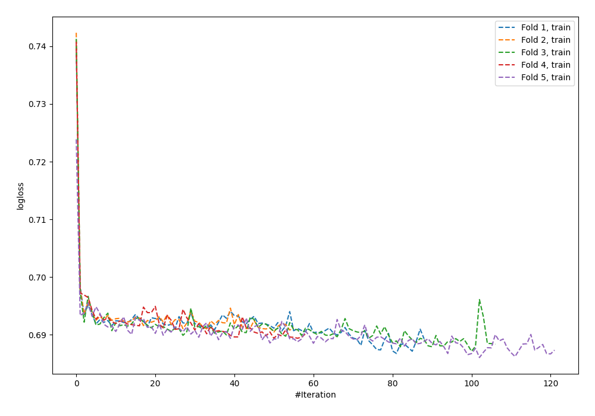
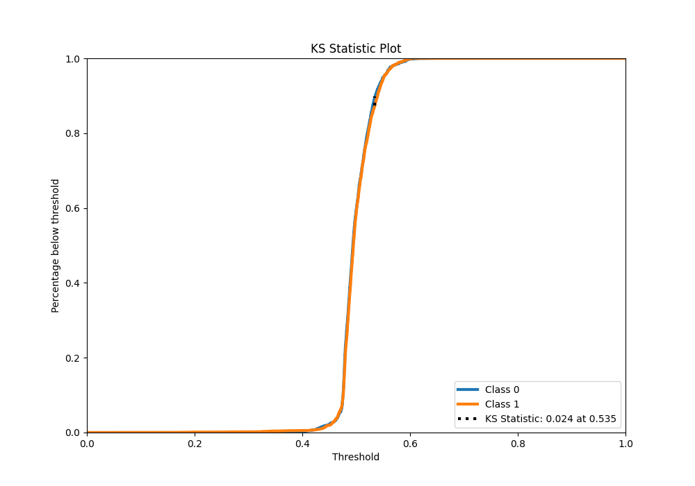

# Summary of 55_NeuralNetwork

[<< Go back](../README.md)

## Neural Network
- **n_jobs**: -1
- **dense_1_size**: 32
- **dense_2_size**: 16
- **learning_rate**: 0.01
- **explain_level**: 1

## Validation
 - **validation_type**: kfold
 - **k_folds**: 5
 - **shuffle**: True
 - **stratify**: True

## Optimized metric
logloss

## Training time

10.4 seconds

## Metric details
|           |     score |   threshold |
|:----------|----------:|------------:|
| logloss   | 0.694499  |  nan        |
| auc       | 0.51075   |  nan        |
| f1        | 0.669324  |    0.144043 |
| accuracy  | 0.513179  |    0.479303 |
| precision | 0.551422  |    0.539933 |
| recall    | 1         |    0.144043 |
| mcc       | 0.0338738 |    0.533341 |

## Metric details with threshold from accuracy metric
|           |     score |   threshold |
|:----------|----------:|------------:|
| logloss   | 0.694499  |  nan        |
| auc       | 0.51075   |  nan        |
| f1        | 0.626417  |    0.479303 |
| accuracy  | 0.513179  |    0.479303 |
| precision | 0.510107  |    0.479303 |
| recall    | 0.811433  |    0.479303 |
| mcc       | 0.0284596 |    0.479303 |

## Confusion matrix (at threshold=0.479303)
|              |   Predicted as 0 |   Predicted as 1 |
|:-------------|-----------------:|-----------------:|
| Labeled as 0 |              526 |             1963 |
| Labeled as 1 |              475 |             2044 |

## Learning curves

## Permutation-based Importance

## Confusion Matrix

## Normalized Confusion Matrix

## ROC Curve

## Kolmogorov-Smirnov Statistic

## Precision-Recall Curve

## Calibration Curve

## Cumulative Gains Curve

## Lift Curve

[<< Go back](../README.md)
