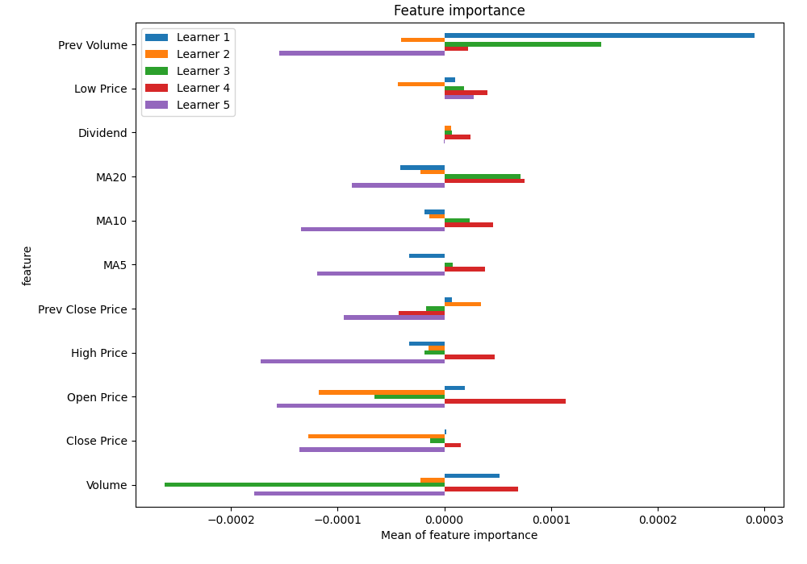
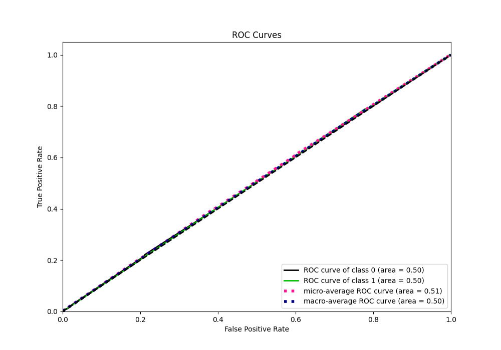

# Summary of 56_NeuralNetwork

[<< Go back](../README.md)

## Neural Network
- **n_jobs**: -1
- **dense_1_size**: 32
- **dense_2_size**: 16
- **learning_rate**: 0.08
- **explain_level**: 1

## Validation
 - **validation_type**: kfold
 - **k_folds**: 5
 - **shuffle**: True
 - **stratify**: True

## Optimized metric
logloss

## Training time

9.3 seconds

## Metric details
|           |      score |   threshold |
|:----------|-----------:|------------:|
| logloss   | 0.693326   |  nan        |
| auc       | 0.503929   |  nan        |
| f1        | 0.669324   |    0.232969 |
| accuracy  | 0.504393   |    0.505864 |
| precision | 0.505864   |    0.512798 |
| recall    | 1          |    0.232969 |
| mcc       | 0.00651992 |    0.506615 |

## Metric details with threshold from accuracy metric
|           |     score |   threshold |
|:----------|----------:|------------:|
| logloss   | 0.693326  |  nan        |
| auc       | 0.503929  |  nan        |
| f1        | 0.616857  |    0.505864 |
| accuracy  | 0.504393  |    0.505864 |
| precision | 0.504673  |    0.505864 |
| recall    | 0.793172  |    0.505864 |
| mcc       | 0.0065186 |    0.505864 |

## Confusion matrix (at threshold=0.505864)
|              |   Predicted as 0 |   Predicted as 1 |
|:-------------|-----------------:|-----------------:|
| Labeled as 0 |              528 |             1961 |
| Labeled as 1 |              521 |             1998 |

## Learning curves

## Permutation-based Importance

## Confusion Matrix

## Normalized Confusion Matrix

## ROC Curve

## Kolmogorov-Smirnov Statistic

## Precision-Recall Curve

## Calibration Curve

## Cumulative Gains Curve

## Lift Curve

[<< Go back](../README.md)
