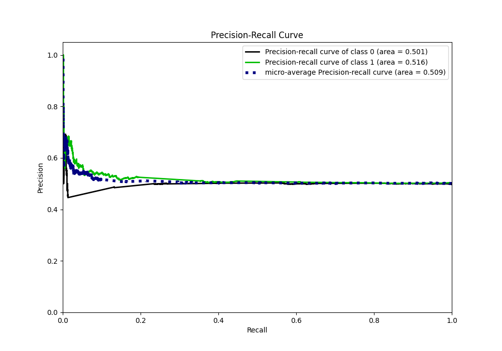
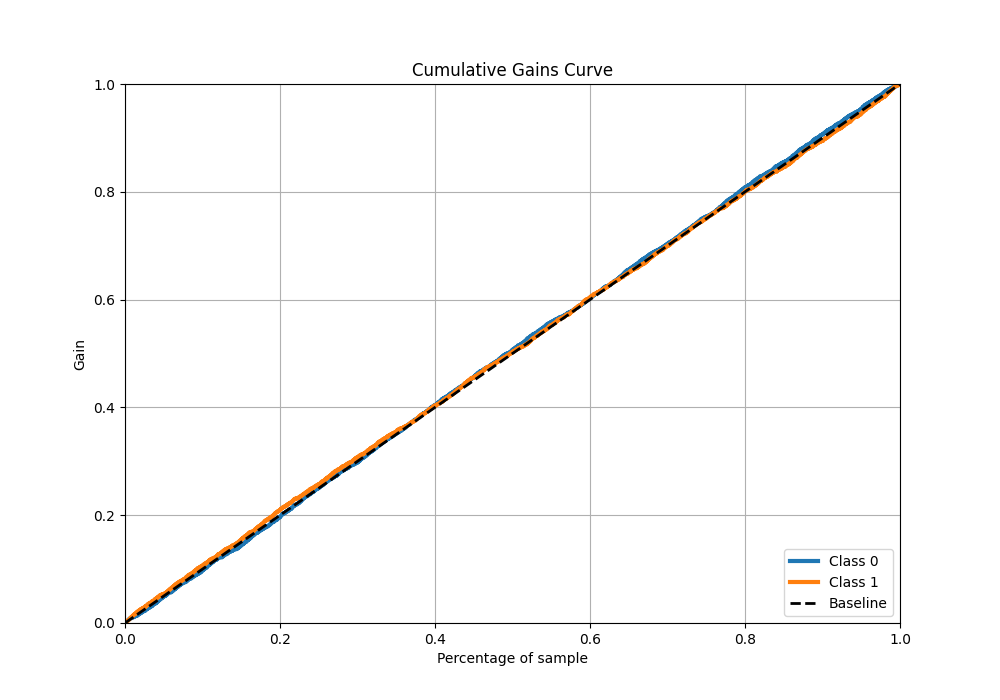

# Summary of 5_Default_NeuralNetwork

[<< Go back](../README.md)

## Neural Network
- **n_jobs**: -1
- **dense_1_size**: 32
- **dense_2_size**: 16
- **learning_rate**: 0.05
- **explain_level**: 1

## Validation
 - **validation_type**: kfold
 - **k_folds**: 5
 - **shuffle**: True
 - **stratify**: True

## Optimized metric
logloss

## Training time

25.6 seconds

## Metric details
|           |     score |   threshold |
|:----------|----------:|------------:|
| logloss   | 0.693198  |  nan        |
| auc       | 0.506523  |  nan        |
| f1        | 0.669324  |    0.389415 |
| accuracy  | 0.506789  |    0.515362 |
| precision | 0.666667  |    0.604988 |
| recall    | 1         |    0.389415 |
| mcc       | 0.0351238 |    0.604988 |

## Metric details with threshold from accuracy metric
|           |     score |   threshold |
|:----------|----------:|------------:|
| logloss   | 0.693198  |  nan        |
| auc       | 0.506523  |  nan        |
| f1        | 0.279043  |    0.515362 |
| accuracy  | 0.506789  |    0.515362 |
| precision | 0.527012  |    0.515362 |
| recall    | 0.189758  |    0.515362 |
| mcc       | 0.0225899 |    0.515362 |

## Confusion matrix (at threshold=0.515362)
|              |   Predicted as 0 |   Predicted as 1 |
|:-------------|-----------------:|-----------------:|
| Labeled as 0 |             2060 |              429 |
| Labeled as 1 |             2041 |              478 |

## Learning curves

## Permutation-based Importance

## Confusion Matrix

## Normalized Confusion Matrix

## ROC Curve

## Kolmogorov-Smirnov Statistic

## Precision-Recall Curve

## Calibration Curve

## Cumulative Gains Curve

## Lift Curve

[<< Go back](../README.md)
