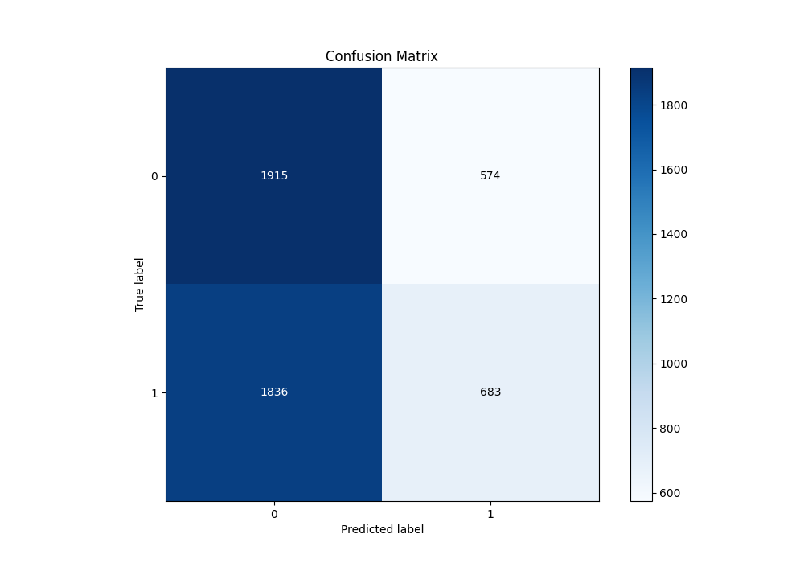

# Summary of 5_Default_NeuralNetwork_SelectedFeatures

[<< Go back](../README.md)

## Neural Network
- **n_jobs**: -1
- **dense_1_size**: 32
- **dense_2_size**: 16
- **learning_rate**: 0.05
- **explain_level**: 1

## Validation
 - **validation_type**: kfold
 - **k_folds**: 5
 - **shuffle**: True
 - **stratify**: True

## Optimized metric
logloss

## Training time

27.6 seconds

## Metric details
|           |     score |   threshold |
|:----------|----------:|------------:|
| logloss   | 0.693501  |  nan        |
| auc       | 0.517011  |  nan        |
| f1        | 0.669324  |    0.324426 |
| accuracy  | 0.51877   |    0.516727 |
| precision | 0.543357  |    0.516727 |
| recall    | 1         |    0.324426 |
| mcc       | 0.0467309 |    0.516727 |

## Metric details with threshold from accuracy metric
|           |     score |   threshold |
|:----------|----------:|------------:|
| logloss   | 0.693501  |  nan        |
| auc       | 0.517011  |  nan        |
| f1        | 0.361758  |    0.516727 |
| accuracy  | 0.51877   |    0.516727 |
| precision | 0.543357  |    0.516727 |
| recall    | 0.271139  |    0.516727 |
| mcc       | 0.0467309 |    0.516727 |

## Confusion matrix (at threshold=0.516727)
|              |   Predicted as 0 |   Predicted as 1 |
|:-------------|-----------------:|-----------------:|
| Labeled as 0 |             1915 |              574 |
| Labeled as 1 |             1836 |              683 |

## Learning curves

## Permutation-based Importance

## Confusion Matrix

## Normalized Confusion Matrix

## ROC Curve

## Kolmogorov-Smirnov Statistic

## Precision-Recall Curve

## Calibration Curve

## Cumulative Gains Curve

## Lift Curve

[<< Go back](../README.md)
