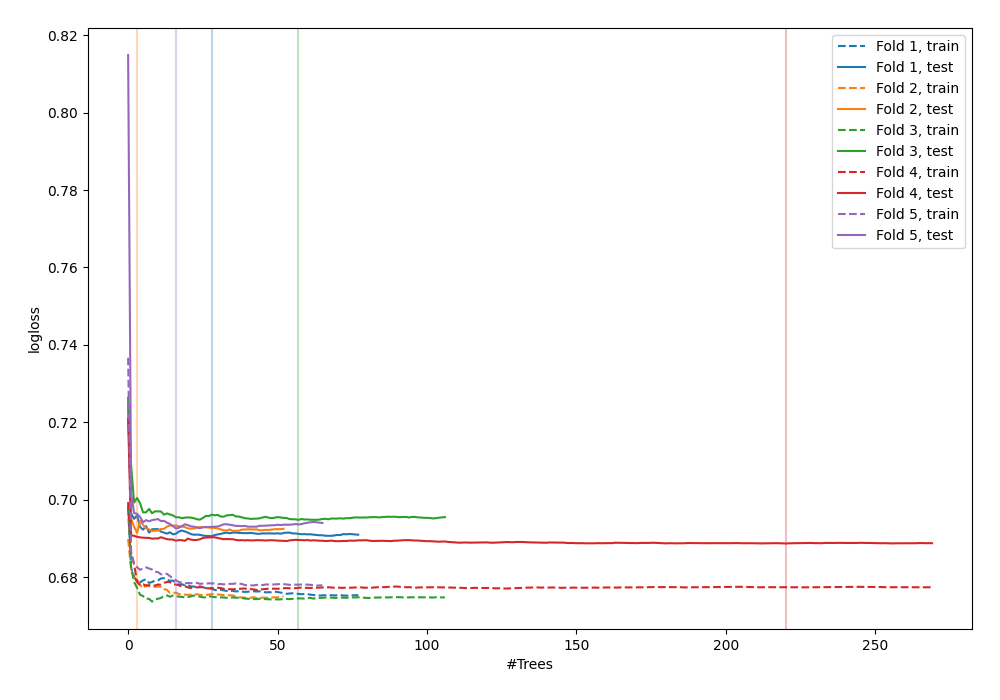

# Summary of 6_Default_RandomForest

[<< Go back](../README.md)

## Random Forest
- **n_jobs**: -1
- **criterion**: gini
- **max_features**: 0.9
- **min_samples_split**: 30
- **max_depth**: 4
- **eval_metric_name**: logloss
- **explain_level**: 1

## Validation
 - **validation_type**: kfold
 - **k_folds**: 5
 - **shuffle**: True
 - **stratify**: True

## Optimized metric
logloss

## Training time

40.7 seconds

## Metric details
|           |     score |   threshold |
|:----------|----------:|------------:|
| logloss   | 0.691638  |  nan        |
| auc       | 0.524164  |  nan        |
| f1        | 0.669324  |    0.171277 |
| accuracy  | 0.519569  |    0.482869 |
| precision | 0.609121  |    0.563001 |
| recall    | 1         |    0.171277 |
| mcc       | 0.0667502 |    0.548656 |

## Metric details with threshold from accuracy metric
|           |    score |   threshold |
|:----------|---------:|------------:|
| logloss   | 0.691638 |  nan        |
| auc       | 0.524164 |  nan        |
| f1        | 0.613556 |    0.482869 |
| accuracy  | 0.519569 |    0.482869 |
| precision | 0.515241 |    0.482869 |
| recall    | 0.758237 |    0.482869 |
| mcc       | 0.041344 |    0.482869 |

## Confusion matrix (at threshold=0.482869)
|              |   Predicted as 0 |   Predicted as 1 |
|:-------------|-----------------:|-----------------:|
| Labeled as 0 |              692 |             1797 |
| Labeled as 1 |              609 |             1910 |

## Learning curves

## Permutation-based Importance

## Confusion Matrix

## Normalized Confusion Matrix

## ROC Curve

## Kolmogorov-Smirnov Statistic

## Precision-Recall Curve

## Calibration Curve

## Cumulative Gains Curve

## Lift Curve

[<< Go back](../README.md)
