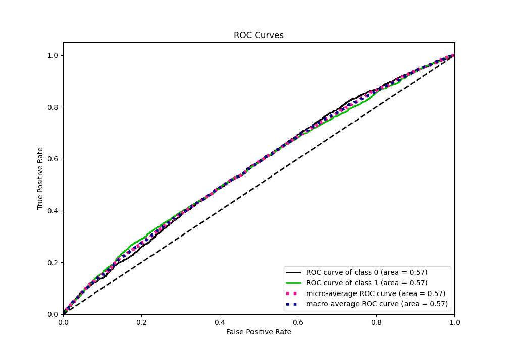

# Summary of Ensemble

[<< Go back](../README.md)

## Ensemble structure
| Model                                       |   Weight |
|:--------------------------------------------|---------:|
| 27_CatBoost_GoldenFeatures_SelectedFeatures |        1 |
| 3_Default_Xgboost_SelectedFeatures          |        1 |
| 45_CatBoost_GoldenFeatures_SelectedFeatures |        1 |

## Metric details
|           |    score |   threshold |
|:----------|---------:|------------:|
| logloss   | 0.686131 |  nan        |
| auc       | 0.566672 |  nan        |
| f1        | 0.67068  |    0.395571 |
| accuracy  | 0.546326 |    0.515238 |
| precision | 0.657005 |    0.578409 |
| recall    | 1        |    0.189841 |
| mcc       | 0.111821 |    0.530055 |

## Metric details with threshold from accuracy metric
|           |    score |   threshold |
|:----------|---------:|------------:|
| logloss   | 0.686131 |  nan        |
| auc       | 0.566672 |  nan        |
| f1        | 0.455939 |    0.515238 |
| accuracy  | 0.546326 |    0.515238 |
| precision | 0.574532 |    0.515238 |
| recall    | 0.377928 |    0.515238 |
| mcc       | 0.10061  |    0.515238 |

## Confusion matrix (at threshold=0.515238)
|              |   Predicted as 0 |   Predicted as 1 |
|:-------------|-----------------:|-----------------:|
| Labeled as 0 |             1784 |              705 |
| Labeled as 1 |             1567 |              952 |

## Learning curves

## Confusion Matrix

## Normalized Confusion Matrix

## ROC Curve

## Kolmogorov-Smirnov Statistic

## Precision-Recall Curve

## Calibration Curve

## Cumulative Gains Curve

## Lift Curve

[<< Go back](../README.md)
