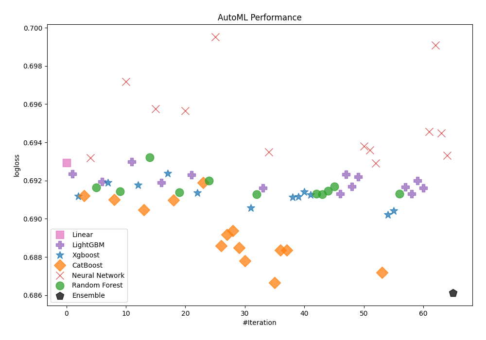
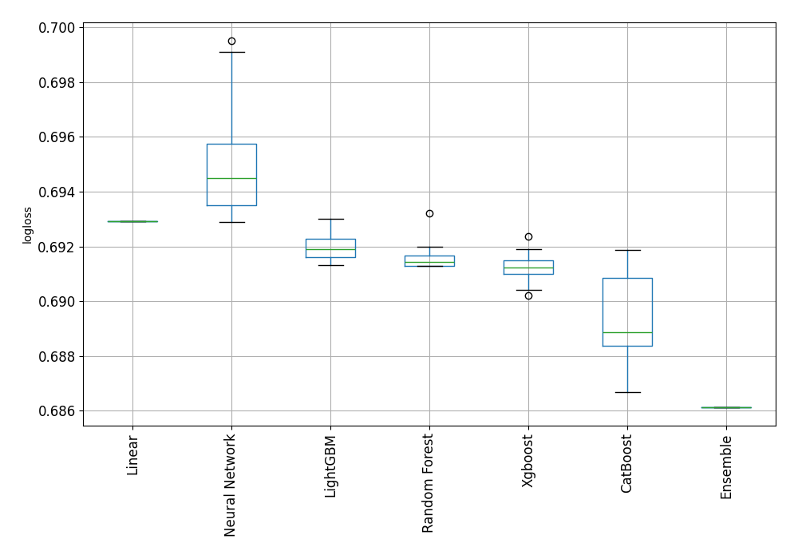
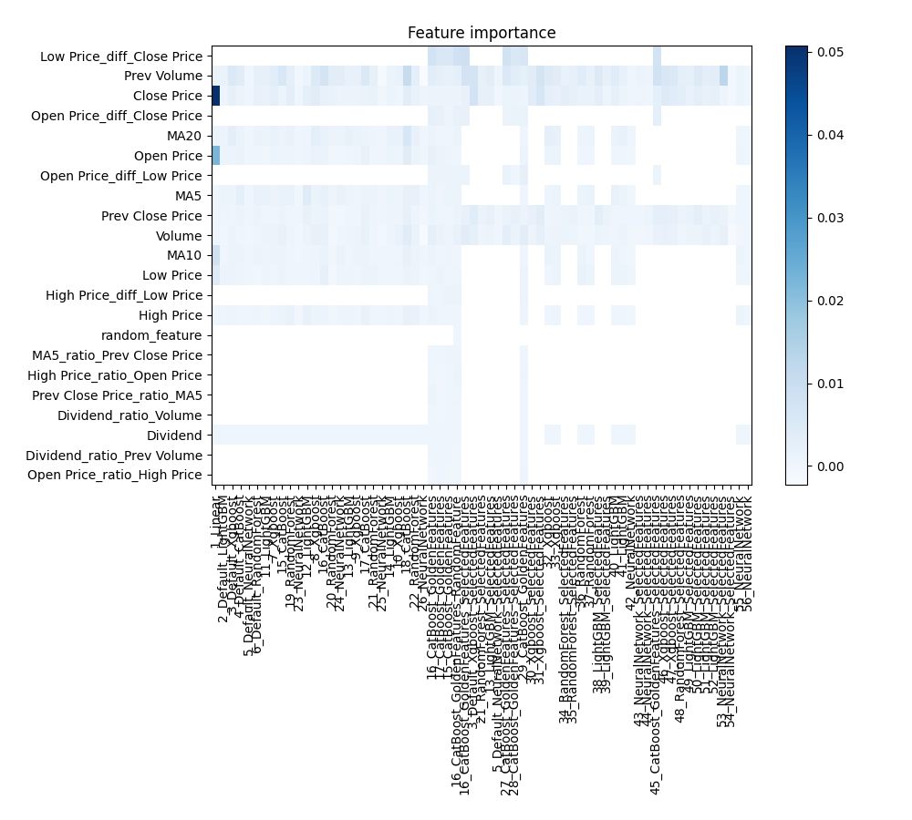
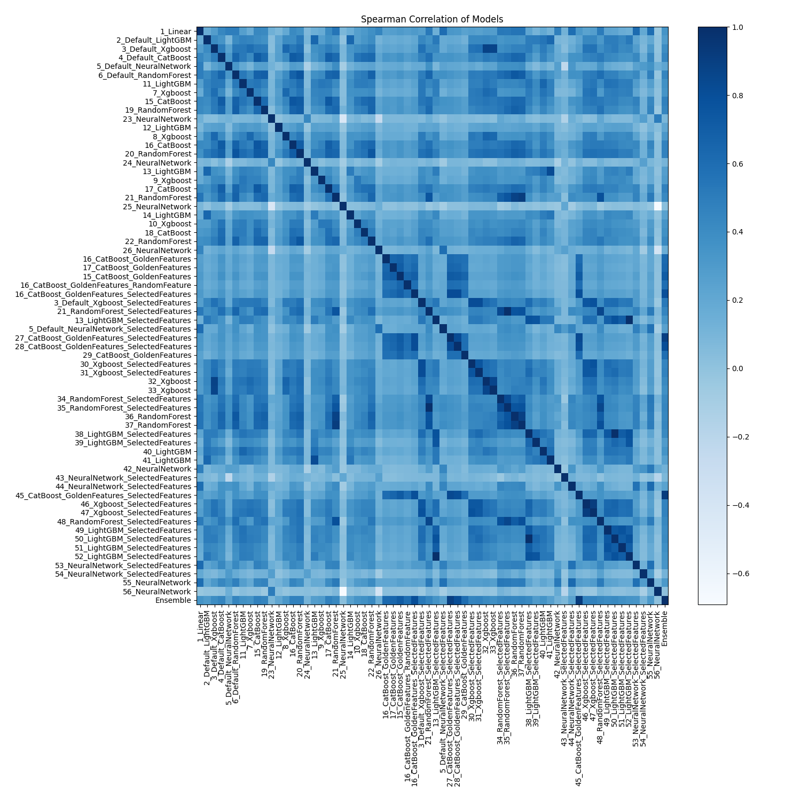

# AutoML Leaderboard

| Best model   | name                                                                                                 | model_type     | metric_type   |   metric_value |   train_time |   single_prediction_time |
|:-------------|:-----------------------------------------------------------------------------------------------------|:---------------|:--------------|---------------:|-------------:|-------------------------:|
|              | [1_Linear](1_Linear/README.md)                                                                       | Linear         | logloss       |       0.692931 |        16.31 |                   0.1887 |
|              | [2_Default_LightGBM](2_Default_LightGBM/README.md)                                                   | LightGBM       | logloss       |       0.692353 |        21.33 |                   0.0923 |
|              | [3_Default_Xgboost](3_Default_Xgboost/README.md)                                                     | Xgboost        | logloss       |       0.691193 |        21.51 |                   0.1069 |
|              | [4_Default_CatBoost](4_Default_CatBoost/README.md)                                                   | CatBoost       | logloss       |       0.691206 |        25.02 |                   0.1058 |
|              | [5_Default_NeuralNetwork](5_Default_NeuralNetwork/README.md)                                         | Neural Network | logloss       |       0.693198 |        30.21 |                   0.2331 |
|              | [6_Default_RandomForest](6_Default_RandomForest/README.md)                                           | Random Forest  | logloss       |       0.691638 |        45.9  |                   0.323  |
|              | [11_LightGBM](11_LightGBM/README.md)                                                                 | LightGBM       | logloss       |       0.691933 |        23.56 |                   0.0561 |
|              | [7_Xgboost](7_Xgboost/README.md)                                                                     | Xgboost        | logloss       |       0.69189  |        18.56 |                   0.0343 |
|              | [15_CatBoost](15_CatBoost/README.md)                                                                 | CatBoost       | logloss       |       0.691007 |         7.94 |                   0.0358 |
|              | [19_RandomForest](19_RandomForest/README.md)                                                         | Random Forest  | logloss       |       0.691435 |         9.13 |                   0.1388 |
|              | [23_NeuralNetwork](23_NeuralNetwork/README.md)                                                       | Neural Network | logloss       |       0.697174 |         7.55 |                   0.056  |
|              | [12_LightGBM](12_LightGBM/README.md)                                                                 | LightGBM       | logloss       |       0.692996 |         5.36 |                   0.0123 |
|              | [8_Xgboost](8_Xgboost/README.md)                                                                     | Xgboost        | logloss       |       0.69176  |         5.54 |                   0.028  |
|              | [16_CatBoost](16_CatBoost/README.md)                                                                 | CatBoost       | logloss       |       0.690463 |         7.57 |                   0.0258 |
|              | [20_RandomForest](20_RandomForest/README.md)                                                         | Random Forest  | logloss       |       0.693228 |        12.93 |                   0.1139 |
|              | [24_NeuralNetwork](24_NeuralNetwork/README.md)                                                       | Neural Network | logloss       |       0.695749 |         7.68 |                   0.036  |
|              | [13_LightGBM](13_LightGBM/README.md)                                                                 | LightGBM       | logloss       |       0.691894 |         6.92 |                   0.016  |
|              | [9_Xgboost](9_Xgboost/README.md)                                                                     | Xgboost        | logloss       |       0.692369 |         6.42 |                   0.032  |
|              | [17_CatBoost](17_CatBoost/README.md)                                                                 | CatBoost       | logloss       |       0.69099  |         7.96 |                   0.0201 |
|              | [21_RandomForest](21_RandomForest/README.md)                                                         | Random Forest  | logloss       |       0.691392 |        20.56 |                   0.3183 |
|              | [25_NeuralNetwork](25_NeuralNetwork/README.md)                                                       | Neural Network | logloss       |       0.695669 |        36.73 |                   0.1911 |
|              | [14_LightGBM](14_LightGBM/README.md)                                                                 | LightGBM       | logloss       |       0.692303 |        22.04 |                   0.054  |
|              | [10_Xgboost](10_Xgboost/README.md)                                                                   | Xgboost        | logloss       |       0.691368 |         6.92 |                   0.041  |
|              | [18_CatBoost](18_CatBoost/README.md)                                                                 | CatBoost       | logloss       |       0.691885 |         8.16 |                   0.0343 |
|              | [22_RandomForest](22_RandomForest/README.md)                                                         | Random Forest  | logloss       |       0.692001 |        11.3  |                   0.1401 |
|              | [26_NeuralNetwork](26_NeuralNetwork/README.md)                                                       | Neural Network | logloss       |       0.69951  |        23.72 |                   0.2026 |
|              | [16_CatBoost_GoldenFeatures](16_CatBoost_GoldenFeatures/README.md)                                   | CatBoost       | logloss       |       0.688577 |        33.36 |                   0.3179 |
|              | [17_CatBoost_GoldenFeatures](17_CatBoost_GoldenFeatures/README.md)                                   | CatBoost       | logloss       |       0.68916  |        28.37 |                   0.1981 |
|              | [15_CatBoost_GoldenFeatures](15_CatBoost_GoldenFeatures/README.md)                                   | CatBoost       | logloss       |       0.689364 |        36.58 |                   0.2529 |
|              | [16_CatBoost_GoldenFeatures_RandomFeature](16_CatBoost_GoldenFeatures_RandomFeature/README.md)       | CatBoost       | logloss       |       0.68848  |        43.4  |                   0.2364 |
|              | [16_CatBoost_GoldenFeatures_SelectedFeatures](16_CatBoost_GoldenFeatures_SelectedFeatures/README.md) | CatBoost       | logloss       |       0.687796 |        25.92 |                   0.1327 |
|              | [3_Default_Xgboost_SelectedFeatures](3_Default_Xgboost_SelectedFeatures/README.md)                   | Xgboost        | logloss       |       0.690573 |        22.68 |                   0.1051 |
|              | [21_RandomForest_SelectedFeatures](21_RandomForest_SelectedFeatures/README.md)                       | Random Forest  | logloss       |       0.69129  |        33.63 |                   0.2137 |
|              | [13_LightGBM_SelectedFeatures](13_LightGBM_SelectedFeatures/README.md)                               | LightGBM       | logloss       |       0.691613 |        22.97 |                   0.048  |
|              | [5_Default_NeuralNetwork_SelectedFeatures](5_Default_NeuralNetwork_SelectedFeatures/README.md)       | Neural Network | logloss       |       0.693501 |        31.64 |                   0.1477 |
|              | [27_CatBoost_GoldenFeatures_SelectedFeatures](27_CatBoost_GoldenFeatures_SelectedFeatures/README.md) | CatBoost       | logloss       |       0.686666 |        28.13 |                   0.1841 |
|              | [28_CatBoost_GoldenFeatures_SelectedFeatures](28_CatBoost_GoldenFeatures_SelectedFeatures/README.md) | CatBoost       | logloss       |       0.688358 |        34.92 |                   0.1421 |
|              | [29_CatBoost_GoldenFeatures](29_CatBoost_GoldenFeatures/README.md)                                   | CatBoost       | logloss       |       0.688371 |        45.61 |                   0.2504 |
|              | [30_Xgboost_SelectedFeatures](30_Xgboost_SelectedFeatures/README.md)                                 | Xgboost        | logloss       |       0.691143 |        23.14 |                   0.0972 |
|              | [31_Xgboost_SelectedFeatures](31_Xgboost_SelectedFeatures/README.md)                                 | Xgboost        | logloss       |       0.69115  |        23.48 |                   0.1083 |
|              | [32_Xgboost](32_Xgboost/README.md)                                                                   | Xgboost        | logloss       |       0.691403 |        22.4  |                   0.0937 |
|              | [33_Xgboost](33_Xgboost/README.md)                                                                   | Xgboost        | logloss       |       0.691265 |        24.82 |                   0.0832 |
|              | [34_RandomForest_SelectedFeatures](34_RandomForest_SelectedFeatures/README.md)                       | Random Forest  | logloss       |       0.691296 |        35.4  |                   0.2402 |
|              | [35_RandomForest_SelectedFeatures](35_RandomForest_SelectedFeatures/README.md)                       | Random Forest  | logloss       |       0.69129  |        34.63 |                   0.2024 |
|              | [36_RandomForest](36_RandomForest/README.md)                                                         | Random Forest  | logloss       |       0.691457 |        40.37 |                   0.2668 |
|              | [37_RandomForest](37_RandomForest/README.md)                                                         | Random Forest  | logloss       |       0.691692 |        48.61 |                   0.3388 |
|              | [38_LightGBM_SelectedFeatures](38_LightGBM_SelectedFeatures/README.md)                               | LightGBM       | logloss       |       0.691306 |        29.41 |                   0.0625 |
|              | [39_LightGBM_SelectedFeatures](39_LightGBM_SelectedFeatures/README.md)                               | LightGBM       | logloss       |       0.692316 |        31.62 |                   0.0517 |
|              | [40_LightGBM](40_LightGBM/README.md)                                                                 | LightGBM       | logloss       |       0.691699 |        30.36 |                   0.071  |
|              | [41_LightGBM](41_LightGBM/README.md)                                                                 | LightGBM       | logloss       |       0.692187 |        29.15 |                   0.039  |
|              | [42_NeuralNetwork](42_NeuralNetwork/README.md)                                                       | Neural Network | logloss       |       0.693793 |        38.17 |                   0.301  |
|              | [43_NeuralNetwork_SelectedFeatures](43_NeuralNetwork_SelectedFeatures/README.md)                     | Neural Network | logloss       |       0.693586 |        37.85 |                   0.1807 |
|              | [44_NeuralNetwork_SelectedFeatures](44_NeuralNetwork_SelectedFeatures/README.md)                     | Neural Network | logloss       |       0.692905 |        38.28 |                   0.1543 |
|              | [45_CatBoost_GoldenFeatures_SelectedFeatures](45_CatBoost_GoldenFeatures_SelectedFeatures/README.md) | CatBoost       | logloss       |       0.687197 |        31.78 |                   0.1543 |
|              | [46_Xgboost_SelectedFeatures](46_Xgboost_SelectedFeatures/README.md)                                 | Xgboost        | logloss       |       0.690206 |        27.32 |                   0.1349 |
|              | [47_Xgboost_SelectedFeatures](47_Xgboost_SelectedFeatures/README.md)                                 | Xgboost        | logloss       |       0.690407 |        17.95 |                   0.0338 |
|              | [48_RandomForest_SelectedFeatures](48_RandomForest_SelectedFeatures/README.md)                       | Random Forest  | logloss       |       0.691304 |        11.39 |                   0.0934 |
|              | [49_LightGBM_SelectedFeatures](49_LightGBM_SelectedFeatures/README.md)                               | LightGBM       | logloss       |       0.691654 |        14.58 |                   0.013  |
|              | [50_LightGBM_SelectedFeatures](50_LightGBM_SelectedFeatures/README.md)                               | LightGBM       | logloss       |       0.691306 |        19.64 |                   0.0476 |
|              | [51_LightGBM_SelectedFeatures](51_LightGBM_SelectedFeatures/README.md)                               | LightGBM       | logloss       |       0.691985 |        26.98 |                   0.051  |
|              | [52_LightGBM_SelectedFeatures](52_LightGBM_SelectedFeatures/README.md)                               | LightGBM       | logloss       |       0.691613 |        28.2  |                   0.067  |
|              | [53_NeuralNetwork_SelectedFeatures](53_NeuralNetwork_SelectedFeatures/README.md)                     | Neural Network | logloss       |       0.694574 |        41.37 |                   0.1601 |
|              | [54_NeuralNetwork_SelectedFeatures](54_NeuralNetwork_SelectedFeatures/README.md)                     | Neural Network | logloss       |       0.699098 |        33.07 |                   0.2421 |
|              | [55_NeuralNetwork](55_NeuralNetwork/README.md)                                                       | Neural Network | logloss       |       0.694499 |        11.15 |                   0.0832 |
|              | [56_NeuralNetwork](56_NeuralNetwork/README.md)                                                       | Neural Network | logloss       |       0.693326 |        10.47 |                   0.0421 |
| **the best** | [Ensemble](Ensemble/README.md)                                                                       | Ensemble       | logloss       |       0.686131 |        13.13 |                   0.4449 |

### AutoML Performance

### AutoML Performance Boxplot

### Features Importance

### Spearman Correlation of Models

